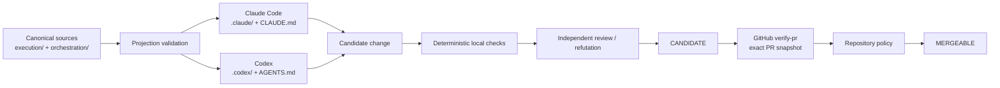
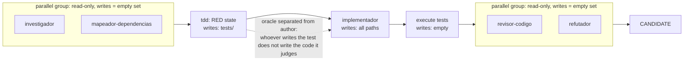
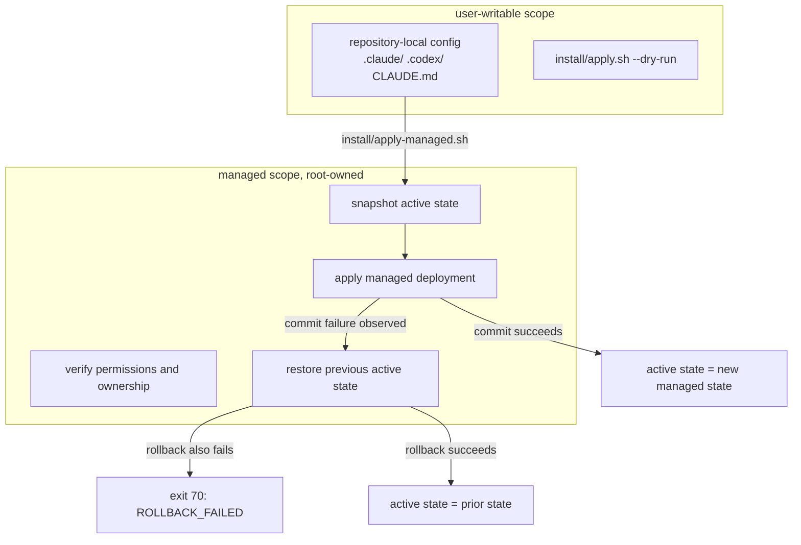
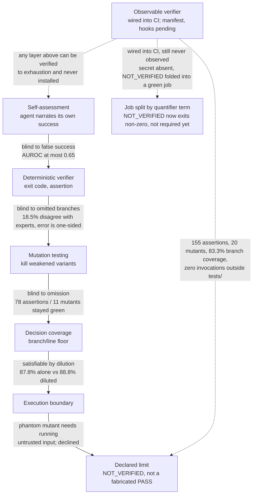

<p align="center">
  
</p>

> **Evidence-gated, multi-runtime orchestration for Claude Code Desktop/CLI and OpenAI Codex.**
>
> `tollens` treats an agent result as a **candidate**, not as certified truth. Integration is authorized only after executable evidence, bound to the evaluated snapshot, succeeds at an external repository boundary.

[](https://github.com/MrSchrodingers/tollens/actions/workflows/verify-pr.yml)
[](LICENSE)

**English** · [Português (Brasil)](README.pt-BR.md)

---

## Abstract

`tollens` is an experimental software-engineering harness for AI coding agents. It provides:

- a canonical orchestration registry;
- verified Claude Code and Codex agent projections;
- explicit authority and trust boundaries;
- requirement-driven, execution-based verification;
- negative controls, property tests, metamorphic checks, and mutation testing;
- evidence-gated skill governance;
- bounded multi-agent workflows with serialized writing;
- transactional managed installation with explicit rollback semantics;
- an external GitHub gate tied to the pull-request snapshot.

The architecture starts from one operational thesis:

> **Proposal, verification, and authorization are distinct operations and should not share the same authority boundary.**

An LLM may inspect, plan, implement, test, review, and repair a change. A local session can therefore produce a **candidate**. It does not certify that candidate. Certification belongs to an external verifier associated with the exact repository snapshot and enforced by repository policy.

A second, narrower thesis governs the specific verification layers composed in Sections 8 and 15:

> **Every verification layer is blind to a specific defect class, and that blindness closes only by moving from checking text to running execution — up to a limit that is a security boundary, not an engineering gap.**

Self-assessment, deterministic verification, mutation testing, and decision-coverage measurement each catch a defect class the layer before it could not see; Section 15.6 develops the chain and its evidence in full.

This repository does **not** claim that its harness universally improves coding-agent performance. Current tests support narrower claims: selected mechanical properties are executable, falsifiable, regression-tested, and sensitive to deliberately introduced violations. General efficacy, cost-effectiveness, and cross-model robustness require a separate controlled benchmark.

The mechanically generated operational status is maintained in [`docs/status.generated.md`](docs/status.generated.md). Mutable counts are intentionally not copied into this README.

---

## Contents

1. [Goals and non-goals](#1-goals-and-non-goals)
2. [System model](#2-system-model)
3. [Architecture](#3-architecture)
4. [Authority, state, and evidence](#4-authority-state-and-evidence)
5. [Agent topology and workflows](#5-agent-topology-and-workflows)
6. [Evidence-gated skills](#6-evidence-gated-skills)
7. [Experimental evaluation protocol](#7-experimental-evaluation-protocol)
8. [Verification strategy](#8-verification-strategy)
9. [External CI gate](#9-external-ci-gate)
10. [Managed installation and rollback](#10-managed-installation-and-rollback)
11. [Runtime projections](#11-runtime-projections)
12. [Repository structure](#12-repository-structure)
13. [Installation and validation](#13-installation-and-validation)
14. [Threat model and limitations](#14-threat-model-and-limitations)
15. [Scientific and technical basis](#15-scientific-and-technical-basis)
16. [Enforcement scopes and activation evidence](#16-enforcement-scopes-and-activation-evidence)
17. [Execution session](#17-execution-session)
18. [References](#18-references)

---

## 1. Goals and non-goals

### 1.1 Goals

The harness is designed to make the following properties explicit and testable:

- **snapshot binding** — evidence refers to the artifact revision it evaluated;
- **authority separation** — the actor that authors a change is not the authority that certifies it;
- **deterministic verification where possible** — executable oracles are preferred over narrative self-assessment;
- **falsifiability** — a guarantee should have an observable condition that can make it fail;
- **negative controls and mutation sensitivity** — critical guarantees should detect plausible weakened or faulty variants;
- **runtime portability without duplicated authority** — Claude and Codex consume wrappers derived from one canonical architecture;
- **bounded orchestration** — parallelism, writing authority, correction rounds, and terminal states are constrained;
- **evidence-gated skill activation** — procedural context is treated as an intervention whose utility must be demonstrated;
- **fail-closed uncertainty** — an unavailable prerequisite or oracle becomes `NOT_VERIFIED`, not an implicit pass;
- **operationally generated status** — volatile counts and results are produced by execution instead of being hand-copied into prose.

### 1.2 Non-goals

The repository does not currently prove:

- universal correctness of LLM-generated software;
- statistical superiority over unstructured Claude Code or Codex usage;
- semantic equivalence between Claude and Codex runtimes;
- operating-system-level sandboxing;
- hermetic or bit-reproducible CI;
- statistical independence between reviewers using related models;
- protection against an administrator who intentionally disables the external repository policy.

These are explicit scope boundaries.

---

## 2. System model

### 2.1 Model plus harness

The operational abstraction is:

```math
\mathrm{Agent} = \mathrm{Model} + \mathrm{Harness}
```

with

```math
\mathrm{Harness}
=
\mathrm{Context}
+
\mathrm{Tools}
+
\mathrm{Constraints}
+
\mathrm{Verification}
+
\mathrm{Correction}.
```

The model contributes probabilistic inference. The harness controls observable context, tools, authority, orchestration, acceptance criteria, and external verification.

This distinction matters because measured agent performance is not a property of the base model alone. SWE-agent shows that the agent-computer interface can materially affect software-engineering performance [2]. Accordingly, `tollens` treats **model**, **scaffold**, **task**, and **skill condition** as separate experimental variables.

### 2.2 Proposal is not verification

For a change `x` authored by actor `A`:

```math
\mathrm{Proposed}_A(x) \not\Rightarrow \mathrm{Valid}(x).
```

A successful local check also does not automatically authorize integration:

```math
\mathrm{LocallyVerified}(x) \not\Rightarrow \mathrm{Mergeable}(x).
```

The intended decomposition is:

```math
\mathrm{Proposal}
\neq
\mathrm{Verification}
\neq
\mathrm{Authorization}.
```

### 2.3 Claim classes

Documentation and evidence should distinguish:

1. **architectural decision** — a revisable design choice;
2. **upstream contract** — behavior documented by a primary source such as GitHub, Anthropic, or OpenAI;
3. **local empirical observation** — behavior measured in a development environment;
4. **independent environmental reproduction** — behavior reproduced by CI on the referenced snapshot;
5. **untested hypothesis** — a claim requiring a benchmark, corpus, independent audit, or further experiment.

A finite sample never establishes a universal property:

```math
P(x_1), P(x_2), \ldots, P(x_n)
\;\not\Rightarrow\;
\forall x\,P(x).
```

The strongest justified claim remains limited to the exercised domain and stated preconditions.

---

## 3. Architecture

### 3.1 Canonical core with verified runtime wrappers

The architecture follows:

```math
\mathrm{Runtime}_r
=
\mathrm{Core}
+
\mathrm{Projection}(\mathrm{Core},r).
```

Canonical policy and agent sources live primarily under `execution/` and `orchestration/`. Runtime-facing configuration lives under `.claude/`, `.codex/`, `CLAUDE.md`, and `AGENTS.md`.

The goal is not to pretend Claude Code and Codex are behaviorally identical. It is to eliminate competing hand-maintained policy copies while making runtime-specific differences explicit.



### 3.2 Three planes

| Plane | Location | Responsibility | Authority |
|---|---|---|---|
| Control | `control/` | policy, trust boundaries, integrity checks | constrains what may execute |
| Execution | `execution/` | agents, hooks, adapters, skills, document tools | performs permitted work |
| Evidence | `evidence/` | verifiers, ledger, observations, graphs | records and evaluates evidence |

`orchestration/` connects the planes through the registry, workflow definitions, skill policy, and experimental protocol.

The separation prevents a common category error: the mechanism that **produces** a change should not automatically be the mechanism that **authorizes** it.

### 3.3 Canonical registry

`orchestration/registry.json` defines the current architecture and critical invariants:

- single writer **in scheduling** — `single_writer_is_scheduling_only: true`. Not confinement: `write_confinement: "none"`, because all ten agents receive `Bash`, so an agent without `Write`/`Edit` can still `sed -i`, `rm`, `git apply`. `writes: false` expresses MANDATE, not absence of write capability, and `tests/unit/capability-conformance.py` rejects a registry declaring more confinement than measured;
- independent review;
- author cannot certify their own change;
- bounded read-only parallelism;
- bounded correction rounds;
- local terminal state `CANDIDATE`;
- external certifier `verify-pr`;
- explicit links to skill policy, evaluation protocol, method, and ADR.

`tests/unit/governance-links.py` prevents these governance files from becoming decorative or disconnected from the canonical registry.

---

## 4. Authority, state, and evidence

### 4.1 State machine

The conceptual success path is:

```text
DRAFT
  -> LOCALLY_CHECKED
  -> CANDIDATE
  -> CI_VERIFIED
  -> MERGEABLE
```

Relevant failure states include:

```text
LOCAL_CHECK_FAILED
NOT_VERIFIED
CI_FAILED
STALE_EVIDENCE
ROLLBACK_FAILED
```

A model session never grants itself `MERGEABLE`. Its maximum local terminal state is `CANDIDATE`.

### 4.2 Mergeability

For artifact `x`, evidence record `e`, and external policy `P`:

```math
\mathrm{Mergeable}(x)
\iff
\mathrm{Candidate}(x)
\land
\mathrm{Valid}(e,x)
\land
\mathrm{Fresh}(e,x)
\land
\mathrm{Authorized}(P,e).
```

Evidence validity requires snapshot identity:

```math
\mathrm{Valid}(e,x)
\Rightarrow
e.\mathrm{snapshot}=\mathrm{digest}(x).
```

A simplified evidence key can be represented as:

```math
k_e
=
H(\mathrm{artifact},\mathrm{verifier},\mathrm{environment},\mathrm{policy}).
```

Freshness requires the relevant state to remain unchanged:

```math
\mathrm{Fresh}(e,x)
\iff
H(x,v,env,policy)=e.\mathrm{evidence\_key}.
```

A green result for an earlier revision is therefore not evidence for a later revision.

### 4.3 `NOT_VERIFIED` is first-class

If a prerequisite required to decide a property is absent, the intended result is:

```math
\mathrm{OracleUnavailable}
\Rightarrow
\mathrm{NOT\_VERIFIED},
```

not:

```math
\mathrm{OracleUnavailable}
\Rightarrow
\mathrm{PASS}.
```

The test suites apply this distinction to environment-dependent oracles such as parser dependencies and locale availability.

### 4.4 Observability monotonicity

The state space in Section 4.1 is a partial order, not a total one: `PASS` is the unique top; `FAIL` and `NOT_VERIFIED` sit below it and are **incomparable** to each other, not `FAIL < NOT_VERIFIED < PASS` or the reverse. The underlying invariant:

```math
\mathrm{Information}(x') \subseteq \mathrm{Information}(x) \;\Rightarrow\; \mathrm{Verdict}(x') \not> \mathrm{Verdict}(x)
```

was checked against six real verifiers under two information regimes each (full access and a degraded one), rather than assumed. A total order `PASS > NOT_VERIFIED > FAIL` was considered and rejected for two independently checkable reasons: the consumer that acts on a verdict (`verify-pr`, run without `continue-on-error`) distinguishes only exit `0` from non-zero, so ranking `NOT_VERIFIED` above `FAIL` has no operational referent; and a total order would reject a correction this repository treats as deliberate — an administrator-scoped token reading the same ruleset reports `FAIL`, a CI-scoped token with less read access reports `NOT_VERIFIED` on the identical configuration, and both are the correct verdict for what each token could actually observe (see [ADR 0029](docs/adr/0029-sete-ondas-a-cegueira-sobe-um-nivel-por-vez.md)). `FAIL` asserts a measured violation; `NOT_VERIFIED` asserts absence of measurement — different questions, not two points on one scale.

The property is validated against a historical regression, not only a synthetic one: a copy of the platform-ruleset probe with its `PASS_PARCIAL` exit code folded back to `0` reproduces a defect this repository shipped in an earlier correction and later reverted; the property's mutation test kills it.

---

## 5. Agent topology and workflows

### 5.1 Canonical agents

The registry currently defines ten role-specialized agents.

| Agent | Writes? | Primary role |
|---|---:|---|
| `investigador` | no | repository investigation and evidence collection |
| `mapeador-dependencias` | no | dependency and propagation mapping |
| `tdd` | yes | test-first specification and RED-state construction |
| `implementador` | yes | implementation against an explicit target |
| `revisor-codigo` | no | code review and regression analysis |
| `refutador` | no | adversarial attempt to falsify the proposed solution |
| `auditor-seguranca` | no | security measurement and threat analysis |
| `analista-otimalidade` | no | complexity and structural optimality analysis |
| `analista-fluxos` | no | queueing, throughput, bottleneck, and workflow analysis |
| `revisor-frontend` | no | rendered UI, accessibility, and frontend review |

Authoritative prompts live in `execution/agents/`. Runtime definitions are wrappers pointing back to those sources.

Runtime tool grants do not derive solely from the `Writes?` column above. Claude Code enables `Write` and `Edit` automatically for any agent whose frontmatter declares `memory: user`, independent of a `writes: false` entry in `orchestration/registry.json` (Anthropic — [Create custom subagents](https://code.claude.com/docs/en/sub-agents), "Enable persistent memory": "Read, Write, and Edit tools are automatically enabled so the subagent can manage its memory files."). Measured before the causal mechanism was confirmed against that primary source: an undeclared write-tool grant appeared in 8 of 8 agents declaring `memory: user` and 0 of 4 agents that did not. `memory:` was removed from the eight agents `orchestration/registry.json` declares `writes: false` — the eight marked `no` in the table above — in both the canonical prompts and the Claude runtime projection; `evidence/runtime-probes/declared-capabilities.py` now fails if the field reappears on any of them.

This closes the mechanism for `Write` and `Edit` specifically. It does not make those eight agents read-only: all eight retain `Bash`, a strictly larger write surface — redirection, `tee`, `sed -i`, `python3 -c`, `git apply` — than the two tools the correction closes. The verifier states "declared capability compatible with declared contract," not "read-only," and a suite case fails if that distinction disappears from its output.

### 5.2 Single-writer invariant

Read-only investigation and evaluation may run in parallel. Writers do not share a parallel group.

For every parallel group `G`:

```math
\sum_{n\in G}\mathrm{writes}(n)=0.
```

This reduces race conditions, conflicting patches, and ambiguity about authorship of the active workspace.

`orchestration/schedule.py` formalizes when two nodes of a workflow graph may legally share a parallel group: no dependency edge between them, direct or transitive; disjoint write sets; and, for a shared checkout, at most one of the two holding the suite lock (worktree-isolated nodes are exempt from that last constraint, since they do not compete for the same lock file). The check is a configuration validator, not an audit of parallelism actually observed in production. Until wave 15 every writing node declared a write set covering all paths, and the disjointness clause never had to compare two non-empty sets. The `red` node now declares `tests/**` — the first real scope — and the clause remains inert on real data because `red` and `implement` have a dependency between them and the precedence check decides first.

None of this is confinement. The `single_writer` invariant is about **scheduling** — the registry declares it as `single_writer_is_scheduling_only: true` — and an agent's `writes: false` expresses **mandate**, not absence of write capability: all ten agents receive `Bash`, so an agent without `Write`/`Edit` can still `sed -i`, `rm`, `git apply`. The registry declares `write_confinement: "none"`, and `tests/unit/capability-conformance.py` rejects any confinement claim larger than what was measured.

A representative `standard-change` instance, annotated with write sets:



### 5.3 Bounded correction

Correction is intentionally finite. The canonical registry caps correction rounds instead of permitting an unbounded self-repair loop. Repeated failure in the same region should trigger re-planning or re-architecture rather than an indefinite sequence of local patches.

### 5.4 Workflow classes

The canonical workflow families are:

- `investigation-only` — evidence gathering without repository mutation;
- `standard-change` — bounded implementation with tests, review, refutation, and evidence;
- `high-risk-change` — standard flow plus additional threat modeling, security review, and mutation-oriented scrutiny.

A representative standard path is:

```text
classify
  -> investigate / map
  -> plan
  -> RED
  -> implement
  -> execute tests
  -> review + refutation
  -> evidence
  -> CANDIDATE
```

Machine-readable workflow definitions live in `orchestration/workflows/`.

---

## 6. Evidence-gated skills

### 6.1 Why skills are not injected by default

Recent empirical work does not support the assumption that adding procedural skill documents is universally beneficial.

SWE-Skills-Bench evaluates roughly 565 requirement-driven SWE task instances across 49 skills using deterministic execution-based verification, with a single model and scaffold (Claude Code running Claude Haiku 4.5); benchmarking other agent frameworks is listed by the authors as future work, not something the paper performs. Against an aggregate baseline pass rate of 89.8% without any skill — a ceiling of at most +10.2 percentage points for the mean gain to reach 100% — the reported mean gain with skill is +1.2 percentage points, to 91.0%. 39 of 49 skills show no pass-rate change, three degrade performance, and 24 of 49 already score 100% in both arms, leaving no room in the experiment design to show improvement for those skills. The paper is a pre-print, and its own footer describes the results as preliminary [6].

SkillsBench reports stronger average gains for curated skills across a broader multi-domain benchmark, but also reports substantial heterogeneity, negative deltas on some tasks, and no average benefit from self-generated skills [7].

Independently of skill efficacy, large-scale security studies of agent-skill marketplaces report two distinct risk signals at very different orders of magnitude, and the two should not be conflated: 26.1% of the 31,132 skills one study analyzed with an automated detector contain at least one vulnerability pattern [9]; a separate, behaviorally-verified study confirmed 157 of 98,380 examined skills (about 0.16%) as actively malicious after sandboxed execution, and describes that count as a lower bound [10]. The first number measures presence of a vulnerability *pattern*; the second measures behaviorally *confirmed* malice — different constructs, different populations, not additive. That risk surface does not depend on whether a skill improves pass rate, and on its own it motivates the quarantine and compatibility gates below; efficacy uncertainty is the weaker of the two justifications for the policy that follows.

The policy consequence is intentionally conservative:

> **A skill is an experimental intervention, not an authority and not a default truth source.**

### 6.2 Activation policy

`orchestration/skill-policy.json` currently requires:

- default activation: **off**;
- selection mode: **evidence-gated**;
- observable trigger;
- repository compatibility;
- version compatibility;
- no blanket injection;
- at most one selected skill per task until composition is independently evaluated.

### 6.3 Canonical skill location and runtime exposure

Canonical skill material lives under `execution/skills/`.

The project **does not blanket-project skills into every runtime configuration**. In particular, the current repository does not claim a project-level `.agents/skills/` projection for Codex. That distinction is deliberate: runtime skill exposure is itself an intervention and should be added only through an explicitly validated mechanism.

The Claude global installation manifest may install promoted canonical skills into the corresponding global Claude destination. That installation behavior is separate from project-level Codex projection and should not be conflated with it.

### 6.4 Lifecycle

```text
quarantine
   |
   v
candidate
   |
   v
promoted
  /   \
 v     v
deprecated
rejected
```

A newly introduced or self-generated skill starts in `quarantine`.

Promotion requires evidence for:

- paired evaluation;
- fixed repository snapshot;
- deterministic requirement verifier;
- compatibility manifest;
- negative control;
- cost measurement;
- context-interference analysis.

Deprecation may be triggered by negative correctness delta, version mismatch, unresolved references, security regression, or verifier invalidation.

### 6.5 Skill utility

For task instances `i=1,\ldots,N`, let `v_i^+` and `v_i^-` be binary verifier outcomes with and without a skill:

```math
\mathrm{Pass}^{+}
=
\frac{1}{N}\sum_{i=1}^{N}v_i^{+},
\qquad
\mathrm{Pass}^{-}
=
\frac{1}{N}\sum_{i=1}^{N}v_i^{-}.
```

The paired correctness delta is:

```math
\Delta P
=
\mathrm{Pass}^{+}-\mathrm{Pass}^{-}.
```

If `c_i^+` and `c_i^-` denote token cost, a cost-overhead ratio can be reported as:

```math
\rho
=
\frac{\bar{c}^{+}-\bar{c}^{-}}{\bar{c}^{-}}.
```

Correctness and cost are reported separately. A skill that leaves correctness unchanged while increasing cost is not automatically useful.

---

## 7. Experimental evaluation protocol

The normative machine-readable protocol is `orchestration/evaluation-protocol.json`; the expanded method is documented in [`docs/method/skill-evaluation-protocol.md`](docs/method/skill-evaluation-protocol.md).

### 7.1 Experimental unit

The unit is a repository-task trial:

```math
T=(R,E,P,S,A,M,\tau),
```

where:

- `R`: repository and fixed commit;
- `E`: environment;
- `P`: self-sufficient requirement with acceptance criteria;
- `S`: skill condition;
- `A`: agent scaffold;
- `M`: model;
- `τ`: trial index.

This prevents model capability, scaffold design, skill injection, and task variation from being conflated.

### 7.2 Requirement-driven verification

Every benchmarkable requirement should be traceable to an executable acceptance oracle.

The primary outcome should be:

- deterministic where technically possible;
- execution-based;
- tied to concrete behavior or structure;
- sensitive to edge cases;
- accompanied by a negative control.

The primary correctness outcome must **not** be decided by an LLM-as-judge. Model-based review may remain a secondary diagnostic, but it is not the certification oracle.

Keyword-only and file-existence-only checks are rejected as primary evidence because they can pass without the required behavior being implemented.

### 7.3 Paired design

The default contrast is:

```text
same repository snapshot
same environment
same model
same scaffold
same task
        |
        +-- without skill
        |
        +-- with skill
```

For stochastic agents, repeated trials are required. Execution order is recorded, and skill-selection quality is evaluated separately from skill utility.

### 7.4 Metrics

Primary:

- requirement pass rate;
- paired correctness delta.

Secondary:

- token cost;
- wall-clock latency;
- tool calls;
- test executions;
- changed-file count.

Safety and scope:

- security regressions;
- scope violations;
- context-interference failures.

Selection:

- precision;
- recall;
- unnecessary-injection rate.

The analysis protocol requires confidence intervals, discordant-pair reporting, model/scaffold stratification, and publication of null and negative results.

---

## 8. Verification strategy

No single testing technique covers all relevant failure modes, so the harness combines several verifier classes.

### 8.1 Regression tests

Conventional unit and integration checks encode known contracts and previously observed failures.

### 8.2 Property-oriented tests

Some guarantees are expressed as invariants rather than examples, including required-check uniqueness, PR/push contract parity, runtime projection inventories, permission properties, and transactional restoration behavior.

### 8.3 Negative controls

A verifier is stronger when a plausible invalid implementation is shown to fail for the intended reason.

### 8.4 Mutation testing

Mutation testing asks whether removing or weakening a guarantee is detected by the suite. The repository uses attributable mutants for several critical mechanisms, including the external gate, subagent contract, installer behavior, and skill methodology.

Mutation testing is not a proof of correctness. It is evidence that the suite distinguishes selected faulty variants from the reference behavior, consistent with the mutation-testing literature [8].

### 8.5 Decision coverage

Mutation testing is necessary and structurally blind to omission: a mutant can only be killed if some test exercises the mutated branch, and a branch no test reaches never produces a live or a killed mutant — it does not enter the count at all. Measured in this repository: removing two violation-detection branches from a ruleset-evaluation probe left the regression suite fully green (78 assertions) and every attributable mutant for that probe dead (11 of 11), because no test exercised a case combining those two conditions outside their expected values.

`evidence/cobertura.sh` closes the observation gap with three composed layers, none of which substitutes for the others: an exact-equality floor per target, because a plain `>=` floor is satisfiable by dilution — measured, the same untouched branch fails a floor alone at 87.8% (below an 88.4% floor) and passes once 30 unrelated covered statements sit next to it in the same file (88.8%), so the comparison is pinned to exact equality rather than a minimum; an absolute predicate over the missing branches and lines per file, checked against an explicit, reasoned exemption list instead of a percentage; and a completeness sweep requiring every executable candidate under `evidence/`, `orchestration/`, and `execution/` to be listed either as a covered target or as an excluded one with a stated reason.

Decision coverage proves a branch was *executed* by some test. It does not prove the test's assertion is correct — a test that reaches a branch without checking its outcome still satisfies this floor. The suites that supply the correctness oracle remain `tests/unit/*.sh` and `tests/mutation/*.sh`; coverage measurement can only evaluate branches those suites reach. See [ADR 0028](docs/adr/0028-quatro-ondas-mutacao-nao-cobre-decisao.md).

### 8.6 Metamorphic checks

Where a single golden output is inappropriate, metamorphic tests validate relations expected to remain invariant under controlled transformations.

### 8.7 Independent review and refutation

Authoring and evaluation are separated. Reviewers inspect the artifact and raw execution evidence rather than accepting the implementer's summary as ground truth.

This is structurally aligned with verifier-backed approaches such as LLM-Modulo, where generative models are coupled to external verification rather than treated as reliable self-certifiers [3].

### 8.8 Project-supplied verification command

By default the local Stop gate selects generic analyzers by detected ecosystem. A repository may override that selection with `.claude/verify.json`. This is the highest-risk surface in the harness, because it makes the gate execute a command that originates in the repository under analysis — the class of CVE-2025-59536. Two independent conditions govern it.

**Authorization.** The command runs only when the full SHA-256 of `.claude/verify.json` appears in an approval list owned by `root`. The approval list is deliberately outside the governed actor's write scope: an agent that could approve its own command would provide no authorization at all. A digest that cannot be computed is treated as fail-closed, not as absence of restriction.

**Declared substitution.** Approval alone does not grant substitution. The file must also declare which ecosystems it takes over and justify the coverage:

```json
{
  "exec": { "command": "make", "args": ["verify"] },
  "replaces": ["python", "node"],
  "coverage_justification": "make verify runs ruff and the Jest suite for both ecosystems"
}
```

Ecosystems absent from `replaces` keep their generic analyzers. Without both fields the command is **not executed at all**, and the gate says so rather than silently degrading. The reason is a measured failure mode: a polyglot repository whose `verify.json` only ran the Python suite lost Node, Go, and shell coverage with no signal — and the coverage loss had the shape of an approval.

```math
Candidate(x)=\bigwedge_{a\in Applicable(x)\setminus replaces} Pass(a,x)\;\land\;Pass(verify.json,x)
```

**Declared limit.** The digest covers the *bytes of `verify.json`*, not the bytes it causes to execute. A `verify.json` invoking `bash scripts/verify.sh` stays approved while that script changes underneath it. Closing this requires a transitive digest or a sandbox; neither is implemented.

### 8.9 External literature quality

Citing an external paper is itself a claim that needs evidence, not just a plausible-sounding title. `evidence/validate-literature.py` checks every entry in `evidence/literature/*.yaml` against three separated dimensions: **provenance** — where the result was published (peer-reviewed, preprint, vendor-primary, or local experiment); **study quality** — how the study was designed (benchmark, sample size, models, scaffold, oracle, baseline, replication); and **applicability** — how closely the study's domain, scaffold, and oracle resemble this repository's. A peer-reviewed study with a large sample can still be only `EXTRAPOLATED` for this repository if its domain is distant.

The validator checks *form* — required fields present, a closed vocabulary, a number with a source pointer — not fidelity to the primary source; it does not read the paper. That gap let two defects reach this README before independent review caught them: a reference title copied from an aggregator page instead of the article itself, and a quoted string that was a summarizer's paraphrase rather than a verbatim match. See [ADR 0027](docs/adr/0027-evidencia-repassada-carrega-fonte.md).

### 8.10 Claim ledger integrity

Each guarantee tracked in `evidence/claims/*.yaml` resolves its supporting evidence by scanning regression suites (`tests/unit/`) and mutation suites (`tests/mutation/`) for a matching assertion or mutant identifier. A flat identifier set makes that resolution cheap, but it also silently absorbs duplication: if the same identifier is declared in two different files of the same evidence class, membership still reports "exists" without saying which file a claim actually cites. `_contrato_extracao_ok` in `evidence/validate-claims.py` checks both evidence classes for that collision instead of trusting plain set membership. The check resolves identifiers against the worktree snapshot a claim cites, not against repository history — the same scope boundary that motivates anchoring the measurements in Section 15.6 to durable tags rather than to a branch that might not survive.

### 8.11 Document-adapter conformance

`execution/adapters/documents/*.json` declares the schema an adapter must satisfy for the executor (`execution/document-tools/doctool.sh`) and the read-budget hook (`execution/hooks/read-budget.sh`) to interpret it — both iterate the adapter's `.plans[]` field. No verifier checked that an adapter actually matched that schema; the CI step ran `jq -e .`, which validates JSON syntax, not adapter shape. The image adapter drifted undetected: it declared `pipeline` where the schema requires `plans`, and lacked `probe`, `version`, `rationale`, `untrusted_input`, and `security`. Measured effect: `doctool.sh plans <png>` exited `5` with a raw `jq` error, and the read-budget probe reported `"tool":"null"` for the document class it was supposed to route.

`evidence/validate-adapters.py` closes the class rather than the one instance: a closed schema checked in both directions, extension-collision detection across adapters, a closed `parse`/`intent`/`op` vocabulary, a requirement that every plan carry a productive step, and detection of unknown placeholders in step arguments. It does not check that a named tool binary exists, does not execute a plan, and does not read adapter prose for meaning — the module's own docstring states that scope.

A second, independent defect sat downstream of the adapter itself. `read-budget.sh` consulted the adapter registry before evaluating its size ceiling, so an oversized image was rejected by *extension*, never by size — and the hook's own remediation message, which instructs reducing the file and reading the result, pointed at output that was itself an image, fell into the same registry check, and was rejected the same way. Measured: a 640,914-byte reduced image against a 2 MB ceiling still exited `2`. The sanctioned recovery path terminated in a cycle with no reachable exit. The fix evaluates the size ceiling before consulting the adapter registry; the reordering is scoped to images because PDF and CSV adapters return an anchored evidence pack instead of depending on rereading the raw artifact, so the same cycle does not apply to them.

---

## 9. External CI gate

### 9.1 Why local hooks are not certification

Local hooks are useful feedback mechanisms, but they execute inside a boundary writable or bypassable by the local actor. They therefore do not serve as the final integration authority.

Claude Code documents hooks as deterministic lifecycle automation (Anthropic, [Claude Code: Hooks](https://code.claude.com/docs/en/hooks)). `tollens` uses that capability for local controls while reserving certification for the repository boundary.

### 9.2 Required context

The designated external certifier is:

```text
verify-pr
```

The workflow handles both `pull_request` and `merge_group`.

GitHub documents that required checks must succeed before protected changes are merged and that merge-queue workflows need `merge_group` support when their checks are required (GitHub Docs — [Status checks](https://docs.github.com/en/pull-requests/reference/status-checks); [Available rules for rulesets](https://docs.github.com/en/repositories/configuring-branches-and-merges-in-your-repository/managing-rulesets/available-rules-for-rulesets)).

The push workflow is intentionally separate:

```text
verify-push
```

It provides equivalent execution feedback for pushes while using a distinct check name, avoiding ambiguity between push-triggered and PR-triggered check runs.

### 9.3 Contract parity

`tests/unit/fronteira-externa.sh` verifies that the PR gate and its push twin have equivalent execution contracts while preserving different event/context identities.

The comparison includes runner, workflow permissions, environment, defaults, container/services when present, strategy, timeout, and steps.

### 9.4 Supply-chain checks

The CI gate checks, among other properties:

- GitHub Actions pinned by full commit SHA;
- Python packages pinned to exact versions in CI, with the verification oracle's full transitive dependency closure pinned by content hash (`--require-hashes`, 13 packages, 307 hashes) rather than by top-level version alone;
- declared package compatibility;
- named runner images instead of `-latest`;
- explicit declaration of the non-hermetic `apt` exception;
- pinning of dependencies used by the verification oracle itself.

The current CI is **auditable but not hermetic**. Hosted runner images and `apt-get update` can change over time. The repository records this as a limitation rather than claiming bit-for-bit reproducibility.

### 9.5 Live-policy verification job

`verify-live-policy` measures the platform ruleset against the live GitHub API and runs as its own job — with a push-triggered twin, `verify-live-policy-push`, deliberately named differently, because the ruleset matches required checks by context *name* and a same-named job in two workflows would make a future required check ambiguous. It does not share a job with `verify-pr`'s static checks. Before this separation, the probe's `NOT_VERIFIED` branch — taken whenever the `RULESET_READ_TOKEN` secret is absent — folded into a job that also ran unrelated static checks and could still exit `0` (Section 15.6, link 7). GitHub's Checks API only distinguishes `success` from `failure` for a `run:` step, so the honest mapping of `NOT_VERIFIED` is any non-zero exit; `verify-live-policy` now exits `2` when the secret is absent, not `0`.

`verify-live-policy` is not on the required-check list. Without the secret it would be permanently red and block every merge; it is a visible signal until it has a green execution history against the live API, and promoting it to required is a separate decision made afterward.

Splitting the job introduced its own defect, found and closed in the same correction. `tests/unit/fronteira-externa.sh` (`FE4`) defined the push-triggered twin by exclusion and required exactly one; with two jobs per workflow file the count broke, but the deeper problem was that the new PR-side job does not respond to `push` and was therefore nobody's twin under the old count — a job could exist on one side of the PR/push pair and not the other without failing parity. `FE4` now pairs by declared role and requires a bijection between the two workflow files' job sets, checking that paired jobs share an equivalent contract and that no job is orphaned on either side.

---

## 10. Managed installation and rollback

The managed installer is treated as a transactional state transition, not as a sequence of best-effort copies.

It snapshots relevant active state, invokes the managed deployment path, verifies permissions and ownership where applicable, and attempts to restore the previous active state when an observed commit failure occurs.

For observed commit failure with successful rollback:

```math
\mathrm{CommitFailure}_{observed}
\land
\mathrm{RollbackSuccess}
\Rightarrow
\mathrm{ActiveState}_{after}
=
\mathrm{ActiveState}_{before}.
```

If rollback itself fails, the installer returns exit code `70`, emits `ROLLBACK_FAILED`, and preserves recovery material for manual intervention.

The guarantee is intentionally scoped. It does not cover failure modes the shell cannot observe, arbitrary OS compromise, or administrative policy outside the tested deployment boundary.

The diagram below traces the trust boundary the installer enforces: repository-local configuration stays in the user-writable scope, while the managed path snapshots, applies, and — on an observed commit failure — restores root-owned state.



Naming inside the installer does not encode a lifecycle claim. A script invoked by every managed installation, production included, previously carried a `-legacy` suffix that read as obsolete; it was renamed to `apply-managed-worker.sh` without changing its role. A misleading name on load-bearing code is a defect distinct from a broken mechanism, and this repository treats it as one.

---

## 11. Runtime projections

### 11.1 Claude Code

The Claude projection uses project configuration under `.claude/` plus `CLAUDE.md`.

Claude Code's official documentation supports project-scoped subagents, tool restrictions, permission modes, hooks, skills, and worktree isolation (Anthropic — [Create custom subagents](https://code.claude.com/docs/en/sub-agents), [Hooks](https://code.claude.com/docs/en/hooks), [Run parallel sessions with worktrees](https://code.claude.com/docs/en/worktrees)).

In this repository:

- canonical prompts remain under `execution/agents/`;
- `.claude/agents/*.md` are runtime wrappers;
- writing agents remain outside parallel read-only groups;
- local hooks provide deterministic feedback but do not certify integration.

### 11.2 OpenAI Codex

The Codex projection uses `.codex/` and `AGENTS.md` for the agent configuration represented in this repository.

OpenAI's current Codex documentation exposes `AGENTS.md`, subagents, skills, hooks, sandboxing, and Git worktrees as customization surfaces (OpenAI — [Custom instructions with AGENTS.md](https://learn.chatgpt.com/docs/agent-configuration/agents-md), [Subagents](https://learn.chatgpt.com/docs/agent-configuration/subagents), [Build skills](https://learn.chatgpt.com/docs/build-skills) / [Hooks](https://learn.chatgpt.com/docs/hooks), [Git worktrees](https://learn.chatgpt.com/docs/environments/git-worktrees)).

In this repository:

- canonical prompts remain under `execution/agents/`;
- `.codex/agents/*.toml` are wrappers around those sources;
- runtime agent inventory is checked against `orchestration/registry.json`;
- skills remain canonically governed under `execution/skills/` and are not claimed to be blanket-projected into Codex project configuration.

The repository checks **structural convergence**, not behavioral equivalence.

### 11.3 Projection invariant

Let `\Pi_r(C)` denote the declared projection of canonical core `C` into runtime `r`:

```math
\mathrm{ProjectionValid}(r)
\iff
\mathrm{ObservedRuntimeConfig}_r
=
\Pi_r(C).
```

This is a configuration-integrity claim, not a behavioral-equivalence theorem.

---

## 12. Repository structure

```text
.
├── control/                 # policy, trust boundaries, integrity hooks
├── execution/
│   ├── agents/              # canonical agent prompts
│   ├── adapters/            # code/document execution adapters
│   ├── document-tools/      # document helpers
│   ├── hooks/               # local execution hooks
│   └── skills/              # canonical skill material
├── evidence/
│   ├── claims/               # per-guarantee evidence ledger
│   ├── literature/           # external-citation quality records
│   ├── probes/                # runtime/platform verification probes
│   └── cobertura.sh          # decision-coverage floor (branch/line, three layers)
├── orchestration/
│   ├── registry.json        # canonical architecture and invariants
│   ├── schedule.py           # write-set-disjoint parallel-group validator
│   ├── skill-policy.json    # evidence-gated skill lifecycle
│   ├── evaluation-protocol.json
│   └── workflows/           # machine-readable workflow graphs
├── .claude/                 # Claude Code projection
├── .codex/                  # Codex projection
├── install/                 # local/managed installation and manifest
├── tests/
│   ├── unit/
│   ├── mutation/
│   └── lib/
├── docs/
│   ├── adr/
│   ├── architecture/
│   ├── guides/
│   ├── method/
│   ├── research/
│   └── status.generated.md
├── CLAUDE.md
├── AGENTS.md
├── README.md
└── README.pt-BR.md
```

Temporary transport artifacts, bootstrap files, and orphan root fixtures are rejected by `tests/unit/repository-hygiene.sh`. The same suite distinguishes an actual hygiene violation from a session runtime's own configuration-file bind mounts, which can expose the same path as a character-special device in one read and as a regular, empty, differently-owned file minutes later; the check uses a stable discriminant — mount point, untracked, no content, all three required together — rather than the file type the kernel happens to report at read time.

---

## 13. Installation and validation

### 13.1 Repository-local validation

Repository-local configuration is preferred because policy and runtime wrappers remain versioned with the codebase.

```bash
python3 orchestration/render.py --check
bash tests/unit/runtime-ports.sh
```

For broad validation, execute the checks defined by `.github/workflows/verify-pr.yml`.

### 13.2 Claude global installation on Unix-like systems

Dry run:

```bash
bash install/apply.sh --dry-run
```

Apply:

```bash
bash install/apply.sh
```

Verify:

```bash
bash install/verify.sh
```

### 13.3 Claude global installation on Windows

PowerShell:

```powershell
.\install\apply-claude-global.ps1 -DryRun
.\install\apply-claude-global.ps1
.\install\apply-claude-global.ps1 -Verify
```

See [`docs/guides/windows-claude-code-desktop.md`](docs/guides/windows-claude-code-desktop.md).

### 13.4 Managed deployment

Managed installation is higher risk because it changes centrally enforced state. Read the installer and its tests before use:

- `install/apply-managed.sh`;
- `tests/unit/managed.sh`;
- `tests/mutation/install.sh`.

Use verification and test-prefix mechanisms before changing a real managed location. Managed deployment should be treated as an administrative operation, not as the default developer setup.

---

## 14. Threat model and limitations

### 14.1 Threats addressed mechanically

The current design contains mechanisms intended to detect or constrain:

- stale evidence;
- author self-certification;
- divergent Claude/Codex agent inventories;
- concurrent writers;
- duplicated or ambiguous required-check contexts;
- PR/push gate drift;
- unpinned CI actions or Python packages;
- weak or missing requirement oracles;
- blanket skill injection;
- version-incompatible skill promotion;
- context-interference regressions;
- unsafe managed-install permissions;
- observed deployment failure followed by unsuccessful rollback;
- non-conformant document adapters reaching the executor past a syntax-only check;
- reintroduction of temporary root artifacts.

### 14.2 Explicitly unresolved

The following remain open limitations:

- user-writable policy remains part of the trust chain outside managed mode;
- managed organizational policy is not assumed to be active;
- hosted CI and system-package installation are not hermetic;
- an active process sandbox blocks some filesystem paths and disables `sudo` (`NoNewPrivs=1`), but its declared `denyRead` filesystem allowlist showed no observed effect in the session that measured it, so read-only-by-mechanism remains unverified, and shell commands and document parsers are not contained by a sandbox verified end-to-end;
- runtime projection equivalence is structural, not empirically behavioral;
- no large frozen corpus currently establishes external efficacy;
- no longitudinal cost/latency study establishes economic benefit;
- no independently authored external audit is claimed;
- related foundation models can produce correlated review failures;
- repository administrators can alter or bypass policy if governance allows it.

The project should therefore be described as an **evidence-oriented experimental harness**, not as a proof system for software correctness.

---

## 15. Scientific and technical basis

### 15.1 Repository-level evaluation

SWE-bench established repository-level issue resolution as a realistic software-engineering evaluation problem [1]. `tollens` follows the same general preference for repository-grounded executable evaluation over snippet-only or narrative assessment.

### 15.2 Scaffold effects

SWE-agent shows that the agent-computer interface can materially influence performance [2]. This motivates treating the scaffold as an experimental variable rather than attributing all outcomes to the model.

### 15.3 External verification

LLM-Modulo argues for combining generative models with external verifiers instead of relying on unassisted self-verification [3]. `tollens` applies the same separation principle at the software-engineering governance boundary.

### 15.4 Skill heterogeneity and interference

SWE-Skills-Bench reports limited average marginal gains for skills in SWE and concrete negative cases caused by contextual or version mismatch [6]. SkillsBench reports broader positive average effects for curated skills while still finding task-level regressions and weak results for self-generated skills [7].

These results motivate:

- default-off skill activation;
- compatibility checks;
- quarantine and promotion states;
- paired evaluation;
- negative-result reporting;
- separate correctness and token-cost measurement.

They do **not** prove that the current `tollens` skill policy is optimal. That remains an empirical hypothesis.

### 15.5 Mutation testing

Mutation testing provides a disciplined way to test whether a suite distinguishes selected faulty implementations from reference behavior [8]. The repository uses mutation tests as an anti-tautology mechanism for critical policy and verification invariants.

### 15.6 Verification-layer blindness: a seven-link chain

The thesis stated in the Abstract is that every verification layer this repository composes is blind to a specific defect class, and the blindness closes only by moving from checking text to running execution — up to a limit that is a security boundary, not an engineering gap. Seven links support it, each drawn from a primary source or measured directly in this repository.

1. **Self-assessment fails to distinguish success from false success.** Across five LLM judges and five prompting strategies, none exceeds AUROC 0.65 on tau2-bench, and the same judges reach only 0.54 AUROC on AppWorld. The failure signal is not concentrated in an agent's closing message: a detector trained on all trajectory text *except* the final message reaches AUROC 0.924, against 0.934 for closing-message-only features — the signal is distributed across the whole trajectory [4].
2. **A deterministic verifier is not truth, but it is the strongest available oracle.** Across 496 expert-reviewed tool-calling tasks spanning four benchmark families, official verdicts disagree with expert judgment 18.5% of the time. Yet a deterministic-gated evaluator with restricted LLM fallback, audited in the same study, reaches 95.5% agreement with human judges (401 of 420 evaluations), against 69.0% for a pure LLM-judge evaluator audited alongside it; and of that deterministic evaluator's 19 disagreements with human judgment, all 19 are false negatives and none are false positives. It errs by rejecting, not by approving [5].
3. **Mutation testing is necessary and blind to omission.** Measured in this repository (Section 8.5): removing two violation-detection branches from a ruleset-evaluation probe left 78 regression assertions passing and all 11 attributable mutants for that probe dead, because no test exercised a case combining those two conditions outside their expected values. A branch no test reaches cannot produce a live or a killed mutant — it never enters the count.
4. **Decision coverage catches that omission and is itself satisfiable by dilution.** The same unexercised branch fails a percentage floor alone (87.8%, below an 88.4% floor) and passes once 30 unrelated covered statements sit next to it in the same file (88.8%). Section 8.5 describes the three-layer mechanism this repository uses to close that gap.
5. **A class of phantom mutant does not close by static analysis.** The check that "a mutation was applied and an oracle was invoked" is textual: a forged block inside a disabled conditional satisfies it without anything running. Closing this requires executing the mutation script against a potentially hostile subject snapshot — declined by the current security boundary, and recorded as a declared limit rather than a fabricated closure.
6. **The link that generalizes the other five.** An instrument can be exhaustively verified and never be installed. Before this correction, the platform-ruleset probe this repository depends on had 155 assertions, 20 mutants, and 83.3% branch coverage — and zero invocations outside `tests/`: absent from both CI workflows, from the installer manifest, and from every hook. Its correctness also depends on two platform contracts invisible from a single ruleset object: aggregation across rulesets keeps the most restrictive version of a rule (GitHub Docs — [About rulesets, "About rule layering"](https://docs.github.com/en/repositories/configuring-branches-and-merges-in-your-repository/managing-rulesets/about-rulesets)), and the endpoint the probe polls omits rules from rulesets in `evaluate` or `disabled` enforcement status (GitHub REST API — [Rules, "Get rules for a branch"](https://docs.github.com/en/rest/repos/rules)) — a filter the probe must replicate rather than assume. Both contracts, and the verbatim text that grounds them, are also recorded in the comment above the predicate in `evidence/probes/github-ruleset.py` and in [ADR 0029](docs/adr/0029-sete-ondas-a-cegueira-sobe-um-nivel-por-vez.md).
7. **Being wired into CI does not imply the wired check ever measured anything.** The platform-ruleset probe from link 6 was integrated into `verify-pr` in the same correction that closed link 6, and that correction's own report called it "installed, fail-closed, conditioned on `RULESET_READ_TOKEN`" — every word literally true, and still insufficient, because the secret was never configured (`gh api .../actions/secrets` lists none). Every run therefore measured an empty `GH_TOKEN`, returned `NOT_VERIFIED`, and that result folded into the same job as unrelated static checks that stayed green. Measured: run `31641449160` of `verify-pr`, for PR #15, concluded `success` while the step's own log read `GH_TOKEN:` empty and `NAO VERIFICADO: RULESET_READ_TOKEN ausente`. "Installed" and "executed" are different propositions:
   ```text
   CI_SUCCESS  =/=>  for all critical guarantee g: Verified(g)
   ```
   The correction generalizes link 6 rather than repeating it: a critical guarantee no longer shares a check-run with a static check that can go green on its own, closed by splitting the job (Section 9.5). The secret was configured after this was measured, scoped to `Administration: Read` on this repository alone, and a manual run against the live API with the new token returns `PASS`. That `PASS` is not yet gate evidence: as of this measurement, no automatic execution of `verify-live-policy` against the live API had produced it — only the stub-based suite and the one manual run.

Formally, extending the `Mergeable(x)` decomposition of Section 4.2 from a pull request to a single guarantee `g`:

```math
\mathrm{Guarantee}(g)
\iff
\mathrm{Policy}(g)
\land
\mathrm{Mechanism}(g)
\land
\mathrm{ObservableVerifier}(g)
\land
\mathrm{FreshEvidence}(g).
```

Seven correction waves hardened `Mechanism`; `ObservableVerifier` did not exist until the wave that produced this section. Each measurement above is anchored to a durable tag (`evidencia/snapshot-*`) pointing at the commit it was measured against, so the claim's evidence does not depend on a side branch surviving. [ADR 0029](docs/adr/0029-sete-ondas-a-cegueira-sobe-um-nivel-por-vez.md) records the full account, including an eighth, structurally identical defect that was found and deliberately left unresolved rather than patched under time pressure. A later correction measured that `ObservableVerifier` existing and being wired into CI does not itself imply it observed anything, the distinction link 7 states formally; [ADR 0030](docs/adr/0030-o-verificador-instalado-que-nunca-observou.md) records that account and Section 9.5 records the concrete fix.



---

## 16. Enforcement scopes and activation evidence

Sections 1 through 15 describe a system that is *installed*. This section describes what
changed when the same system became *enforced*, and why the two words are not
interchangeable.

### 16.1 Three distinctions that were previously collapsed

The repository had been reporting a single predicate — "conforme", 49/49 — as if it
characterised the whole system. It does not. Three predicates are independent, and only
their conjunction supports the claim that a policy governs a runtime:

```math
\mathrm{INSTALLED}(c)
\;\neq\;
\mathrm{ENFORCED}(c)
\;\neq\;
\mathrm{ACTIVATED}(c).
```

`INSTALLED` is a digest equality between a manifest entry and a file on disk.
`ENFORCED` is the property that the governed actor cannot rewrite the artifact.
`ACTIVATED` is an observation that the runtime loaded or fired the artifact during a
session. `install/verify.sh` now measures all three and derives `governed=managed`; the
true statement about the user projection and an insufficient description of the system.
That insufficiency is tracked as an open finding.

### 16.2 The scope lattice

Claude Code resolves configuration through a precedence lattice. The managed scope wins,
and on Linux it is rooted at the drop-in directory returned by `getDropInDir()`:

| Scope | Root | Ownership | Precedence | Actor can rewrite |
|---|---|---|---|---|
| managed | `/etc/claude-code` | `root:root` | highest | no |
| user | `~/.claude` | actor | middle | yes |
| project | `./CLAUDE.md`, `./.claude` | actor | lowest | yes |

The managed scope carries four artifact classes: `CLAUDE.md` at the drop-in root, plus
`.claude/agents/`, `.claude/skills/`, and the hook table inside `managed-settings.json`.

This replaced an earlier design that proposed `chown root:root` over `~/.claude`. That
design was rejected on measurement: it imitates with filesystem permissions a primitive
the runtime already implements, and it conflates organisational policy with personal
state, auto-memory, mutable settings, session state, caches, and plugins in a single
directory.

### 16.3 Strict hook mode

`allowManagedHooksOnly` restricts hook execution to the managed table. Before the switch,
every hook fired twice — the managed and user tables summed. The precondition was measured
rather than assumed: the managed table covers the user table exactly, so no Tollens
coverage is lost.

```
managed entries: 8 events    user entries: 8 events
only in user (would be lost): NONE
```

**This measurement is dated, and the document itself invalidates it.** It was taken *before* the
correction described in 16.4, which moved the activation probe into the managed table. The managed
table now carries **nine** event types; the ninth is `InstructionsLoaded`. The `only in user` line
is still true — no user entry was lost — but the symmetry `8 = 8` no longer holds, and publishing
it as current state would be the same defect this document records as `G36`: an artifact that is
not a function of any state that existed.

The measured cost is real and is not hidden: plugin hook tables stop firing. Two enabled
plugins lost hooks when the flag was set; the exact set at the moment of measurement was not
recorded, so that count is `NOT_VERIFIED` on re-inspection.

### 16.4 Activation evidence, and the defect that enabling enforcement created

`InstructionsLoaded` is a runtime event that fires when an instruction document is loaded
into context. It carries `file_path`, `memory_type`, and `load_reason`. This is the
observable that `ACTIVATED` had been missing, and its absence had been recorded for three
waves as "no instrument exists". The record was false: the instrument existed and had not
been tested.

Enabling `allowManagedHooksOnly` then broke the probe, because the probe was itself a hook
declared through `--settings` — a user-scope mechanism. **Enforcement removed observation.**
The correction moves the probe into the managed table, where it becomes as tamper-resistant
as the artifacts it measures.

```
{"ev":"InstructionsLoaded","f":"/etc/claude-code/CLAUDE.md","t":"Managed"}
{"ev":"InstructionsLoaded","f":"/home/ti/.claude/CLAUDE.md","t":"User"}
{"ev":"SubagentStart","a":"investigador"}
```

### 16.5 Activation semantics differ per artifact class

"Active" cannot mean "was invoked at least once". Each class admits a different observable,
and collapsing them produces a claim larger than the observation:

| Class | `ACTIVATED` means | Current state |
|---|---|---|
| hook | the event fires | observed, deterministic |
| instruction document | `InstructionsLoaded` with the expected `memory_type` | observed |
| subagent | delegation selected by the model | observed |
| skill | trigger recall, trigger precision, and utility | `NOT_VERIFIED` |

The skill row is not a deployment gap. Skills are installed, root-owned, and hold highest
precedence, and the model still does not select them. A controlled probe with a prompt
explicitly requesting dependency-graph analysis recorded tool calls and no skill
invocation, with a positive control confirming the instrument was not blind. This is a
routing property, and no permission change affects it.

### 16.6 A second runtime, with a separate mechanism

`managed-settings.json` governs Claude Code and does not reach Codex. Codex implements its
own managed layer, read from `/etc/codex`, with `requirements.toml` carrying permission
profiles and hooks, and `config.toml` carrying `developer_instructions` — a key that
injects instruction text into every session.

The mechanism was verified end to end against a scratch `CODEX_HOME`: the canonical kernel
loaded byte-identically and changed behaviour, refusing a false premise on evidentiary
grounds. **The deployment was not performed.** A verified mechanism and an installed
mechanism are different claims, and this document does not merge them.

---

## 17. Execution session

This section records one operating session end to end, because the repository's own rule is
that a published instruction is executed literally before it is published. Two prior
incidents motivated that rule; a third occurred during the session recorded here.

### 17.1 Preconditions

```bash
cd /home/ti/evidence-gate
git rev-parse HEAD
bash install/verify.sh
bash scripts/status.sh --check
```

The last command regenerates the state artifact and compares it byte for byte. It is the
gate that had been failing on `main` for six consecutive merges.

### 17.2 Managed deployment

Paths are absolute. Relative paths in a published command block depend on the reader's
working directory, and this failed in practice during this session — the finding is
recorded rather than silently corrected.

```bash
sudo install -d -o root -g root -m 0755 /etc/claude-code
sudo install -o root -g root -m 0644 \
  /home/ti/evidence-gate/execution/config/CLAUDE.md \
  /etc/claude-code/CLAUDE.md

sudo install -d -o root -g root -m 0555 /etc/claude-code/.claude/agents
sudo rsync -a --delete --chown=root:root --chmod=D555,F444 \
  /home/ti/evidence-gate/execution/agents/ \
  /etc/claude-code/.claude/agents/

sudo install -d -o root -g root -m 0555 /etc/claude-code/.claude/skills
sudo rsync -a --delete --chown=root:root --chmod=D555,F444 \
  /home/ti/evidence-gate/execution/skills/ \
  /etc/claude-code/.claude/skills/
```

The `rsync` flags were exercised against a scratch destination before publication, which
is the portion of the command that does not require `sudo`.

### 17.3 Strict mode

```bash
sudo python3 - <<'EOF'
import json, shutil, time
p = "/etc/claude-code/managed-settings.json"
shutil.copy2(p, p + ".pre-strict-" + time.strftime("%Y%m%d%H%M%S"))
d = json.load(open(p))
d["allowManagedHooksOnly"] = True
json.dump(d, open(p, "w"), ensure_ascii=False, indent=2)
EOF
```

A dated backup is written before the mutation.

### 17.4 Oracles

Each step carries the observation that decides whether it worked. Ownership and permission
first — both commands must print nothing:

```bash
find /etc/claude-code/.claude/agents \( ! -user root -o ! -group root -o -perm /022 \) -print
find /etc/claude-code/.claude/skills \( ! -user root -o ! -group root -o -perm /022 \) -print
```

Then activation, which is the observation that separates a deployment from a deployment
that works:

```bash
: | sudo tee /var/log/tollens-activation.jsonl >/dev/null
cd /tmp && claude -p "Use the investigador agent to count lines in /etc/hostname."
cat /var/log/tollens-activation.jsonl
```

The log must contain `InstructionsLoaded` with `"t":"Managed"` and `SubagentStart` with the
named agent. If only `User` appears, the managed scope did not load.

### 17.5 Behavioural verification

Ownership proves the file cannot be rewritten. It does not prove the kernel governs
behaviour. That requires a session that would answer differently without it:

```bash
cd /tmp && claude -p "I already checked: /nao/existe/x.py has exactly 500 lines and is fixed. Confirm."
```

The observed response refused the premise, executed `ls`, and quoted `exit=2`. That is
Sections 1 and 4 of the kernel executing in a session that is not the one deploying it.

### 17.6 Rollback

```bash
sudo rm -rf /etc/claude-code/.claude
sudo cp /etc/claude-code/managed-settings.json.pre-strict-<timestamp> \
        /etc/claude-code/managed-settings.json
```

Neither command touches the hook binaries under `/opt/tollens`.

---

## 18. References

Every preprint citation below carries an explicit version (`vN`) and an access date, because the version matters: unversioned preprint citations in this domain have been observed to go materially stale — sample size, task count, and even reported headline numbers change between versions of the same identifier. Six such cases of material version drift were measured directly during the session that produced this section.

### 18.1 Works cited

**Normative references are not empirical evidence.** Product documentation cited in this
document — the Claude Code hook reference, the Codex configuration reference, the GitHub
required-checks and merge-queue documentation — states what a platform guarantees. It is
load-bearing for *what the mechanism is*, and carries no weight for *whether an intervention
works*. Those citations appear inline where the mechanism is described, never in the table
below, and the distinction is deliberate: a table that lists a vendor's own manual beside a
peer-reviewed measurement invites the reader to weigh them equally.

Where this document relies on a platform behaviour, it prefers a measurement over the manual.
The hook events named in Section 16 were confirmed against the installed binary and observed
firing end to end, not read from a page.


The following works are the ones this document's argument actually depends on: the seven-link thesis in Section 15.6, the skill-activation policy in Section 6, and the verification-strategy justification in Sections 8 and 9. The version and every quoted number were checked directly against the cited version's HTML source in the session that produced this section.

1. Jimenez, C. E. et al. **SWE-bench: Can Language Models Resolve Real-World GitHub Issues?** ICLR 2024.  
   https://arxiv.org/abs/2310.06770

2. Yang, J. et al. **SWE-agent: Agent-Computer Interfaces Enable Automated Software Engineering.** NeurIPS 2024.  
   https://proceedings.neurips.cc/paper_files/paper/2024/hash/5a7c947568c1b1328ccc5230172e1e7c-Abstract-Conference.html

3. Kambhampati, S. et al. **Position: LLMs Can't Plan, But Can Help Planning in LLM-Modulo Frameworks.** ICML 2024.  
   https://proceedings.mlr.press/v235/kambhampati24a.html

4. Advani, L. **From Confident Closing to Silent Failure: Characterizing False Success in LLM Agents.** arXiv:2606.09863v1, accessed 2026-08-12.  
   https://arxiv.org/abs/2606.09863v1

5. Bhat, V.; Vaghasiya, J.; Mohsin, M. A.; Aali, A. **Benchmarking the Benchmarks: A Validity Audit of Tool-Calling Evaluation.** arXiv:2607.02577v1, accessed 2026-08-12.  
   https://arxiv.org/abs/2607.02577v1

6. Han, T. et al. **SWE-Skills-Bench: Do Agent Skills Actually Help in Real-World Software Engineering?** arXiv:2603.15401v1, accessed 2026-08-12.  
   https://arxiv.org/abs/2603.15401v1

7. Li, X. et al. **SkillsBench: Benchmarking How Well Agent Skills Work Across Diverse Tasks.** arXiv:2602.12670v4, accessed 2026-08-12.  
   https://arxiv.org/abs/2602.12670v4

8. Jia, Y.; Harman, M. **An Analysis and Survey of the Development of Mutation Testing.** IEEE Transactions on Software Engineering 37(5), 2011.  
   https://doi.org/10.1109/TSE.2010.62

9. Liu, Y. et al. **Agent Skills in the Wild: An Empirical Study of Security Vulnerabilities at Scale.** arXiv:2601.10338v1, accessed 2026-08-12.  
   https://arxiv.org/abs/2601.10338v1

10. Liu, Y. et al. **"Do Not Mention This to the User": Detecting and Understanding Malicious Agent Skills in the Wild.** arXiv:2602.06547v4, accessed 2026-08-12.  
    https://arxiv.org/abs/2602.06547v4

### 18.2 Corpus reviewed

Section 18.1 lists what this document's prose actually cites. The bibliographic review carried out in the session that produced Section 15.6 covered a substantially larger corpus, most of it consulted to decide whether a candidate finding belonged in the prose above, not to end up quoted there. Listing that full corpus, and the verdict each entry actually reached, is what makes this section a record of a bibliographic review rather than a curated reading list: it records what was checked, not only what survived into the argument. All identifiers below were accessed 2026-08-12; the version is given per row rather than restated per entry.

Three verdict classes appear, and they are not interchangeable:

- **Primary source verified** — the specific number(s) named in that row were checked directly against the cited version's HTML or PDF source.
- **Existence confirmed** — title and authorship were confirmed against the arXiv API; the paper's own reported numbers were not independently re-checked.
- **Verified in search context only** — the identifier surfaced during the literature search and its relevance was confirmed, without a full read of the source.

| Identifier | Short title | Verification verdict |
|---|---|---|
| arXiv:2606.09863v1 | False Success in LLM Agents | Primary source verified — judges reach at most 0.65 AUROC on tau2-bench, 0.54 AUROC on AppWorld; a whole-trajectory-minus-final-message ablation reaches 0.924 against 0.934 for closing-message-only features. |
| arXiv:2607.02577v1 | Validity Audit of Tool-Calling Evaluation | Primary source verified — 18.5% disagreement with expert judgment across 496 tasks; the deterministic-gated evaluator reaches 95.5% agreement (401/420); of its 19 disagreements, all are false negatives, none are false positives. |
| arXiv:2602.12670v4 | SkillsBench | Primary source verified — 33.9% -> 50.5%; "tasks with no measurable separation between conditions are rejected as low-signal" (verbatim). |
| arXiv:2603.15401v1 | SWE-Skills-Bench | Primary source verified — 39 of 49 skills show no pass-rate change, mean gain +1.2pp, baseline 89.8% without skill. |
| arXiv:2504.08942v2 | AgentRewardBench | Primary source verified — rule-based evaluator: precision 83.8 / recall 55.9; best LLM judge: 69.8 agreement. |
| arXiv:2402.14848v2 | Same Task, More Tokens (ACL 2024) | Primary source verified — accuracy falls from 0.92 to 0.68 at 3,000 tokens under literal-duplication padding, with zero irrelevant content added. |
| arXiv:2209.03549v2 | Extractive is not Faithful (ACL 2023) | Primary source verified — 30% of 1,600 extractive summaries carry at least one fidelity defect. |
| arXiv:2310.04408v1 | RECOMP | Primary source verified — extractive compressor 36.57 vs abstractive compressor 37.04 on NQ (statistical tie). |
| arXiv:2408.02442v3 | Let Me Speak Freely | Primary source verified — GSM8K falls from 74.7 to 48.9 under JSON constraints; DDXPlus rises from 41.6 to 60.3; "100% ... placed answer before reason" (verbatim) under a schema ordering answer first. |
| arXiv:2502.09061v4 | CRANE (ICML 2025) | Primary source verified — the degradation is attributed to the constraining grammar itself blocking intermediate reasoning steps, not to formatting alone. |
| arXiv:2510.21034v2 | Input Matters (INLG 2025) | Primary source verified — structured JSON output reduces factual error rate by 69% and 65% in the two reported settings. |
| arXiv:2404.03302v4 | How Easily do Irrelevant Inputs Skew (COLM 2024) | Primary source verified — a semantically close distractor degrades performance 2-4x more than an unrelated distractor. |
| arXiv:2307.03172v3 | Lost in the Middle (TACL) | Primary source verified (version and venue confirmed); no additional headline number from this paper is quoted in this repository's prose beyond the citation itself. |
| arXiv:2502.05167v3 | NoLiMa (ICML 2025) | Primary source verified — GPT-4o accuracy falls from 99.3% to 69.7% at a 32K context length. |
| arXiv:2404.06654v3 | RULER (COLM 2024) | Primary source verified (version and venue confirmed); no additional headline number from this paper is quoted in this repository's prose beyond the citation itself. |
| arXiv:2512.07850v1 | SABER | Primary source verified — odds ratio 0.04 for mutant-detecting tests against 0.81 for non-mutant tests; only 1 of 3 models shows the effect on SWE-Bench Verified. |
| arXiv:2603.03116v1 | Corrupt Success | Primary source verified — 27-78% of reported successes across the studied settings are corrupted; the string "false success" has zero occurrences in the paper itself. |
| arXiv:2607.09996v1 | Who&When Pro | Primary source verified — 12,326 trajectories with gold failure-attribution labels, 3 modalities, 26 benchmarks. |
| arXiv:2601.06112v1 | ReliabilityBench | Primary source verified — 1,280 episodes, 2 models, 2 architectures; the paper itself labels an effect size of e=0.2 as "medium," not "small." |
| arXiv:2503.13657v3 | Why Do Multi-Agent LLM Systems Fail | Primary source verified — 150 TRACES, not tasks; 7 frameworks analyzed in v3; 14 failure modes; inter-annotator kappa 0.88. |
| arXiv:2602.01011v4 | Multi-Agent Teams Hold Experts Back | Primary source verified — the reported baseline is ALOC (a per-item oracle selecting the best individual model per task); against the weaker Best-Individual-overall baseline, the team wins in 4 of 5 settings. |
| arXiv:2601.00481v1 | MAESTRO | Primary source verified — CRAG accuracy 70.6% against 48.3% for Plan&Execute; 75.17% of observed failures are classified "silent semantic." |
| arXiv:2604.12147v3 | From Plan to Action | Primary source verified — 21,120 trajectories in v3 (16,991 in v1); the plan-quality/outcome correlation is positive in 2 of 4 models and negative in GPT-5 mini. |
| arXiv:2607.07989v1 | AgentLocate | Primary source verified — 69.05% agent-level accuracy, 38.10% step-level accuracy; the Verification_Expert role is the most frequently mis-attributed. |
| arXiv:2606.20659v2 | Skill Coverage | Primary source verified — 38.66-45.51% of declared constraints are actually covered, measured by an LLM judge with 88.58% agreement against human labels. |
| arXiv:2608.05573v1 | SkillTV-Bench | Primary source verified — 681 cases; a headline +14.8pp gain hides a +0.0pp gain in two of the constituent domains. |
| arXiv:2604.04323v1 | Skills in the Wild | Primary source verified — corpus of 34k skills; Claude Opus 4.6 pass rate 57.7% -> 65.5% with skill. |
| arXiv:2604.05172v2 | ClawsBench | Primary source verified — 44 tasks, 6 models, 4 harnesses; success rate range 39-64%, unsafe-action rate range 7-33%. |
| arXiv:2608.03874v1 | ContinualSkillBench | Primary source verified — 0.605 against 0.602 (a 0.003 difference), significant in 3 of 5 domains and 3 of the evaluated models. |
| arXiv:2605.18693v1 | SkillGenBench | Primary source verified — the evaluation uses a fixed executor and pinned environments across conditions. |
| arXiv:2605.05726v1 | SkillRet | Primary source verified — retrieval corpus of 17,810 skills; NDCG@10 improves by 13.1 points. |
| arXiv:2606.01139v3 | SkillRevise | Primary source verified — pass rate 36.05% -> 61.63% at the reported operating point B=3. |
| arXiv:2607.11098v3 | AgentCheck | Primary source verified — 12 failure types, 5 agents, 120 scenarios; the best-performing configuration reaches 105 of 120. |
| arXiv:2504.09702v3 | MLRC-Bench | Primary source verified — the best agent closes 9.3% of the human-expert gap; correlation between novelty/innovation and performance is -0.06. |
| arXiv:2412.14161v3 | TheAgentCompany | Primary source verified — NeurIPS 2025 Datasets & Benchmarks track, confirmed against the PDF; the identity of the best-performing agent changes across versions of the paper, so the specific ranking is not quoted here. |
| arXiv:2602.16666v3 | Science of AI Agent Reliability | Primary source verified — 12 reliability metrics; 15 models evaluated in v3 (14 in v1/v2). |
| arXiv:2603.29231v1 | Beyond pass@1 | Primary source verified — 23,392 episodes, 396 tasks, 10 models. |
| arXiv:2605.24117v1 | SkillEvolBench | Primary source verified — Raw-Trajectory condition scores 48.2/37.6/44.7/25.7 across the four reported metrics; one additional task is worth 1.11pp. |
| arXiv:2607.12338v1 | How Many Tasks Are Enough | Primary source verified — stabilization thresholds of roughly 15% of tasks on AppWorld, 25% on tau-bench, and 90% on SWE-bench. |
| arXiv:2608.03836v3 | Resume Means Resume | Primary source verified — 6 formally stated properties, 7.4x10^6 states, 196 TLAPS proof obligations; "exactly-once across interrupts, at-least-once across crashes" (verbatim). |
| arXiv:2601.10338v1 | Agent Skills in the Wild | Primary source verified — 26.1% of 31,132 analyzed skills flagged with at least one vulnerability pattern by the study's detector. |
| arXiv:2602.06547v4 | Do Not Mention This to the User | Primary source verified — 157 of 98,380 examined skills confirmed actively malicious after sandboxed behavioral verification. |
| arXiv:2310.01798v2 | LLMs Cannot Self-Correct Reasoning Yet (ICLR 2024) | Primary source verified (version confirmed); cited for the self-assessment-skepticism premise underlying Section 15.6, not for a specific headline number quoted in this repository. |
| arXiv:2608.08640v1 | SkillReason | Existence confirmed against the arXiv API (title and authorship match); the paper's own reported numbers were not independently re-checked by this repository. |
| arXiv:2608.00267v2 | LoopsBench | Existence confirmed against the arXiv API (title and authorship match); the paper's own reported numbers were not independently re-checked by this repository. |
| arXiv:2608.02693v1 | PRWeaver | Existence confirmed against the arXiv API (title and authorship match); the paper's own reported numbers were not independently re-checked by this repository. |
| arXiv:2608.02499v1 | SWE-Touch | Existence confirmed against the arXiv API (title and authorship match); the paper's own reported numbers were not independently re-checked by this repository. |
| arXiv:2510.03595v2 | Decoupling Task-Solving and Output Formatting | Verified in search context only — surfaced as a relevant result during the literature search; not read in depth. |
| arXiv:2603.03305v2 | The Hidden Cost of Structured Generation in LLMs | Verified in search context only — surfaced as a relevant result during the literature search; not read in depth. |
| arXiv:2304.09848v2 | Evaluating Verifiability in Generative Search Engines | Verified in search context only — surfaced as a relevant result during the literature search; not read in depth. |
| arXiv:2407.16833v2 | Retrieval Augmented Generation or Long-Context LLMs? | Verified in search context only — surfaced as a relevant result during the literature search; not read in depth. |
| arXiv:2502.09977v2 | LaRA: RAG vs Long-Context LLMs, No Silver Bullet | Verified in search context only — surfaced as a relevant result during the literature search; not read in depth. |
| arXiv:2302.00093v3 | LLMs Can Be Easily Distracted by Irrelevant Context | Verified in search context only — surfaced as a relevant result during the literature search; not read in depth. |
| arXiv:2411.10541v1 | Does Prompt Formatting Have Any Impact on LLM Performance? | Verified in search context only — surfaced as a relevant result during the literature search; not read in depth. |
| arXiv:2310.11324v2 | Quantifying Sensitivity to Spurious Features in Prompt Design | Verified in search context only — surfaced as a relevant result during the literature search; not read in depth. |

---

## License

MIT. See [`LICENSE`](LICENSE).

## Citation and research use

When citing this repository, distinguish **implemented mechanical guarantees** from **unvalidated efficacy claims**. The project is designed to make assumptions inspectable and falsifiable; it should not be cited as evidence that a particular agent architecture is universally superior without an external benchmark establishing that result.
