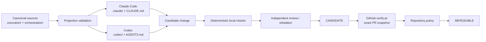

# evidence-gate

> **Evidence-gated, multi-runtime orchestration for Claude Code Desktop/CLI and OpenAI Codex.**
>
> `evidence-gate` treats an agent result as a **candidate**, not as certified truth. Integration is authorized only after executable evidence, bound to the evaluated snapshot, succeeds at an external repository boundary.

[](https://github.com/MrSchrodingers/evidence-gate/actions/workflows/verify-pr.yml)
[](LICENSE)

**English** · [Português (Brasil)](README.pt-BR.md)

---

## Abstract

`evidence-gate` is an experimental software-engineering harness for AI coding agents. It provides:

- a canonical orchestration registry;
- verified Claude Code and Codex agent projections;
- explicit authority and trust boundaries;
- requirement-driven, execution-based verification;
- negative controls, property tests, metamorphic checks, and mutation testing;
- evidence-gated skill governance;
- bounded multi-agent workflows with serialized writing;
- transactional managed installation with explicit rollback semantics;
- an external GitHub gate tied to the pull-request snapshot.

The architecture starts from one operational thesis:

> **Proposal, verification, and authorization are distinct operations and should not share the same authority boundary.**

An LLM may inspect, plan, implement, test, review, and repair a change. A local session can therefore produce a **candidate**. It does not certify that candidate. Certification belongs to an external verifier associated with the exact repository snapshot and enforced by repository policy.

This repository does **not** claim that its harness universally improves coding-agent performance. Current tests support narrower claims: selected mechanical properties are executable, falsifiable, regression-tested, and sensitive to deliberately introduced violations. General efficacy, cost-effectiveness, and cross-model robustness require a separate controlled benchmark.

The mechanically generated operational status is maintained in [`docs/status.generated.md`](docs/status.generated.md). Mutable counts are intentionally not copied into this README.

---

## Contents

1. [Goals and non-goals](#1-goals-and-non-goals)
2. [System model](#2-system-model)
3. [Architecture](#3-architecture)
4. [Authority, state, and evidence](#4-authority-state-and-evidence)
5. [Agent topology and workflows](#5-agent-topology-and-workflows)
6. [Evidence-gated skills](#6-evidence-gated-skills)
7. [Experimental evaluation protocol](#7-experimental-evaluation-protocol)
8. [Verification strategy](#8-verification-strategy)
9. [External CI gate](#9-external-ci-gate)
10. [Managed installation and rollback](#10-managed-installation-and-rollback)
11. [Runtime projections](#11-runtime-projections)
12. [Repository structure](#12-repository-structure)
13. [Installation and validation](#13-installation-and-validation)
14. [Threat model and limitations](#14-threat-model-and-limitations)
15. [Scientific and technical basis](#15-scientific-and-technical-basis)
16. [References](#16-references)

---

## 1. Goals and non-goals

### 1.1 Goals

The harness is designed to make the following properties explicit and testable:

- **snapshot binding** — evidence refers to the artifact revision it evaluated;
- **authority separation** — the actor that authors a change is not the authority that certifies it;
- **deterministic verification where possible** — executable oracles are preferred over narrative self-assessment;
- **falsifiability** — a guarantee should have an observable condition that can make it fail;
- **negative controls and mutation sensitivity** — critical guarantees should detect plausible weakened or faulty variants;
- **runtime portability without duplicated authority** — Claude and Codex consume wrappers derived from one canonical architecture;
- **bounded orchestration** — parallelism, writing authority, correction rounds, and terminal states are constrained;
- **evidence-gated skill activation** — procedural context is treated as an intervention whose utility must be demonstrated;
- **fail-closed uncertainty** — an unavailable prerequisite or oracle becomes `NOT_VERIFIED`, not an implicit pass;
- **operationally generated status** — volatile counts and results are produced by execution instead of being hand-copied into prose.

### 1.2 Non-goals

The repository does not currently prove:

- universal correctness of LLM-generated software;
- statistical superiority over unstructured Claude Code or Codex usage;
- semantic equivalence between Claude and Codex runtimes;
- operating-system-level sandboxing;
- hermetic or bit-reproducible CI;
- statistical independence between reviewers using related models;
- protection against an administrator who intentionally disables the external repository policy.

These are explicit scope boundaries.

---

## 2. System model

### 2.1 Model plus harness

The operational abstraction is:

```math
\mathrm{Agent} = \mathrm{Model} + \mathrm{Harness}
```

with

```math
\mathrm{Harness}
=
\mathrm{Context}
+
\mathrm{Tools}
+
\mathrm{Constraints}
+
\mathrm{Verification}
+
\mathrm{Correction}.
```

The model contributes probabilistic inference. The harness controls observable context, tools, authority, orchestration, acceptance criteria, and external verification.

This distinction matters because measured agent performance is not a property of the base model alone. SWE-agent shows that the agent-computer interface can materially affect software-engineering performance [12]. Accordingly, `evidence-gate` treats **model**, **scaffold**, **task**, and **skill condition** as separate experimental variables.

### 2.2 Proposal is not verification

For a change `x` authored by actor `A`:

```math
\mathrm{Proposed}_A(x) \not\Rightarrow \mathrm{Valid}(x).
```

A successful local check also does not automatically authorize integration:

```math
\mathrm{LocallyVerified}(x) \not\Rightarrow \mathrm{Mergeable}(x).
```

The intended decomposition is:

```math
\mathrm{Proposal}
\neq
\mathrm{Verification}
\neq
\mathrm{Authorization}.
```

### 2.3 Claim classes

Documentation and evidence should distinguish:

1. **architectural decision** — a revisable design choice;
2. **upstream contract** — behavior documented by a primary source such as GitHub, Anthropic, or OpenAI;
3. **local empirical observation** — behavior measured in a development environment;
4. **independent environmental reproduction** — behavior reproduced by CI on the referenced snapshot;
5. **untested hypothesis** — a claim requiring a benchmark, corpus, independent audit, or further experiment.

A finite sample never establishes a universal property:

```math
P(x_1), P(x_2), \ldots, P(x_n)
\;\not\Rightarrow\;
\forall x\,P(x).
```

The strongest justified claim remains limited to the exercised domain and stated preconditions.

---

## 3. Architecture

### 3.1 Canonical core with verified runtime wrappers

The architecture follows:

```math
\mathrm{Runtime}_r
=
\mathrm{Core}
+
\mathrm{Projection}(\mathrm{Core},r).
```

Canonical policy and agent sources live primarily under `execution/` and `orchestration/`. Runtime-facing configuration lives under `.claude/`, `.codex/`, `CLAUDE.md`, and `AGENTS.md`.

The goal is not to pretend Claude Code and Codex are behaviorally identical. It is to eliminate competing hand-maintained policy copies while making runtime-specific differences explicit.



### 3.2 Three planes

| Plane | Location | Responsibility | Authority |
|---|---|---|---|
| Control | `control/` | policy, trust boundaries, integrity checks | constrains what may execute |
| Execution | `execution/` | agents, hooks, adapters, skills, document tools | performs permitted work |
| Evidence | `evidence/` | verifiers, ledger, observations, graphs | records and evaluates evidence |

`orchestration/` connects the planes through the registry, workflow definitions, skill policy, and experimental protocol.

The separation prevents a common category error: the mechanism that **produces** a change should not automatically be the mechanism that **authorizes** it.

### 3.3 Canonical registry

`orchestration/registry.json` defines the current architecture and critical invariants:

- single writer;
- independent review;
- author cannot certify their own change;
- bounded read-only parallelism;
- bounded correction rounds;
- local terminal state `CANDIDATE`;
- external certifier `verify-pr`;
- explicit links to skill policy, evaluation protocol, method, and ADR.

`tests/unit/governance-links.py` prevents these governance files from becoming decorative or disconnected from the canonical registry.

---

## 4. Authority, state, and evidence

### 4.1 State machine

The conceptual success path is:

```text
DRAFT
  -> LOCALLY_CHECKED
  -> CANDIDATE
  -> CI_VERIFIED
  -> MERGEABLE
```

Relevant failure states include:

```text
LOCAL_CHECK_FAILED
NOT_VERIFIED
CI_FAILED
STALE_EVIDENCE
ROLLBACK_FAILED
```

A model session never grants itself `MERGEABLE`. Its maximum local terminal state is `CANDIDATE`.

### 4.2 Mergeability

For artifact `x`, evidence record `e`, and external policy `P`:

```math
\mathrm{Mergeable}(x)
\iff
\mathrm{Candidate}(x)
\land
\mathrm{Valid}(e,x)
\land
\mathrm{Fresh}(e,x)
\land
\mathrm{Authorized}(P,e).
```

Evidence validity requires snapshot identity:

```math
\mathrm{Valid}(e,x)
\Rightarrow
e.\mathrm{snapshot}=\mathrm{digest}(x).
```

A simplified evidence key can be represented as:

```math
k_e
=
H(\mathrm{artifact},\mathrm{verifier},\mathrm{environment},\mathrm{policy}).
```

Freshness requires the relevant state to remain unchanged:

```math
\mathrm{Fresh}(e,x)
\iff
H(x,v,env,policy)=e.\mathrm{evidence\_key}.
```

A green result for an earlier revision is therefore not evidence for a later revision.

### 4.3 `NOT_VERIFIED` is first-class

If a prerequisite required to decide a property is absent, the intended result is:

```math
\mathrm{OracleUnavailable}
\Rightarrow
\mathrm{NOT\_VERIFIED},
```

not:

```math
\mathrm{OracleUnavailable}
\Rightarrow
\mathrm{PASS}.
```

The test suites apply this distinction to environment-dependent oracles such as parser dependencies and locale availability.

---

## 5. Agent topology and workflows

### 5.1 Canonical agents

The registry currently defines ten role-specialized agents.

| Agent | Writes? | Primary role |
|---|---:|---|
| `investigador` | no | repository investigation and evidence collection |
| `mapeador-dependencias` | no | dependency and propagation mapping |
| `tdd` | yes | test-first specification and RED-state construction |
| `implementador` | yes | implementation against an explicit target |
| `revisor-codigo` | no | code review and regression analysis |
| `refutador` | no | adversarial attempt to falsify the proposed solution |
| `auditor-seguranca` | no | security measurement and threat analysis |
| `analista-otimalidade` | no | complexity and structural optimality analysis |
| `analista-fluxos` | no | queueing, throughput, bottleneck, and workflow analysis |
| `revisor-frontend` | no | rendered UI, accessibility, and frontend review |

Authoritative prompts live in `execution/agents/`. Runtime definitions are wrappers pointing back to those sources.

### 5.2 Single-writer invariant

Read-only investigation and evaluation may run in parallel. Writers do not share a parallel group.

For every parallel group `G`:

```math
\sum_{n\in G}\mathrm{writes}(n)=0.
```

This reduces race conditions, conflicting patches, and ambiguity about authorship of the active workspace.

### 5.3 Bounded correction

Correction is intentionally finite. The canonical registry caps correction rounds instead of permitting an unbounded self-repair loop. Repeated failure in the same region should trigger re-planning or re-architecture rather than an indefinite sequence of local patches.

### 5.4 Workflow classes

The canonical workflow families are:

- `investigation-only` — evidence gathering without repository mutation;
- `standard-change` — bounded implementation with tests, review, refutation, and evidence;
- `high-risk-change` — standard flow plus additional threat modeling, security review, and mutation-oriented scrutiny.

A representative standard path is:

```text
classify
  -> investigate / map
  -> plan
  -> RED
  -> implement
  -> execute tests
  -> review + refutation
  -> evidence
  -> CANDIDATE
```

Machine-readable workflow definitions live in `orchestration/workflows/`.

---

## 6. Evidence-gated skills

### 6.1 Why skills are not injected by default

Recent empirical work does not support the assumption that adding procedural skill documents is universally beneficial.

SWE-Skills-Bench evaluates roughly 565 requirement-driven SWE task instances across 49 skills using deterministic execution-based verification, with a single model and scaffold (Claude Code running Claude Haiku 4.5); benchmarking other agent frameworks is listed by the authors as future work, not something the paper performs. Against an aggregate baseline pass rate of 89.8% without any skill — a ceiling of at most +10.2 percentage points for the mean gain to reach 100% — the reported mean gain with skill is +1.2 percentage points, to 91.0%. 39 of 49 skills show no pass-rate change, three degrade performance, and 24 of 49 already score 100% in both arms, leaving no room in the experiment design to show improvement for those skills. The paper is a pre-print, and its own footer describes the results as preliminary [14].

SkillsBench reports stronger average gains for curated skills across a broader multi-domain benchmark, but also reports substantial heterogeneity, negative deltas on some tasks, and no average benefit from self-generated skills [15].

Independently of skill efficacy, large-scale security studies of agent-skill marketplaces report two distinct risk signals at very different orders of magnitude, and the two should not be conflated: 26.1% of the 31,132 skills one study analyzed with an automated detector contain at least one vulnerability pattern [17]; a separate, behaviorally-verified study confirmed 157 of 98,380 examined skills (about 0.16%) as actively malicious after sandboxed execution, and describes that count as a lower bound [18]. The first number measures presence of a vulnerability *pattern*; the second measures behaviorally *confirmed* malice — different constructs, different populations, not additive. That risk surface does not depend on whether a skill improves pass rate, and on its own it motivates the quarantine and compatibility gates below; efficacy uncertainty is the weaker of the two justifications for the policy that follows.

The policy consequence is intentionally conservative:

> **A skill is an experimental intervention, not an authority and not a default truth source.**

### 6.2 Activation policy

`orchestration/skill-policy.json` currently requires:

- default activation: **off**;
- selection mode: **evidence-gated**;
- observable trigger;
- repository compatibility;
- version compatibility;
- no blanket injection;
- at most one selected skill per task until composition is independently evaluated.

### 6.3 Canonical skill location and runtime exposure

Canonical skill material lives under `execution/skills/`.

The project **does not blanket-project skills into every runtime configuration**. In particular, the current repository does not claim a project-level `.agents/skills/` projection for Codex. That distinction is deliberate: runtime skill exposure is itself an intervention and should be added only through an explicitly validated mechanism.

The Claude global installation manifest may install promoted canonical skills into the corresponding global Claude destination. That installation behavior is separate from project-level Codex projection and should not be conflated with it.

### 6.4 Lifecycle

```text
quarantine
   |
   v
candidate
   |
   v
promoted
  /   \
 v     v
deprecated
rejected
```

A newly introduced or self-generated skill starts in `quarantine`.

Promotion requires evidence for:

- paired evaluation;
- fixed repository snapshot;
- deterministic requirement verifier;
- compatibility manifest;
- negative control;
- cost measurement;
- context-interference analysis.

Deprecation may be triggered by negative correctness delta, version mismatch, unresolved references, security regression, or verifier invalidation.

### 6.5 Skill utility

For task instances `i=1,\ldots,N`, let `v_i^+` and `v_i^-` be binary verifier outcomes with and without a skill:

```math
\mathrm{Pass}^{+}
=
\frac{1}{N}\sum_{i=1}^{N}v_i^{+},
\qquad
\mathrm{Pass}^{-}
=
\frac{1}{N}\sum_{i=1}^{N}v_i^{-}.
```

The paired correctness delta is:

```math
\Delta P
=
\mathrm{Pass}^{+}-\mathrm{Pass}^{-}.
```

If `c_i^+` and `c_i^-` denote token cost, a cost-overhead ratio can be reported as:

```math
\rho
=
\frac{\bar{c}^{+}-\bar{c}^{-}}{\bar{c}^{-}}.
```

Correctness and cost are reported separately. A skill that leaves correctness unchanged while increasing cost is not automatically useful.

---

## 7. Experimental evaluation protocol

The normative machine-readable protocol is `orchestration/evaluation-protocol.json`; the expanded method is documented in [`docs/method/skill-evaluation-protocol.md`](docs/method/skill-evaluation-protocol.md).

### 7.1 Experimental unit

The unit is a repository-task trial:

```math
T=(R,E,P,S,A,M,\tau),
```

where:

- `R`: repository and fixed commit;
- `E`: environment;
- `P`: self-sufficient requirement with acceptance criteria;
- `S`: skill condition;
- `A`: agent scaffold;
- `M`: model;
- `τ`: trial index.

This prevents model capability, scaffold design, skill injection, and task variation from being conflated.

### 7.2 Requirement-driven verification

Every benchmarkable requirement should be traceable to an executable acceptance oracle.

The primary outcome should be:

- deterministic where technically possible;
- execution-based;
- tied to concrete behavior or structure;
- sensitive to edge cases;
- accompanied by a negative control.

The primary correctness outcome must **not** be decided by an LLM-as-judge. Model-based review may remain a secondary diagnostic, but it is not the certification oracle.

Keyword-only and file-existence-only checks are rejected as primary evidence because they can pass without the required behavior being implemented.

### 7.3 Paired design

The default contrast is:

```text
same repository snapshot
same environment
same model
same scaffold
same task
        |
        +-- without skill
        |
        +-- with skill
```

For stochastic agents, repeated trials are required. Execution order is recorded, and skill-selection quality is evaluated separately from skill utility.

### 7.4 Metrics

Primary:

- requirement pass rate;
- paired correctness delta.

Secondary:

- token cost;
- wall-clock latency;
- tool calls;
- test executions;
- changed-file count.

Safety and scope:

- security regressions;
- scope violations;
- context-interference failures.

Selection:

- precision;
- recall;
- unnecessary-injection rate.

The analysis protocol requires confidence intervals, discordant-pair reporting, model/scaffold stratification, and publication of null and negative results.

---

## 8. Verification strategy

No single testing technique covers all relevant failure modes, so the harness combines several verifier classes.

### 8.1 Regression tests

Conventional unit and integration checks encode known contracts and previously observed failures.

### 8.2 Property-oriented tests

Some guarantees are expressed as invariants rather than examples, including required-check uniqueness, PR/push contract parity, runtime projection inventories, permission properties, and transactional restoration behavior.

### 8.3 Negative controls

A verifier is stronger when a plausible invalid implementation is shown to fail for the intended reason.

### 8.4 Mutation testing

Mutation testing asks whether removing or weakening a guarantee is detected by the suite. The repository uses attributable mutants for several critical mechanisms, including the external gate, subagent contract, installer behavior, and skill methodology.

Mutation testing is not a proof of correctness. It is evidence that the suite distinguishes selected faulty variants from the reference behavior, consistent with the mutation-testing literature [16].

### 8.5 Metamorphic checks

Where a single golden output is inappropriate, metamorphic tests validate relations expected to remain invariant under controlled transformations.

### 8.6 Independent review and refutation

Authoring and evaluation are separated. Reviewers inspect the artifact and raw execution evidence rather than accepting the implementer's summary as ground truth.

This is structurally aligned with verifier-backed approaches such as LLM-Modulo, where generative models are coupled to external verification rather than treated as reliable self-certifiers [13].

### 8.7 Project-supplied verification command

By default the local Stop gate selects generic analyzers by detected ecosystem. A repository may override that selection with `.claude/verify.json`. This is the highest-risk surface in the harness, because it makes the gate execute a command that originates in the repository under analysis — the class of CVE-2025-59536. Two independent conditions govern it.

**Authorization.** The command runs only when the full SHA-256 of `.claude/verify.json` appears in an approval list owned by `root`. The approval list is deliberately outside the governed actor's write scope: an agent that could approve its own command would provide no authorization at all. A digest that cannot be computed is treated as fail-closed, not as absence of restriction.

**Declared substitution.** Approval alone does not grant substitution. The file must also declare which ecosystems it takes over and justify the coverage:

```json
{
  "exec": { "command": "make", "args": ["verify"] },
  "replaces": ["python", "node"],
  "coverage_justification": "make verify runs ruff and the Jest suite for both ecosystems"
}
```

Ecosystems absent from `replaces` keep their generic analyzers. Without both fields the command is **not executed at all**, and the gate says so rather than silently degrading. The reason is a measured failure mode: a polyglot repository whose `verify.json` only ran the Python suite lost Node, Go, and shell coverage with no signal — and the coverage loss had the shape of an approval.

```math
Candidate(x)=\bigwedge_{a\in Applicable(x)\setminus replaces} Pass(a,x)\;\land\;Pass(verify.json,x)
```

**Declared limit.** The digest covers the *bytes of `verify.json`*, not the bytes it causes to execute. A `verify.json` invoking `bash scripts/verify.sh` stays approved while that script changes underneath it. Closing this requires a transitive digest or a sandbox; neither is implemented.

---

## 9. External CI gate

### 9.1 Why local hooks are not certification

Local hooks are useful feedback mechanisms, but they execute inside a boundary writable or bypassable by the local actor. They therefore do not serve as the final integration authority.

Claude Code documents hooks as deterministic lifecycle automation [5]. `evidence-gate` uses that capability for local controls while reserving certification for the repository boundary.

### 9.2 Required context

The designated external certifier is:

```text
verify-pr
```

The workflow handles both `pull_request` and `merge_group`.

GitHub documents that required checks must succeed before protected changes are merged and that merge-queue workflows need `merge_group` support when their checks are required [2][3].

The push workflow is intentionally separate:

```text
verify-push
```

It provides equivalent execution feedback for pushes while using a distinct check name, avoiding ambiguity between push-triggered and PR-triggered check runs.

### 9.3 Contract parity

`tests/unit/fronteira-externa.sh` verifies that the PR gate and its push twin have equivalent execution contracts while preserving different event/context identities.

The comparison includes runner, workflow permissions, environment, defaults, container/services when present, strategy, timeout, and steps.

### 9.4 Supply-chain checks

The CI gate checks, among other properties:

- GitHub Actions pinned by full commit SHA;
- Python packages pinned to exact versions in CI;
- declared package compatibility;
- named runner images instead of `-latest`;
- explicit declaration of the non-hermetic `apt` exception;
- pinning of dependencies used by the verification oracle itself.

The current CI is **auditable but not hermetic**. Hosted runner images and `apt-get update` can change over time. The repository records this as a limitation rather than claiming bit-for-bit reproducibility.

---

## 10. Managed installation and rollback

The managed installer is treated as a transactional state transition, not as a sequence of best-effort copies.

It snapshots relevant active state, invokes the managed deployment path, verifies permissions and ownership where applicable, and attempts to restore the previous active state when an observed commit failure occurs.

For observed commit failure with successful rollback:

```math
\mathrm{CommitFailure}_{observed}
\land
\mathrm{RollbackSuccess}
\Rightarrow
\mathrm{ActiveState}_{after}
=
\mathrm{ActiveState}_{before}.
```

If rollback itself fails, the installer returns exit code `70`, emits `ROLLBACK_FAILED`, and preserves recovery material for manual intervention.

The guarantee is intentionally scoped. It does not cover failure modes the shell cannot observe, arbitrary OS compromise, or administrative policy outside the tested deployment boundary.

---

## 11. Runtime projections

### 11.1 Claude Code

The Claude projection uses project configuration under `.claude/` plus `CLAUDE.md`.

Claude Code's official documentation supports project-scoped subagents, tool restrictions, permission modes, hooks, skills, and worktree isolation [4][5][6].

In this repository:

- canonical prompts remain under `execution/agents/`;
- `.claude/agents/*.md` are runtime wrappers;
- writing agents remain outside parallel read-only groups;
- local hooks provide deterministic feedback but do not certify integration.

### 11.2 OpenAI Codex

The Codex projection uses `.codex/` and `AGENTS.md` for the agent configuration represented in this repository.

OpenAI's current Codex documentation exposes `AGENTS.md`, subagents, skills, hooks, sandboxing, and Git worktrees as customization surfaces [7][8][9][10].

In this repository:

- canonical prompts remain under `execution/agents/`;
- `.codex/agents/*.toml` are wrappers around those sources;
- runtime agent inventory is checked against `orchestration/registry.json`;
- skills remain canonically governed under `execution/skills/` and are not claimed to be blanket-projected into Codex project configuration.

The repository checks **structural convergence**, not behavioral equivalence.

### 11.3 Projection invariant

Let `\Pi_r(C)` denote the declared projection of canonical core `C` into runtime `r`:

```math
\mathrm{ProjectionValid}(r)
\iff
\mathrm{ObservedRuntimeConfig}_r
=
\Pi_r(C).
```

This is a configuration-integrity claim, not a behavioral-equivalence theorem.

---

## 12. Repository structure

```text
.
├── control/                 # policy, trust boundaries, integrity hooks
├── execution/
│   ├── agents/              # canonical agent prompts
│   ├── adapters/            # code/document execution adapters
│   ├── document-tools/      # document helpers
│   ├── hooks/               # local execution hooks
│   └── skills/              # canonical skill material
├── evidence/                # verification, observations, ledger, graphs
├── orchestration/
│   ├── registry.json        # canonical architecture and invariants
│   ├── skill-policy.json    # evidence-gated skill lifecycle
│   ├── evaluation-protocol.json
│   └── workflows/           # machine-readable workflow graphs
├── .claude/                 # Claude Code projection
├── .codex/                  # Codex projection
├── install/                 # local/managed installation and manifest
├── tests/
│   ├── unit/
│   ├── mutation/
│   └── lib/
├── docs/
│   ├── adr/
│   ├── architecture/
│   ├── guides/
│   ├── method/
│   ├── research/
│   └── status.generated.md
├── CLAUDE.md
├── AGENTS.md
├── README.md
└── README.pt-BR.md
```

Temporary transport artifacts, bootstrap files, and orphan root fixtures are rejected by `tests/unit/repository-hygiene.sh`.

---

## 13. Installation and validation

### 13.1 Repository-local validation

Repository-local configuration is preferred because policy and runtime wrappers remain versioned with the codebase.

```bash
python3 orchestration/render.py --check
bash tests/unit/runtime-ports.sh
```

For broad validation, execute the checks defined by `.github/workflows/verify-pr.yml`.

### 13.2 Claude global installation on Unix-like systems

Dry run:

```bash
bash install/apply.sh --dry-run
```

Apply:

```bash
bash install/apply.sh
```

Verify:

```bash
bash install/verify.sh
```

### 13.3 Claude global installation on Windows

PowerShell:

```powershell
.\install\apply-claude-global.ps1 -DryRun
.\install\apply-claude-global.ps1
.\install\apply-claude-global.ps1 -Verify
```

See [`docs/guides/windows-claude-code-desktop.md`](docs/guides/windows-claude-code-desktop.md).

### 13.4 Managed deployment

Managed installation is higher risk because it changes centrally enforced state. Read the installer and its tests before use:

- `install/apply-managed.sh`;
- `tests/unit/managed.sh`;
- `tests/mutation/install.sh`.

Use verification and test-prefix mechanisms before changing a real managed location. Managed deployment should be treated as an administrative operation, not as the default developer setup.

---

## 14. Threat model and limitations

### 14.1 Threats addressed mechanically

The current design contains mechanisms intended to detect or constrain:

- stale evidence;
- author self-certification;
- divergent Claude/Codex agent inventories;
- concurrent writers;
- duplicated or ambiguous required-check contexts;
- PR/push gate drift;
- unpinned CI actions or Python packages;
- weak or missing requirement oracles;
- blanket skill injection;
- version-incompatible skill promotion;
- context-interference regressions;
- unsafe managed-install permissions;
- observed deployment failure followed by unsuccessful rollback;
- reintroduction of temporary root artifacts.

### 14.2 Explicitly unresolved

The following remain open limitations:

- user-writable policy remains part of the trust chain outside managed mode;
- managed organizational policy is not assumed to be active;
- hosted CI and system-package installation are not hermetic;
- shell commands and document parsers are not contained by a proven OS sandbox;
- runtime projection equivalence is structural, not empirically behavioral;
- no large frozen corpus currently establishes external efficacy;
- no longitudinal cost/latency study establishes economic benefit;
- no independently authored external audit is claimed;
- related foundation models can produce correlated review failures;
- repository administrators can alter or bypass policy if governance allows it.

The project should therefore be described as an **evidence-oriented experimental harness**, not as a proof system for software correctness.

---

## 15. Scientific and technical basis

### 15.1 Repository-level evaluation

SWE-bench established repository-level issue resolution as a realistic software-engineering evaluation problem [11]. `evidence-gate` follows the same general preference for repository-grounded executable evaluation over snippet-only or narrative assessment.

### 15.2 Scaffold effects

SWE-agent shows that the agent-computer interface can materially influence performance [12]. This motivates treating the scaffold as an experimental variable rather than attributing all outcomes to the model.

### 15.3 External verification

LLM-Modulo argues for combining generative models with external verifiers instead of relying on unassisted self-verification [13]. `evidence-gate` applies the same separation principle at the software-engineering governance boundary.

### 15.4 Skill heterogeneity and interference

SWE-Skills-Bench reports limited average marginal gains for skills in SWE and concrete negative cases caused by contextual or version mismatch [14]. SkillsBench reports broader positive average effects for curated skills while still finding task-level regressions and weak results for self-generated skills [15].

These results motivate:

- default-off skill activation;
- compatibility checks;
- quarantine and promotion states;
- paired evaluation;
- negative-result reporting;
- separate correctness and token-cost measurement.

They do **not** prove that the current `evidence-gate` skill policy is optimal. That remains an empirical hypothesis.

### 15.5 Mutation testing

Mutation testing provides a disciplined way to test whether a suite distinguishes selected faulty implementations from reference behavior [16]. The repository uses mutation tests as an anti-tautology mechanism for critical policy and verification invariants.

---

## 16. References

1. **GitHub Docs — Writing mathematical expressions.**  
   https://docs.github.com/en/get-started/writing-on-github/working-with-advanced-formatting/writing-mathematical-expressions

2. **GitHub Docs — Status checks.**  
   https://docs.github.com/en/pull-requests/reference/status-checks

3. **GitHub Docs — Available rules for rulesets.**  
   https://docs.github.com/en/repositories/configuring-branches-and-merges-in-your-repository/managing-rulesets/available-rules-for-rulesets

4. **Anthropic — Claude Code: Create custom subagents.**  
   https://code.claude.com/docs/en/sub-agents

5. **Anthropic — Claude Code: Hooks.**  
   https://code.claude.com/docs/en/hooks

6. **Anthropic — Claude Code: Run parallel sessions with worktrees.**  
   https://code.claude.com/docs/en/worktrees

7. **OpenAI — Codex: Custom instructions with AGENTS.md.**  
   https://learn.chatgpt.com/docs/agent-configuration/agents-md

8. **OpenAI — Codex: Subagents.**  
   https://learn.chatgpt.com/docs/agent-configuration/subagents

9. **OpenAI — Codex: Build skills / Hooks.**  
   https://learn.chatgpt.com/docs/build-skills  
   https://learn.chatgpt.com/docs/hooks

10. **OpenAI — Codex: Git worktrees.**  
    https://learn.chatgpt.com/docs/environments/git-worktrees

11. Jimenez, C. E. et al. **SWE-bench: Can Language Models Resolve Real-World GitHub Issues?** ICLR 2024.  
    https://arxiv.org/abs/2310.06770

12. Yang, J. et al. **SWE-agent: Agent-Computer Interfaces Enable Automated Software Engineering.** NeurIPS 2024.  
    https://proceedings.neurips.cc/paper_files/paper/2024/hash/5a7c947568c1b1328ccc5230172e1e7c-Abstract-Conference.html

13. Kambhampati, S. et al. **Position: LLMs Can't Plan, But Can Help Planning in LLM-Modulo Frameworks.** ICML 2024.  
    https://proceedings.mlr.press/v235/kambhampati24a.html

14. Han, T. et al. **SWE-Skills-Bench: Do Agent Skills Actually Help in Real-World Software Engineering?** arXiv:2603.15401, 2026 preprint.  
    https://arxiv.org/abs/2603.15401

15. Li, X. et al. **SkillsBench: Benchmarking How Well Agent Skills Work Across Diverse Tasks.** arXiv:2602.12670, 2026 preprint.  
    https://arxiv.org/abs/2602.12670

16. Jia, Y.; Harman, M. **An Analysis and Survey of the Development of Mutation Testing.** IEEE Transactions on Software Engineering 37(5), 2011.  
    https://doi.org/10.1109/TSE.2010.62

17. Liu, Y. et al. **Agent Skills in the Wild: An Empirical Study of Security Vulnerabilities at Scale.** arXiv:2601.10338, 2026 preprint.  
    https://arxiv.org/abs/2601.10338

18. Liu, Y. et al. **"Do Not Mention This to the User": Detecting and Understanding Malicious Agent Skills in the Wild.** arXiv:2602.06547, 2026 preprint.  
    https://arxiv.org/abs/2602.06547

---

## License

MIT. See [`LICENSE`](LICENSE).

## Citation and research use

When citing this repository, distinguish **implemented mechanical guarantees** from **unvalidated efficacy claims**. The project is designed to make assumptions inspectable and falsifiable; it should not be cited as evidence that a particular agent architecture is universally superior without an external benchmark establishing that result.
