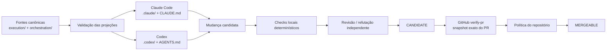
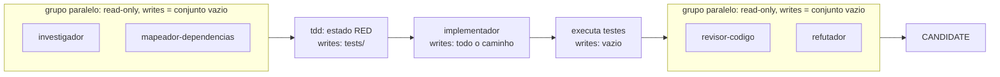
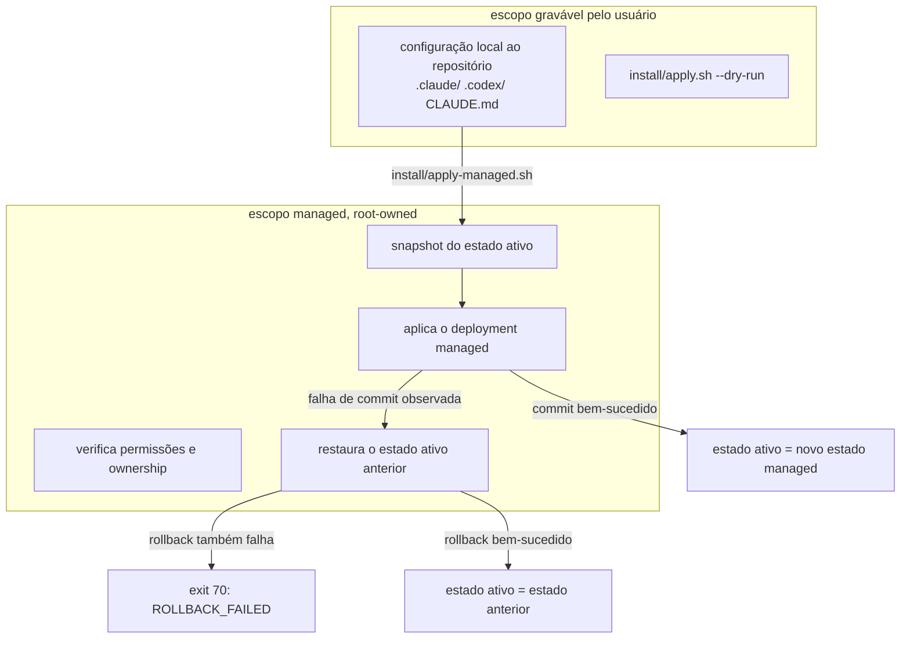
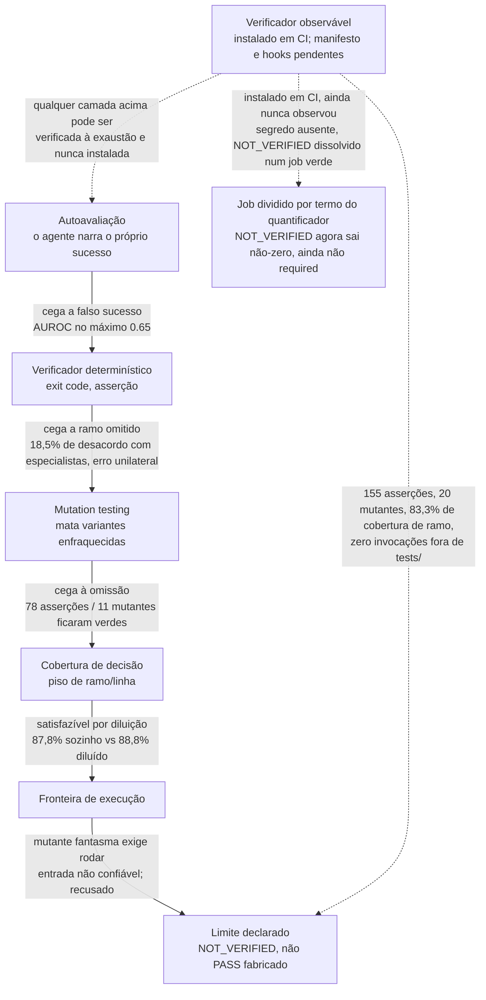

<p align="center">
  
</p>

> **Orquestração multirruntime, governada por evidência, para Claude Code Desktop/CLI e OpenAI Codex.**
>
> O `tollens` trata o resultado de um agente como **candidato**, não como verdade certificada. A integração só é autorizada depois que evidência executável, vinculada ao snapshot avaliado, é aprovada em uma fronteira externa do repositório.

[](https://github.com/MrSchrodingers/tollens/actions/workflows/verify-pr.yml)
[](LICENSE)

[English](README.md) · **Português (Brasil)**

---

## Resumo

`tollens` é um harness experimental de engenharia de software para agentes de programação baseados em IA. O projeto fornece:

- registry canônico de orquestração;
- projeções verificadas de agentes para Claude Code e Codex;
- fronteiras explícitas de autoridade e confiança;
- verificação orientada por requisitos e baseada em execução;
- controles negativos, testes de propriedades, testes metamórficos e mutation testing;
- governança evidence-gated de skills;
- workflows multiagente limitados, com escrita serializada;
- instalação managed transacional com semântica explícita de rollback;
- gate externo no GitHub vinculado ao snapshot do pull request.

A arquitetura parte de uma tese operacional simples:

> **Proposta, verificação e autorização são operações distintas e não devem compartilhar a mesma fronteira de autoridade.**

Um LLM pode investigar, planejar, implementar, testar, revisar e reparar uma mudança. Uma sessão local pode, portanto, produzir um **candidato**. Ela não certifica esse candidato. A certificação pertence a um verificador externo associado ao snapshot exato e aplicado por política do repositório.

Uma segunda tese, mais estreita, governa as camadas de verificação especificamente compostas nas seções 8 e 15:

> **Toda camada de verificação é cega a uma classe específica de defeito, e essa cegueira só se fecha subindo de checagem sobre texto para execução — até um limite que é fronteira de segurança, não lacuna de engenharia.**

Autoavaliação, verificação determinística, mutation testing e medição de cobertura de decisão capturam, cada uma, uma classe de defeito que a camada anterior não via; a seção 15.6 desenvolve a cadeia inteira e sua evidência.

O projeto **não** afirma que seu harness melhora universalmente o desempenho de agentes de código. Os testes atuais sustentam claims mais estreitos: determinadas propriedades mecânicas são executáveis, falsificáveis, cobertas por regressão e sensíveis a violações introduzidas deliberadamente. Eficácia geral, custo-benefício e robustez entre modelos exigem benchmark controlado próprio.

O estado operacional gerado mecanicamente é mantido em [`docs/status.generated.md`](docs/status.generated.md). Contagens mutáveis são propositalmente evitadas neste README.

---

## Sumário

1. [Objetivos e não objetivos](#1-objetivos-e-não-objetivos)
2. [Modelo do sistema](#2-modelo-do-sistema)
3. [Arquitetura](#3-arquitetura)
4. [Autoridade, estados e evidência](#4-autoridade-estados-e-evidência)
5. [Topologia de agentes e workflows](#5-topologia-de-agentes-e-workflows)
6. [Skills governadas por evidência](#6-skills-governadas-por-evidência)
7. [Protocolo experimental de avaliação](#7-protocolo-experimental-de-avaliação)
8. [Estratégia de verificação](#8-estratégia-de-verificação)
9. [Gate externo de CI](#9-gate-externo-de-ci)
10. [Instalação managed e rollback](#10-instalação-managed-e-rollback)
11. [Projeções por runtime](#11-projeções-por-runtime)
12. [Estrutura do repositório](#12-estrutura-do-repositório)
13. [Instalação e validação](#13-instalação-e-validação)
14. [Threat model e limitações](#14-threat-model-e-limitações)
15. [Fundamentação científica e técnica](#15-fundamentação-científica-e-técnica)
16. [Referências](#16-referências)

---

## 1. Objetivos e não objetivos

### 1.1 Objetivos

O harness foi concebido para tornar explícitas e testáveis as seguintes propriedades:

- **vínculo ao snapshot** — a evidência referencia a revisão do artefato que efetivamente avaliou;
- **separação de autoridade** — o ator que produz uma mudança não é a autoridade que a certifica;
- **verificação determinística quando possível** — oráculos executáveis são preferidos a autoavaliação narrativa;
- **falsificabilidade** — toda garantia deve possuir uma condição observável capaz de torná-la falsa;
- **controles negativos e sensibilidade a mutação** — garantias críticas devem detectar variantes plausivelmente enfraquecidas ou defeituosas;
- **portabilidade multirruntime sem autoridade duplicada** — Claude e Codex consomem wrappers derivados de uma arquitetura canônica única;
- **orquestração limitada** — paralelismo, autoridade de escrita, rodadas de correção e estados terminais são restringidos;
- **ativação evidence-gated de skills** — contexto procedural é tratado como intervenção cuja utilidade precisa ser demonstrada;
- **incerteza fail-closed** — dependência ou oráculo indisponível resulta em `NOT_VERIFIED`, nunca em aprovação implícita;
- **estado operacional gerado por execução** — contagens e resultados voláteis não são copiados manualmente para a narrativa.

### 1.2 Não objetivos

O repositório não prova, no estado atual:

- correção universal de software gerado por LLM;
- superioridade estatística sobre uso não estruturado de Claude Code ou Codex;
- equivalência semântica entre runtimes Claude e Codex;
- sandboxing em nível de sistema operacional;
- CI hermética ou reproduzível bit a bit;
- independência estatística entre revisores baseados em modelos relacionados;
- proteção contra um administrador que deliberadamente desative a política externa do repositório.

Esses itens são limites explícitos de escopo.

---

## 2. Modelo do sistema

### 2.1 Modelo mais harness

A abstração operacional é:

```math
\mathrm{Agent} = \mathrm{Model} + \mathrm{Harness}
```

com

```math
\mathrm{Harness}
=
\mathrm{Context}
+
\mathrm{Tools}
+
\mathrm{Constraints}
+
\mathrm{Verification}
+
\mathrm{Correction}.
```

O modelo contribui com inferência probabilística. O harness controla contexto observável, ferramentas, autoridade, orquestração, critérios de aceitação e verificação externa.

Essa distinção importa porque o desempenho medido de um agente não é propriedade exclusiva do modelo-base. SWE-agent mostra que a interface agente-computador pode alterar materialmente o desempenho em engenharia de software [2]. Por isso, `tollens` trata **modelo**, **scaffold**, **tarefa** e **condição de skill** como variáveis experimentais distintas.

### 2.2 Proposta não é verificação

Para uma mudança `x` proposta pelo ator `A`:

```math
\mathrm{Proposed}_A(x) \not\Rightarrow \mathrm{Valid}(x).
```

Uma verificação local bem-sucedida também não autoriza integração automaticamente:

```math
\mathrm{LocallyVerified}(x) \not\Rightarrow \mathrm{Mergeable}(x).
```

A decomposição pretendida é:

```math
\mathrm{Proposal}
\neq
\mathrm{Verification}
\neq
\mathrm{Authorization}.
```

### 2.3 Classes de afirmação

Documentação e evidência devem distinguir:

1. **decisão arquitetural** — escolha de projeto sujeita a revisão;
2. **contrato upstream** — comportamento documentado por fonte primária, como GitHub, Anthropic ou OpenAI;
3. **observação empírica local** — comportamento medido no ambiente de desenvolvimento;
4. **reprodução ambiental independente** — comportamento reproduzido pela CI sobre o snapshot referenciado;
5. **hipótese ainda não testada** — afirmação que exige benchmark, corpus, auditoria independente ou experimento adicional.

Observar uma amostra finita não estabelece uma propriedade universal:

```math
P(x_1), P(x_2), \ldots, P(x_n)
\;\not\Rightarrow\;
\forall x\,P(x).
```

A conclusão mais forte justificável permanece limitada ao domínio exercitado e às precondições declaradas.

---

## 3. Arquitetura

### 3.1 Núcleo canônico com wrappers de runtime verificados

A arquitetura segue:

```math
\mathrm{Runtime}_r
=
\mathrm{Core}
+
\mathrm{Projection}(\mathrm{Core},r).
```

As fontes canônicas de política e agentes vivem principalmente em `execution/` e `orchestration/`. Configurações voltadas aos runtimes vivem em `.claude/`, `.codex/`, `CLAUDE.md` e `AGENTS.md`.

O objetivo não é fingir que Claude Code e Codex são comportamentalmente idênticos. O objetivo é eliminar cópias manuais de política com autoridade concorrente, preservando diferenças específicas de runtime de forma explícita.



### 3.2 Três planos

| Plano | Localização | Responsabilidade | Autoridade |
|---|---|---|---|
| Controle | `control/` | política, fronteiras de confiança, checks de integridade | restringe o que pode executar |
| Execução | `execution/` | agentes, hooks, adaptadores, skills e ferramentas | executa trabalho permitido |
| Evidência | `evidence/` | verificadores, ledger, observações e grafos | registra e avalia evidência |

`orchestration/` conecta os planos por meio do registry, definições de workflow, política de skills e protocolo experimental.

Essa separação evita um erro categorial recorrente: o mecanismo que **produz** uma alteração não deve ser automaticamente o mecanismo que **autoriza** sua integração.

### 3.3 Registry canônico

`orchestration/registry.json` define a arquitetura atual e invariantes críticos:

- escritor único;
- revisão independente;
- autor não certifica a própria mudança;
- paralelismo read-only limitado;
- rodadas de correção limitadas;
- estado terminal local `CANDIDATE`;
- certificador externo `verify-pr`;
- links explícitos para política de skills, protocolo de avaliação, método e ADR.

`tests/unit/governance-links.py` impede que esses arquivos de governança se tornem decorativos ou desconectados do registry canônico.

---

## 4. Autoridade, estados e evidência

### 4.1 Máquina de estados

O caminho conceitual de sucesso é:

```text
DRAFT
  -> LOCALLY_CHECKED
  -> CANDIDATE
  -> CI_VERIFIED
  -> MERGEABLE
```

Estados relevantes de falha incluem:

```text
LOCAL_CHECK_FAILED
NOT_VERIFIED
CI_FAILED
STALE_EVIDENCE
ROLLBACK_FAILED
```

Uma sessão de modelo nunca se concede `MERGEABLE`. Seu estado terminal local máximo é `CANDIDATE`.

### 4.2 Mergeability

Para um artefato `x`, um registro de evidência `e` e uma política externa `P`:

```math
\mathrm{Mergeable}(x)
\iff
\mathrm{Candidate}(x)
\land
\mathrm{Valid}(e,x)
\land
\mathrm{Fresh}(e,x)
\land
\mathrm{Authorized}(P,e).
```

A validade exige identidade do snapshot:

```math
\mathrm{Valid}(e,x)
\Rightarrow
e.\mathrm{snapshot}=\mathrm{digest}(x).
```

Uma chave simplificada de evidência pode ser representada como:

```math
k_e
=
H(\mathrm{artifact},\mathrm{verifier},\mathrm{environment},\mathrm{policy}).
```

Frescura exige que o estado relevante permaneça inalterado:

```math
\mathrm{Fresh}(e,x)
\iff
H(x,v,env,policy)=e.\mathrm{evidence\_key}.
```

Um resultado verde para uma revisão anterior não constitui evidência para uma revisão posterior.

### 4.3 `NOT_VERIFIED` como estado de primeira classe

Se uma precondição necessária para decidir uma propriedade estiver ausente, o resultado pretendido é:

```math
\mathrm{OracleUnavailable}
\Rightarrow
\mathrm{NOT\_VERIFIED},
```

não:

```math
\mathrm{OracleUnavailable}
\Rightarrow
\mathrm{PASS}.
```

As suítes aplicam essa distinção a oráculos dependentes do ambiente, como dependências de parser e disponibilidade de locale.

### 4.4 Monotonicidade da observabilidade

O espaço de estados da seção 4.1 é uma ordem parcial, não total: `PASS` é o único topo; `FAIL` e `NOT_VERIFIED` ficam abaixo dele e são **incomparáveis** entre si, não `FAIL < NOT_VERIFIED < PASS` nem o inverso. O invariante subjacente:

```math
\mathrm{Information}(x') \subseteq \mathrm{Information}(x) \;\Rightarrow\; \mathrm{Verdict}(x') \not> \mathrm{Verdict}(x)
```

foi checado contra seis verificadores reais, cada um sob dois regimes de informação (acesso completo e um degradado), em vez de presumido. Uma ordem total `PASS > NOT_VERIFIED > FAIL` foi considerada e rejeitada por duas razões verificáveis de forma independente: o consumidor que age sobre o veredito (`verify-pr`, executado sem `continue-on-error`) só distingue exit `0` de não-zero, então ranquear `NOT_VERIFIED` acima de `FAIL` não tem referente operacional; e uma ordem total reprovaria uma correção que este repositório trata como deliberada — um token com escopo de administrador lendo o mesmo ruleset reporta `FAIL`, um token com escopo de CI e menos acesso de leitura reporta `NOT_VERIFIED` sobre a configuração idêntica, e os dois são o veredito correto para o que cada token conseguiu de fato observar (ver [ADR 0029](docs/adr/0029-sete-ondas-a-cegueira-sobe-um-nivel-por-vez.md)). `FAIL` afirma uma violação medida; `NOT_VERIFIED` afirma ausência de medição — perguntas diferentes, não dois pontos na mesma escala.

A propriedade é validada contra uma regressão histórica, não só uma sintética: uma cópia do probe de ruleset de plataforma com o exit code `PASS_PARCIAL` revertido para `0` reproduz um defeito que este repositório já publicou numa correção anterior e depois reverteu; o mutante da propriedade o mata.

---

## 5. Topologia de agentes e workflows

### 5.1 Agentes canônicos

O registry define atualmente dez agentes especializados por papel.

| Agente | Escreve? | Papel principal |
|---|---:|---|
| `investigador` | não | investigação do repositório e coleta de evidência |
| `mapeador-dependencias` | não | mapeamento de dependências e propagação |
| `tdd` | sim | especificação test-first e construção do estado RED |
| `implementador` | sim | implementação contra alvo explícito |
| `revisor-codigo` | não | revisão de código e análise de regressão |
| `refutador` | não | tentativa adversarial de falsificar a solução proposta |
| `auditor-seguranca` | não | medição orientada à segurança e threat analysis |
| `analista-otimalidade` | não | complexidade e optimalidade estrutural |
| `analista-fluxos` | não | filas, throughput, gargalos e workflows |
| `revisor-frontend` | não | UI renderizada, acessibilidade e revisão frontend |

Os prompts autoritativos vivem em `execution/agents/`. As definições de runtime são wrappers que apontam para essas fontes.

A concessão de ferramentas em runtime não deriva só da coluna `Escreve?` acima. O Claude Code habilita `Write` e `Edit` automaticamente para qualquer agente cujo frontmatter declare `memory: user`, independentemente de uma entrada `writes: false` em `orchestration/registry.json` (Anthropic — [Create custom subagents](https://code.claude.com/docs/en/sub-agents), "Enable persistent memory": "Read, Write, and Edit tools are automatically enabled so the subagent can manage its memory files."). Medido antes de o mecanismo causal ser confirmado contra essa fonte primária: um acréscimo não declarado de ferramenta de escrita apareceu em 8 de 8 agentes que declaravam `memory: user` e em 0 de 4 agentes que não declaravam. `memory:` foi removido dos oito agentes que `orchestration/registry.json` declara `writes: false` — os oito marcados `não` na tabela acima —, tanto nos prompts canônicos quanto na projeção de runtime do Claude; `evidence/runtime-probes/declared-capabilities.py` agora falha se o campo reaparecer em qualquer um deles.

Isso fecha o mecanismo especificamente para `Write` e `Edit`. Não torna esses oito agentes read-only: todos os oito mantêm `Bash`, superfície de escrita estritamente maior — redirecionamento, `tee`, `sed -i`, `python3 -c`, `git apply` — que as duas ferramentas que a correção fecha. O verificador afirma "capacidade declarada compatível com o contrato declarado", não "read-only", e há caso de suíte que reprova se essa distinção sumir da saída.

### 5.2 Invariante de escritor único

Investigação e avaliação read-only podem ocorrer em paralelo. Escritores não compartilham grupo paralelo.

Para todo grupo paralelo `G`:

```math
\sum_{n\in G}\mathrm{writes}(n)=0.
```

Isso reduz condições de corrida, patches conflitantes e ambiguidade sobre autoria no workspace ativo.

`orchestration/schedule.py` formaliza quando dois nós do grafo de um workflow podem legalmente compartilhar um grupo paralelo: nenhuma dependência entre eles, direta ou transitiva; conjuntos de escrita disjuntos; e, para um checkout compartilhado, no máximo um dos dois segurando o lock de suíte (nós isolados em worktree próprio ficam isentos dessa última restrição, porque não competem pelo mesmo arquivo de lock). A checagem é um validador de configuração, não uma auditoria do paralelismo efetivamente observado em produção: todo nó de escrita hoje declara um conjunto de escrita que cobre todos os caminhos, e todo nó read-only declara um conjunto vazio, então a cláusula de disjunção de escrita nunca chega a comparar dois conjuntos não vazios nos workflows que este repositório publica hoje. Ela passa a ter peso real no dia em que um nó de escrita restringir o escopo declarado.

Uma instância representativa de `standard-change`, anotada com conjuntos de escrita:



### 5.3 Correção limitada

Correção é deliberadamente finita. O registry limita rodadas de correção em vez de permitir ciclos ilimitados de auto-reparo. Falha recorrente na mesma região deve forçar replanejamento ou re-arquitetura, não uma sequência indefinida de patches locais.

### 5.4 Classes de workflow

As famílias canônicas são:

- `investigation-only` — coleta de evidência sem mutar o repositório;
- `standard-change` — implementação limitada com testes, revisão, refutação e evidência;
- `high-risk-change` — fluxo padrão acrescido de threat model, auditoria de segurança e maior escrutínio por mutação.

Um caminho padrão representativo é:

```text
classify
  -> investigate / map
  -> plan
  -> RED
  -> implement
  -> execute tests
  -> review + refutation
  -> evidence
  -> CANDIDATE
```

As definições legíveis por máquina vivem em `orchestration/workflows/`.

---

## 6. Skills governadas por evidência

### 6.1 Por que skills não são injetadas por padrão

A evidência empírica recente não sustenta a premissa de que adicionar documentos procedurais melhora universalmente um agente.

SWE-Skills-Bench avalia aproximadamente 565 instâncias de tarefas SWE orientadas por requisitos sobre 49 skills, usando verificação determinística baseada em execução, com um único modelo e um único scaffold (Claude Code rodando Claude Haiku 4.5); avaliar outros frameworks de agente consta como trabalho futuro declarado pelos autores, não como algo que o artigo realiza. Contra uma taxa de acerto agregada de 89,8% sem skill — um teto de no máximo +10,2 pontos percentuais para o ganho médio chegar a 100% —, o ganho médio reportado com skill é de +1,2 ponto percentual, para 91,0%. 39 de 49 skills não mudam o pass rate, três reduzem desempenho, e 24 de 49 já marcam 100% nos dois braços, sem espaço no desenho do experimento para mostrar melhora nessas skills. O artigo é um pre-print, e o próprio rodapé descreve os resultados como preliminares [6].

SkillsBench relata ganhos médios maiores para skills curadas em um benchmark multi-domínio mais amplo, mas também encontra grande heterogeneidade, deltas negativos em determinadas tarefas e ausência de ganho médio para skills auto-geradas [7].

Independente da eficácia de skill, estudos de segurança em larga escala sobre marketplaces de agent skills relatam dois sinais de risco distintos, em ordens de grandeza muito diferentes, que não devem ser somados nem tratados como equivalentes: 26,1% das 31.132 skills que um estudo analisou com um detector automático contêm ao menos um padrão de vulnerabilidade [9]; um estudo independente, com verificação comportamental, confirmou 157 de 98.380 skills examinadas (cerca de 0,16%) como ativamente maliciosas após execução em sandbox, e descreve essa contagem como um limite inferior [10]. O primeiro número mede a presença de um *padrão* de vulnerabilidade; o segundo mede malícia *confirmada* por comportamento — construtos diferentes, populações diferentes, não somáveis. Essa superfície de risco não depende de a skill melhorar o pass rate, e por si só já motiva os portões de quarentena e compatibilidade abaixo; a incerteza de eficácia é a justificativa mais fraca das duas para a política a seguir.

A consequência de política é deliberadamente conservadora:

> **Uma skill é uma intervenção experimental, não uma autoridade e não uma fonte de verdade padrão.**

### 6.2 Política de ativação

`orchestration/skill-policy.json` exige atualmente:

- ativação padrão: **off**;
- modo de seleção: **evidence-gated**;
- gatilho observável;
- compatibilidade com o repositório;
- compatibilidade de versão;
- proibição de blanket injection;
- no máximo uma skill selecionada por tarefa até que composição seja avaliada independentemente.

### 6.3 Local canônico e exposição aos runtimes

O material canônico de skills vive em `execution/skills/`.

O projeto **não projeta indiscriminadamente skills para todas as configurações de runtime**. Em particular, o repositório atual não reivindica uma projeção de projeto `.agents/skills/` para Codex. Essa distinção é deliberada: exposição de skill ao runtime é uma intervenção e deve ser incorporada apenas por mecanismo explicitamente validado.

O manifesto de instalação global do Claude pode instalar skills canônicas promovidas no destino global correspondente. Esse comportamento de instalação é diferente de projeção de projeto para Codex e não deve ser confundido com ela.

### 6.4 Ciclo de vida

```text
quarantine
   |
   v
candidate
   |
   v
promoted
  /   \
 v     v
deprecated
rejected
```

Uma skill nova ou auto-gerada começa em `quarantine`.

Promoção exige evidência de:

- avaliação pareada;
- snapshot fixo do repositório;
- verificador determinístico orientado por requisito;
- manifesto de compatibilidade;
- controle negativo;
- medição de custo;
- análise de interferência contextual.

Depreciação pode ser disparada por delta negativo de correção, incompatibilidade de versão, referência não resolvida, regressão de segurança ou invalidação do verificador.

### 6.5 Utilidade de skill

Para instâncias `i=1,\ldots,N`, sejam `v_i^+` e `v_i^-` os resultados binários do verificador com e sem skill:

```math
\mathrm{Pass}^{+}
=
\frac{1}{N}\sum_{i=1}^{N}v_i^{+},
\qquad
\mathrm{Pass}^{-}
=
\frac{1}{N}\sum_{i=1}^{N}v_i^{-}.
```

O delta pareado de correção é:

```math
\Delta P
=
\mathrm{Pass}^{+}-\mathrm{Pass}^{-}.
```

Se `c_i^+` e `c_i^-` representam custo de tokens, um overhead relativo pode ser reportado como:

```math
\rho
=
\frac{\bar{c}^{+}-\bar{c}^{-}}{\bar{c}^{-}}.
```

Correção e custo são reportados separadamente. Uma skill que não altera correção, mas aumenta custo, não é automaticamente tratada como útil.

---

## 7. Protocolo experimental de avaliação

O protocolo normativo legível por máquina é `orchestration/evaluation-protocol.json`; o método expandido está em [`docs/method/skill-evaluation-protocol.md`](docs/method/skill-evaluation-protocol.md).

### 7.1 Unidade experimental

A unidade é um trial de tarefa em repositório:

```math
T=(R,E,P,S,A,M,\tau),
```

onde:

- `R`: repositório e commit fixo;
- `E`: ambiente;
- `P`: requisito autocontido com critérios de aceitação;
- `S`: condição de skill;
- `A`: scaffold do agente;
- `M`: modelo;
- `τ`: índice do trial.

Essa decomposição evita confundir capacidade do modelo, desenho do scaffold, injeção de skill e variação da tarefa.

### 7.2 Verificação orientada por requisitos

Todo requisito avaliável deve ser rastreável a um oráculo executável de aceitação.

O desfecho primário deve ser:

- determinístico quando tecnicamente possível;
- baseado em execução;
- ligado a comportamento ou estrutura concretos;
- sensível a casos de borda;
- acompanhado por controle negativo.

O resultado primário de correção **não** deve ser decidido por LLM-as-judge. Revisão por modelo pode continuar como diagnóstico secundário, mas não constitui o oráculo certificador.

Checks baseados apenas em palavra-chave ou existência de arquivo são rejeitados como evidência primária porque podem aprovar sem que o comportamento requerido exista.

### 7.3 Desenho pareado

A comparação padrão é:

```text
mesmo snapshot
mesmo ambiente
mesmo modelo
mesmo scaffold
mesma tarefa
        |
        +-- sem skill
        |
        +-- com skill
```

Para agentes estocásticos, trials repetidos são obrigatórios. A ordem de execução é registrada e a qualidade de seleção de skill é avaliada separadamente da utilidade da skill.

### 7.4 Métricas

Primárias:

- requirement pass rate;
- paired correctness delta.

Secundárias:

- custo de tokens;
- latência wall-clock;
- chamadas de ferramenta;
- execuções de testes;
- número de arquivos alterados.

Segurança e escopo:

- regressões de segurança;
- violações de escopo;
- falhas por interferência contextual.

Seleção:

- precision;
- recall;
- taxa de injeção desnecessária.

O protocolo analítico exige intervalos de confiança, reporte de pares discordantes, estratificação por modelo/scaffold e publicação de resultados nulos e negativos.

---

## 8. Estratégia de verificação

Nenhuma técnica de teste isolada cobre todos os modos de falha relevantes; por isso, o harness combina diferentes classes de verificadores.

### 8.1 Testes de regressão

Testes unitários e de integração convencionais codificam contratos conhecidos e defeitos previamente observados.

### 8.2 Testes orientados a propriedades

Algumas garantias são expressas como invariantes, não como exemplos. Entre elas: unicidade do contexto required, paridade do contrato PR/push, inventários de projeção, propriedades de permissão e restauração transacional.

### 8.3 Controles negativos

Um verificador é mais forte quando uma implementação plausivelmente inválida é demonstrada como falha pelo motivo pretendido.

### 8.4 Mutation testing

Mutation testing pergunta se a remoção ou o enfraquecimento de uma garantia é detectado pela suíte. O repositório usa mutantes atribuíveis em mecanismos críticos, incluindo gate externo, contrato de subagente, comportamento do instalador e metodologia de skills.

Mutation testing não é prova de correção. É evidência de que a suíte distingue variantes defeituosas selecionadas do comportamento de referência, de acordo com a interpretação clássica da literatura da área [8].

### 8.5 Cobertura de decisão

Mutation testing é necessário e estruturalmente cego à omissão: um mutante só pode morrer se algum teste exercitar o ramo mutado, e um ramo que nenhum teste alcança nunca produz mutante vivo nem morto — ele nem entra na contagem. Medido neste repositório: remover duas detecções de violação de um probe de avaliação de ruleset deixou a suíte de regressão inteiramente verde (78 asserções) e todos os mutantes atribuíveis daquele probe mortos (11 de 11), porque nenhum teste exercitava um caso que combinasse essas duas condições fora do valor esperado.

`evidence/cobertura.sh` fecha a lacuna de observação com três camadas compostas, nenhuma substituindo as outras: um piso de igualdade exata por alvo, porque um piso simples de `>=` é satisfazível por diluição — medido, o mesmo ramo intocado reprova um piso sozinho em 87,8% (abaixo de um piso de 88,4%) e passa quando 30 statements cobertos e sem relação se somam a ele no mesmo arquivo (88,8%), por isso a comparação é fixada em igualdade exata em vez de mínimo; um predicado absoluto sobre os ramos e linhas ausentes por arquivo, checado contra uma lista de isenção explícita e justificada em vez de uma porcentagem; e uma varredura de completude que exige que todo executável candidato sob `evidence/`, `orchestration/` e `execution/` esteja listado como alvo coberto ou como excluído com motivo declarado.

Cobertura de decisão prova que um ramo foi *executado* por algum teste. Não prova que a asserção do teste está correta — um teste que alcança um ramo sem checar seu resultado ainda satisfaz esse piso. As suítes que fornecem o oráculo de correção continuam sendo `tests/unit/*.sh` e `tests/mutation/*.sh`; a medição de cobertura só consegue avaliar ramos que essas suítes alcançam. Ver [ADR 0028](docs/adr/0028-quatro-ondas-mutacao-nao-cobre-decisao.md).

### 8.6 Testes metamórficos

Quando um único golden output é inadequado, testes metamórficos verificam relações esperadas como invariantes sob transformações controladas.

### 8.7 Revisão e refutação independentes

Autoria e avaliação são separadas. Revisores inspecionam o artefato e a evidência crua de execução em vez de aceitar como fato o resumo do implementador.

Essa organização é estruturalmente compatível com abordagens verificadas externamente, como LLM-Modulo, nas quais modelos generativos são combinados com verificadores externos em vez de tratados como autocertificadores confiáveis [3].

### 8.8 Comando de verificação fornecido pelo projeto

Por padrão o gate local de Stop escolhe analisadores genéricos pelo ecossistema detectado. Um repositório pode sobrepor essa escolha com `.claude/verify.json`. Esta é a superfície de maior risco do harness, porque faz o gate executar um comando originado no repositório sob análise — a classe do CVE-2025-59536. Duas condições independentes a governam.

**Autorização.** O comando só executa quando o SHA-256 completo de `.claude/verify.json` consta de uma lista de aprovação pertencente a `root`. A lista fica deliberadamente fora do escopo de escrita do ator governado: um agente capaz de aprovar o próprio comando não constitui autorização alguma. Digest que não pode ser calculado é tratado como fail-closed, não como ausência de restrição.

**Substituição declarada.** Aprovação sozinha não concede substituição. O arquivo precisa também declarar quais ecossistemas assume e justificar a cobertura:

```json
{
  "exec": { "command": "make", "args": ["verify"] },
  "replaces": ["python", "node"],
  "coverage_justification": "make verify roda ruff e a suite Jest para os dois ecossistemas"
}
```

Ecossistemas ausentes de `replaces` mantêm seus analisadores genéricos. Sem os dois campos o comando **não é executado**, e o gate declara isso em vez de degradar em silêncio. O motivo é um modo de falha medido: um repositório poliglota cujo `verify.json` só rodava a suíte de Python perdia a checagem de Node, Go e shell sem nenhum sinal — e a perda de cobertura tinha a forma de uma aprovação.

```math
Candidate(x)=\bigwedge_{a\in Applicable(x)\setminus replaces} Pass(a,x)\;\land\;Pass(verify.json,x)
```

**Limite declarado.** O digest cobre os *bytes de `verify.json`*, não os bytes que ele manda executar. Um `verify.json` que invoca `bash scripts/verify.sh` permanece aprovado enquanto esse script muda por baixo. Fechar isso exige digest transitivo ou sandbox; nenhum dos dois está implementado.

### 8.9 Qualidade da literatura externa

Citar um artigo externo é, em si, uma afirmação que precisa de evidência, não só um título plausível. `evidence/validate-literature.py` checa cada entrada de `evidence/literature/*.yaml` contra três dimensões separadas: **proveniência** — onde o resultado foi publicado (peer-reviewed, preprint, vendor-primary ou experimento local); **qualidade do estudo** — como o estudo foi desenhado (benchmark, tamanho de amostra, modelos, scaffold, oráculo, baseline, replicação); e **aplicabilidade** — o quanto o domínio, o scaffold e o oráculo do estudo se parecem com os deste repositório. Um estudo peer-reviewed com amostra grande ainda pode ser apenas `EXTRAPOLATED` para este repositório se o domínio for distante.

O validador checa *forma* — campos obrigatórios presentes, vocabulário fechado, número com ponteiro de fonte — não fidelidade à fonte primária; ele não lê o artigo. Essa lacuna deixou dois defeitos chegarem a este README antes de serem capturados por revisão independente: um título de referência copiado de uma página agregadora em vez do próprio artigo, e uma string citada como verbatim que era, na verdade, paráfrase de um sumarizador. Ver [ADR 0027](docs/adr/0027-evidencia-repassada-carrega-fonte.md).

### 8.10 Integridade do ledger de claims

Cada garantia rastreada em `evidence/claims/*.yaml` resolve sua evidência de suporte varrendo suítes de regressão (`tests/unit/`) e de mutação (`tests/mutation/`) em busca de um identificador de asserção ou de mutante que combine. Um conjunto de identificadores plano torna essa resolução barata, mas também absorve duplicidade em silêncio: se o mesmo identificador é declarado em dois arquivos diferentes do mesmo espaço de evidência, a checagem de pertencimento ainda reporta "existe", sem dizer qual dos dois arquivos a claim realmente cita. `_contrato_extracao_ok`, em `evidence/validate-claims.py`, checa os dois espaços de evidência contra essa colisão em vez de confiar num set simples. A checagem resolve identificadores contra o snapshot do worktree que a claim cita, não contra o histórico do repositório — a mesma fronteira de escopo que motiva ancorar as medições da seção 15.6 a tags duráveis em vez de a um branch que pode não sobreviver.

### 8.11 Conformidade de adaptador de documento

`execution/adapters/documents/*.json` declara o schema que um adaptador precisa satisfazer para que o executor (`execution/document-tools/doctool.sh`) e o hook de orçamento de leitura (`execution/hooks/read-budget.sh`) o interpretem — os dois iteram o campo `.plans[]` do adaptador. Nenhum verificador checava se um adaptador de fato batia com esse schema; o passo de CI rodava `jq -e .`, que valida sintaxe JSON, não a forma do adaptador. O adaptador de imagem sofreu drift sem ser detectado: declarava `pipeline` onde o schema exige `plans`, e faltavam `probe`, `version`, `rationale`, `untrusted_input` e `security`. Efeito medido: `doctool.sh plans <png>` saía com exit `5` e erro cru de `jq`, e o probe de orçamento de leitura reportava `"tool":"null"` para a classe de documento que deveria rotear.

`evidence/validate-adapters.py` fecha a classe, não só a instância: schema fechado checado nos dois sentidos, detecção de colisão de extensão entre adaptadores, vocabulário fechado de `parse`/`intent`/`op`, exigência de que todo plano carregue um passo produtivo, e detecção de placeholder desconhecido nos argumentos de passo. Ele não confere se um binário de ferramenta nomeado existe, não executa um plano, e não lê a prosa do adaptador em busca de sentido — o próprio docstring do módulo declara esse escopo.

Um segundo defeito, independente, ficava a jusante do próprio adaptador. `read-budget.sh` consultava o registro de adaptadores antes de avaliar o teto de tamanho, então uma imagem grande demais era rejeitada por *extensão*, nunca por tamanho — e a própria mensagem de correção do hook, que instrui reduzir o arquivo e ler o resultado, apontava para uma saída que era ela mesma uma imagem, caía no mesmo registro e era rejeitada do mesmo jeito. Medido: uma imagem reduzida a 640.914 bytes contra um teto de 2 MB ainda saía com exit `2`. O caminho de recuperação sancionado terminava num ciclo sem saída alcançável. A correção passa a avaliar o teto de tamanho antes de consultar o registro de adaptadores; a reordenação fica restrita a imagens porque os adaptadores de PDF e CSV devolvem um evidence pack ancorado em vez de depender de reler o artefato bruto, então o mesmo ciclo não se aplica a eles.

---

## 9. Gate externo de CI

### 9.1 Por que hooks locais não certificam

Hooks locais são mecanismos úteis de feedback, mas executam dentro de uma fronteira gravável ou contornável pelo ator local. Portanto, não constituem a autoridade final de integração.

A documentação do Claude Code apresenta hooks como automação determinística do ciclo de vida (Anthropic, [Claude Code: Hooks](https://code.claude.com/docs/en/hooks)). `tollens` usa essa capacidade para controles locais enquanto reserva certificação à fronteira do repositório.

### 9.2 Contexto required

O certificador externo designado é:

```text
verify-pr
```

O workflow responde a `pull_request` e `merge_group`.

O GitHub documenta que required checks precisam passar antes de mudanças protegidas serem integradas e que workflows usados com merge queue precisam responder a `merge_group` quando seus checks são obrigatórios (GitHub Docs — [Status checks](https://docs.github.com/en/pull-requests/reference/status-checks); [Available rules for rulesets](https://docs.github.com/en/repositories/configuring-branches-and-merges-in-your-repository/managing-rulesets/available-rules-for-rulesets)).

O workflow de push é separado deliberadamente:

```text
verify-push
```

Ele fornece feedback de execução equivalente para pushes, usando nome de check distinto e evitando ambiguidade entre checks disparados por push e por pull request.

### 9.3 Paridade de contrato

`tests/unit/fronteira-externa.sh` verifica que o gate de PR e seu gêmeo de push possuem contratos de execução equivalentes, preservando identidades distintas de evento/contexto.

A comparação inclui runner, permissões de workflow, ambiente, defaults, container/services quando presentes, strategy, timeout e steps.

### 9.4 Supply chain

A CI verifica, entre outras propriedades:

- GitHub Actions pinadas por SHA completo;
- pacotes Python pinados a versões exatas na CI, com o fecho transitivo completo das dependências do oráculo de verificação pinado por hash de conteúdo (`--require-hashes`, 13 pacotes, 307 hashes) em vez de apenas a versão de topo;
- compatibilidade entre versões declaradas e instaladas;
- runner nomeado em vez de `-latest`;
- declaração explícita da exceção não-hermética de `apt`;
- pinagem das próprias dependências do oráculo de verificação.

A CI atual é **auditável, mas não hermética**. Imagens de runner hospedadas e `apt-get update` podem mudar ao longo do tempo. O repositório registra isso como limitação em vez de reivindicar reprodutibilidade bit a bit.

### 9.5 Job de verificação de política viva

`verify-live-policy` mede o ruleset de plataforma contra a API viva do GitHub e roda como job próprio — com gêmeo disparado por push, `verify-live-policy-push`, nomeado deliberadamente diferente, porque o ruleset casa required checks pelo *nome* do contexto, e um job de mesmo nome em dois workflows tornaria um required check futuro ambíguo. Ele não compartilha job com as checagens estáticas de `verify-pr`. Antes desta separação, o ramo `NOT_VERIFIED` do probe — tomado sempre que o segredo `RULESET_READ_TOKEN` está ausente — se dissolvia num job que também rodava checagens estáticas não relacionadas e podia sair `0` mesmo assim (seção 15.6, elo 7). A API de Checks do GitHub só distingue `success` de `failure` para um passo `run:`, então o mapeamento honesto de `NOT_VERIFIED` é qualquer exit não-zero; `verify-live-policy` agora sai `2` quando o segredo está ausente, não `0`.

`verify-live-policy` não está na lista de required checks. Sem o segredo ficaria vermelho permanente e bloquearia todo merge; é um sinal visível até ter histórico de execução verde contra a API viva, e promovê-lo a required é decisão separada, tomada depois.

Dividir o job introduziu seu próprio defeito, achado e fechado na mesma correção. `tests/unit/fronteira-externa.sh` (`FE4`) definia o gêmeo disparado por push por exclusão e exigia exatamente um; com dois jobs por arquivo de workflow a contagem quebrou, mas o problema mais profundo era que o job novo do lado do PR não responde a `push` e por isso não era gêmeo de ninguém sob a contagem antiga — um job podia existir de um lado do par PR/push e não do outro sem reprovar a paridade. `FE4` agora pareia por papel declarado e exige bijeção entre os conjuntos de jobs dos dois arquivos de workflow, checando que jobs pareados compartilham contrato equivalente e que nenhum job fica órfão de nenhum dos dois lados.

---

## 10. Instalação managed e rollback

O instalador managed é tratado como transição de estado transacional, não como sequência best-effort de cópias.

Ele captura o estado ativo relevante, invoca o caminho managed de deployment, verifica permissões e ownership quando aplicável e tenta restaurar o estado ativo anterior quando ocorre falha observada no commit da instalação.

Para falha observada de commit seguida por rollback bem-sucedido:

```math
\mathrm{CommitFailure}_{observed}
\land
\mathrm{RollbackSuccess}
\Rightarrow
\mathrm{ActiveState}_{after}
=
\mathrm{ActiveState}_{before}.
```

Se o próprio rollback falhar, o instalador retorna código `70`, emite `ROLLBACK_FAILED` e preserva material de recuperação para intervenção manual.

A garantia é deliberadamente limitada. Ela não cobre modos de falha que o shell não consegue observar, comprometimento arbitrário do sistema operacional ou política administrativa fora da fronteira testada.

O diagrama abaixo traça a fronteira de confiança que o instalador aplica: a configuração local ao repositório permanece no escopo gravável pelo usuário, enquanto o caminho managed captura snapshot, aplica e — em caso de falha observada de commit — restaura estado root-owned.



O nome dentro do instalador não codifica uma afirmação de ciclo de vida. Um script invocado por toda instalação managed, produção inclusive, carregava antes o sufixo `-legacy`, que lia como obsoleto; foi renomeado para `apply-managed-worker.sh` sem que seu papel mudasse. Um nome enganoso sobre código portante é um defeito distinto de um mecanismo quebrado, e este repositório o trata como tal.

---

## 11. Projeções por runtime

### 11.1 Claude Code

A projeção Claude usa configuração de projeto em `.claude/` e `CLAUDE.md`.

A documentação oficial do Claude Code oferece subagentes de projeto, restrições de ferramentas, permission modes, hooks, skills e isolamento por worktree (Anthropic — [Create custom subagents](https://code.claude.com/docs/en/sub-agents), [Hooks](https://code.claude.com/docs/en/hooks), [Run parallel sessions with worktrees](https://code.claude.com/docs/en/worktrees)).

Neste repositório:

- prompts canônicos permanecem em `execution/agents/`;
- `.claude/agents/*.md` são wrappers de runtime;
- agentes escritores permanecem fora de grupos read-only paralelos;
- hooks locais fornecem feedback determinístico, mas não certificam integração.

### 11.2 OpenAI Codex

A projeção Codex usa `.codex/` e `AGENTS.md` para a configuração de agentes representada neste repositório.

A documentação atual da OpenAI expõe `AGENTS.md`, subagentes, skills, hooks, sandboxing e Git worktrees como superfícies de customização do Codex (OpenAI — [Custom instructions with AGENTS.md](https://learn.chatgpt.com/docs/agent-configuration/agents-md), [Subagents](https://learn.chatgpt.com/docs/agent-configuration/subagents), [Build skills](https://learn.chatgpt.com/docs/build-skills) / [Hooks](https://learn.chatgpt.com/docs/hooks), [Git worktrees](https://learn.chatgpt.com/docs/environments/git-worktrees)).

Neste repositório:

- prompts canônicos permanecem em `execution/agents/`;
- `.codex/agents/*.toml` são wrappers das fontes canônicas;
- o inventário de agentes é verificado contra `orchestration/registry.json`;
- skills permanecem governadas canonicamente em `execution/skills/` e não são reivindicadas como blanket projection de projeto para Codex.

O repositório verifica **convergência estrutural**, não equivalência comportamental.

### 11.3 Invariante de projeção

Seja `\Pi_r(C)` a projeção declarada do núcleo canônico `C` para o runtime `r`:

```math
\mathrm{ProjectionValid}(r)
\iff
\mathrm{ObservedRuntimeConfig}_r
=
\Pi_r(C).
```

Essa é uma afirmação de integridade de configuração, não um teorema de equivalência comportamental.

---

## 12. Estrutura do repositório

```text
.
├── control/                 # política, fronteiras de confiança e hooks de integridade
├── execution/
│   ├── agents/              # prompts canônicos dos agentes
│   ├── adapters/            # adaptadores de código/documentos
│   ├── document-tools/      # ferramentas auxiliares de documentos
│   ├── hooks/               # hooks locais de execução
│   └── skills/              # material canônico de skills
├── evidence/
│   ├── claims/               # ledger de evidência por garantia
│   ├── literature/           # registros de qualidade de citação externa
│   ├── probes/                # probes de verificação de runtime/plataforma
│   └── cobertura.sh          # piso de cobertura de decisão (ramo/linha, três camadas)
├── orchestration/
│   ├── registry.json        # arquitetura e invariantes canônicos
│   ├── schedule.py           # validador de grupo paralelo por write-set disjunto
│   ├── skill-policy.json    # lifecycle evidence-gated de skills
│   ├── evaluation-protocol.json
│   └── workflows/           # grafos legíveis por máquina
├── .claude/                 # projeção Claude Code
├── .codex/                  # projeção Codex
├── install/                 # instalação local/managed e manifesto
├── tests/
│   ├── unit/
│   ├── mutation/
│   └── lib/
├── docs/
│   ├── adr/
│   ├── architecture/
│   ├── guides/
│   ├── method/
│   ├── research/
│   └── status.generated.md
├── CLAUDE.md
├── AGENTS.md
├── README.md
└── README.pt-BR.md
```

Artefatos temporários de transporte, arquivos de bootstrap e fixtures órfãs na raiz são rejeitados por `tests/unit/repository-hygiene.sh`. A mesma suíte distingue uma violação de higiene real dos próprios bind mounts de arquivo de configuração que o runtime da sessão cria, que podem expor o mesmo caminho como um character-special device numa leitura e como um arquivo regular, vazio e com dono diferente minutos depois; a checagem usa um discriminante estável — ponto de montagem, não rastreado, sem conteúdo, os três exigidos em conjunto — em vez do tipo de arquivo que o kernel relata no momento da leitura.

---

## 13. Instalação e validação

### 13.1 Validação local ao repositório

A configuração versionada junto ao projeto é o modo preferido porque política e wrappers de runtime acompanham a revisão do código.

```bash
python3 orchestration/render.py --check
bash tests/unit/runtime-ports.sh
```

Para validação ampla, execute os checks definidos em `.github/workflows/verify-pr.yml`.

### 13.2 Instalação global do Claude em Unix-like

Dry run:

```bash
bash install/apply.sh --dry-run
```

Aplicar:

```bash
bash install/apply.sh
```

Verificar:

```bash
bash install/verify.sh
```

### 13.3 Instalação global do Claude no Windows

PowerShell:

```powershell
.\install\apply-claude-global.ps1 -DryRun
.\install\apply-claude-global.ps1
.\install\apply-claude-global.ps1 -Verify
```

Consulte [`docs/guides/windows-claude-code-desktop.md`](docs/guides/windows-claude-code-desktop.md).

### 13.4 Deployment managed

Instalação managed possui risco maior porque altera estado centralmente imposto. Antes de usar, leia o instalador e seus testes:

- `install/apply-managed.sh`;
- `tests/unit/managed.sh`;
- `tests/mutation/install.sh`.

Use mecanismos de verificação e prefixo de teste antes de alterar um local managed real. Deployment managed deve ser tratado como operação administrativa, não como setup padrão de desenvolvimento.

---

## 14. Threat model e limitações

### 14.1 Ameaças tratadas mecanicamente

O desenho atual contém mecanismos destinados a detectar ou restringir:

- evidência obsoleta;
- autocertificação pelo autor;
- divergência entre inventários Claude/Codex de agentes;
- escritores concorrentes;
- contexto required duplicado ou ambíguo;
- drift entre gate de PR e gate de push;
- actions ou pacotes Python não pinados na CI;
- oráculos fracos ou ausentes para requisitos;
- blanket skill injection;
- promoção de skill incompatível com versão;
- regressões por interferência contextual;
- permissões inseguras na instalação managed;
- falha observada de deployment seguida de rollback malsucedido;
- adaptadores de documento não conformes chegando ao executor por checagem só de sintaxe;
- reintrodução de artefatos temporários na raiz.

### 14.2 Limitações explicitamente abertas

Permanecem limitações relevantes:

- política gravável pelo usuário continua participando da cadeia de confiança fora do modo managed;
- não se presume ativação de política organizacional managed;
- CI hospedada e instalação de pacotes de sistema não são herméticas;
- um sandbox de processo ativo bloqueia alguns caminhos de sistema de arquivos e desativa `sudo` (`NoNewPrivs=1`), mas sua lista declarada `denyRead` não mostrou efeito observado na sessão que a mediu, então read-only por mecanismo permanece não verificado, e comandos shell e parsers de documentos não estão contidos por um sandbox verificado de ponta a ponta;
- equivalência de projeções é estrutural, não comportamentalmente demonstrada;
- não existe ainda grande corpus congelado demonstrando eficácia externa;
- não há estudo longitudinal de custo/latência que estabeleça benefício econômico;
- não é alegada auditoria externa de autoria independente;
- modelos-base relacionados podem compartilhar modos de falha correlacionados;
- administradores do repositório podem alterar ou contornar política caso a governança permita.

O projeto deve, portanto, ser descrito como **harness experimental orientado por evidência**, e não como sistema de prova de correção de software.

---

## 15. Fundamentação científica e técnica

### 15.1 Avaliação em repositórios reais

SWE-bench consolidou resolução de issues em repositórios reais como problema representativo de avaliação em engenharia de software [1]. `tollens` segue a mesma preferência geral por avaliação executável e ancorada no repositório, em vez de depender apenas de snippets ou julgamento narrativo.

### 15.2 Efeito do scaffold

SWE-agent mostra que a interface agente-computador pode afetar materialmente o desempenho [2]. Isso justifica tratar scaffold como variável experimental em vez de atribuir todo resultado ao modelo.

### 15.3 Verificação externa

LLM-Modulo defende combinar modelos generativos com verificadores externos em vez de depender de autoverificação não assistida [3]. `tollens` aplica a mesma separação na fronteira de governança da engenharia de software.

### 15.4 Heterogeneidade e interferência de skills

SWE-Skills-Bench relata ganhos marginais médios limitados em SWE e casos negativos concretos causados por incompatibilidade contextual ou de versão [6]. SkillsBench relata efeitos médios mais positivos para skills curadas, mas ainda encontra regressões em tarefas específicas e resultados fracos para skills auto-geradas [7].

Esses resultados motivam:

- ativação default-off;
- verificação de compatibilidade;
- estados de quarantine e promoção;
- avaliação pareada;
- publicação de resultados negativos;
- medição separada de correção e custo de tokens.

Eles **não** provam que a política atual de `tollens` seja ótima. Isso permanece hipótese empírica.

### 15.5 Mutation testing

Mutation testing fornece um método disciplinado para avaliar se uma suíte distingue implementações defeituosas selecionadas do comportamento de referência [8]. O repositório usa mutation testing como mecanismo anti-tautologia para invariantes críticos de política e verificação.

### 15.6 Cegueira em camadas de verificação: uma cadeia de sete elos

A tese enunciada no Resumo é que toda camada de verificação composta neste repositório é cega a uma classe específica de defeito, e essa cegueira só se fecha subindo de checagem sobre texto para execução — até um limite que é fronteira de segurança, não lacuna de engenharia. Sete elos a sustentam, cada um extraído de fonte primária ou medido diretamente neste repositório.

1. **Autoavaliação não distingue sucesso de falso sucesso.** Em cinco juízes LLM e cinco estratégias de prompt, nenhum ultrapassa AUROC 0,65 em tau2-bench, e os mesmos juízes alcançam apenas 0,54 de AUROC em AppWorld. O sinal de falha não está concentrado na mensagem de fechamento do agente: um detector treinado em todo o texto da trajetória, *exceto* a mensagem final, alcança AUROC 0,924, contra 0,934 usando só as features da mensagem final — o sinal está distribuído pela trajetória inteira [4].
2. **Verificador determinístico não é verdade, mas é o melhor oráculo disponível.** Em 496 tarefas de tool-calling revisadas por especialistas, em quatro famílias de benchmark, os vereditos oficiais discordam do julgamento especialista em 18,5% dos casos. Ainda assim, um avaliador com gate determinístico e fallback restrito a LLM, auditado no mesmo estudo, alcança 95,5% de concordância com julgamento humano (401 de 420 avaliações), contra 69,0% de um avaliador puramente por juiz LLM auditado ao lado dele; e, das 19 discordâncias desse avaliador determinístico com o julgamento humano, todas as 19 são falso-negativas e nenhuma é falso-positiva. Ele erra por rejeitar, não por aprovar [5].
3. **Mutation testing é necessário e cego à omissão.** Medido neste repositório (seção 8.5): remover duas detecções de violação de um probe de avaliação de ruleset deixou 78 asserções de regressão passando e os 11 mutantes atribuíveis daquele probe todos mortos, porque nenhum teste exercitava um caso que combinasse essas duas condições fora do valor esperado. Um ramo que nenhum teste alcança não pode gerar mutante vivo nem morto — ele nunca entra na contagem.
4. **Cobertura de decisão pega essa omissão e é, ela mesma, satisfazível por diluição.** O mesmo ramo não exercitado reprova um piso percentual sozinho (87,8%, abaixo de um piso de 88,4%) e passa quando 30 statements cobertos e sem relação se somam a ele no mesmo arquivo (88,8%). A seção 8.5 descreve o mecanismo de três camadas que este repositório usa para fechar essa lacuna.
5. **Uma classe de mutante fantasma não se fecha por análise estática.** A checagem de que "uma mutação foi aplicada e um oráculo foi invocado" é textual: um bloco forjado dentro de um condicional desativado a satisfaz sem que nada rode. Fechar isso exige executar o script de mutação contra um `subject_snapshot` potencialmente hostil — recusado pela fronteira de segurança atual, e registrado como limite declarado, não como fechamento fingido.
6. **O elo que generaliza os outros cinco.** Um instrumento pode ser verificado à exaustão e nunca ser instalado. Antes desta correção, o probe de ruleset de plataforma do qual este repositório depende tinha 155 asserções, 20 mutantes e 83,3% de cobertura de ramo — e zero invocações fora de `tests/`: ausente dos dois workflows de CI, do manifesto do instalador e de todo hook. Sua correção também depende de dois contratos de plataforma invisíveis a partir de um único objeto de ruleset: a agregação entre rulesets mantém a versão mais restritiva de uma regra (GitHub Docs — [About rulesets, "About rule layering"](https://docs.github.com/en/repositories/configuring-branches-and-merges-in-your-repository/managing-rulesets/about-rulesets)), e o endpoint que o probe consulta omite regras de rulesets com status de enforcement `evaluate` ou `disabled` (GitHub REST API — [Rules, "Get rules for a branch"](https://docs.github.com/en/rest/repos/rules)) — um filtro que o probe precisa replicar, não presumir. Os dois contratos, e o texto verbatim que os fundamenta, também estão registrados no comentário acima do predicado em `evidence/probes/github-ruleset.py` e no [ADR 0029](docs/adr/0029-sete-ondas-a-cegueira-sobe-um-nivel-por-vez.md).
7. **Estar instalado em CI não implica que a checagem instalada mediu algo.** O probe de ruleset de plataforma do elo 6 foi integrado ao `verify-pr` na mesma correção que fechou o elo 6, e o relato daquela correção o chamou de "instalado, fail-closed, condicionado a `RULESET_READ_TOKEN`" — cada palavra literalmente verdadeira, e ainda assim insuficiente, porque o segredo nunca foi configurado (`gh api .../actions/secrets` não lista nenhum). Toda execução, portanto, media um `GH_TOKEN` vazio, retornava `NOT_VERIFIED`, e esse resultado se dissolvia no mesmo job de checagens estáticas não relacionadas que permaneciam verdes. Medido: a execução `31641449160` de `verify-pr`, do PR #15, concluiu `success` enquanto o log do próprio passo trazia `GH_TOKEN:` vazio e "NAO VERIFICADO: RULESET_READ_TOKEN ausente". "Instalado" e "executado" são proposições diferentes:
   ```text
   CI_SUCCESS  =/=>  para toda garantia crítica g: Verified(g)
   ```
   A correção generaliza o elo 6 em vez de repeti-lo: uma garantia crítica deixa de compartilhar check-run com uma checagem estática que pode ficar verde por conta própria, fechado dividindo o job (seção 9.5). O segredo foi configurado depois desta medição, com escopo `Administration: Read` restrito a este repositório, e uma execução manual contra a API viva com o novo token retorna `PASS`. Esse `PASS` ainda não é evidência de gate: até esta medição, nenhuma execução automática de `verify-live-policy` contra a API viva o havia produzido — só a suíte com stub e a única execução manual.

Formalmente, estendendo a decomposição de `Mergeable(x)` da seção 4.2, de um pull request para uma garantia `g` qualquer:

```math
\mathrm{Guarantee}(g)
\iff
\mathrm{Policy}(g)
\land
\mathrm{Mechanism}(g)
\land
\mathrm{ObservableVerifier}(g)
\land
\mathrm{FreshEvidence}(g).
```

Sete ondas de correção endureceram `Mechanism`; `ObservableVerifier` não existia até a onda que produziu esta seção. Cada medição acima está ancorada a uma tag durável (`evidencia/snapshot-*`) que aponta para o commit em que foi medida, para que a evidência da afirmação não dependa de um branch lateral sobreviver. O [ADR 0029](docs/adr/0029-sete-ondas-a-cegueira-sobe-um-nivel-por-vez.md) registra o relato completo, incluindo um oitavo defeito, estruturalmente idêntico, encontrado e deliberadamente deixado sem correção em vez de remendado sob pressão de tempo. Uma correção posterior mediu que `ObservableVerifier` existir e estar instalado em CI não implica, por si só, que observou algo — a distinção que o elo 7 enuncia formalmente; o [ADR 0030](docs/adr/0030-o-verificador-instalado-que-nunca-observou.md) registra esse relato e a seção 9.5 registra a correção concreta.



---

## 16. Referências

Toda citação de preprint abaixo carrega versão explícita (`vN`) e data de acesso, porque a versão importa: citações de preprint sem versão, neste domínio, já se mostraram materialmente desatualizadas de uma versão para outra - tamanho de amostra, número de tarefas e até números centrais reportados mudam entre versões do mesmo identificador. Seis casos de deriva material de versão foram medidos diretamente na sessão que produziu esta seção.

### 16.1 Referências citadas

As obras a seguir são aquelas de que o argumento deste documento de fato depende: a cadeia de sete elos da seção 15.6, a política de ativação de skills da seção 6 e a justificativa de estratégia de verificação das seções 8 e 9. A versão e cada número citado foram conferidos diretamente contra o HTML da versão citada, na sessão que produziu esta seção.

1. Jimenez, C. E. et al. **SWE-bench: Can Language Models Resolve Real-World GitHub Issues?** ICLR 2024.  
   https://arxiv.org/abs/2310.06770

2. Yang, J. et al. **SWE-agent: Agent-Computer Interfaces Enable Automated Software Engineering.** NeurIPS 2024.  
   https://proceedings.neurips.cc/paper_files/paper/2024/hash/5a7c947568c1b1328ccc5230172e1e7c-Abstract-Conference.html

3. Kambhampati, S. et al. **Position: LLMs Can't Plan, But Can Help Planning in LLM-Modulo Frameworks.** ICML 2024.  
   https://proceedings.mlr.press/v235/kambhampati24a.html

4. Advani, L. **From Confident Closing to Silent Failure: Characterizing False Success in LLM Agents.** arXiv:2606.09863v1, acesso em 2026-08-12.  
   https://arxiv.org/abs/2606.09863v1

5. Bhat, V.; Vaghasiya, J.; Mohsin, M. A.; Aali, A. **Benchmarking the Benchmarks: A Validity Audit of Tool-Calling Evaluation.** arXiv:2607.02577v1, acesso em 2026-08-12.  
   https://arxiv.org/abs/2607.02577v1

6. Han, T. et al. **SWE-Skills-Bench: Do Agent Skills Actually Help in Real-World Software Engineering?** arXiv:2603.15401v1, acesso em 2026-08-12.  
   https://arxiv.org/abs/2603.15401v1

7. Li, X. et al. **SkillsBench: Benchmarking How Well Agent Skills Work Across Diverse Tasks.** arXiv:2602.12670v4, acesso em 2026-08-12.  
   https://arxiv.org/abs/2602.12670v4

8. Jia, Y.; Harman, M. **An Analysis and Survey of the Development of Mutation Testing.** IEEE Transactions on Software Engineering 37(5), 2011.  
   https://doi.org/10.1109/TSE.2010.62

9. Liu, Y. et al. **Agent Skills in the Wild: An Empirical Study of Security Vulnerabilities at Scale.** arXiv:2601.10338v1, acesso em 2026-08-12.  
   https://arxiv.org/abs/2601.10338v1

10. Liu, Y. et al. **"Do Not Mention This to the User": Detecting and Understanding Malicious Agent Skills in the Wild.** arXiv:2602.06547v4, acesso em 2026-08-12.  
    https://arxiv.org/abs/2602.06547v4

### 16.2 Corpus revisado

A seção 16.1 lista o que a prosa deste documento de fato cita. A revisão bibliográfica feita na sessão que produziu a seção 15.6 cobriu um corpus substancialmente maior, a maior parte consultada para decidir se um achado candidato entrava na prosa acima, não para terminar citada nela. Listar esse corpus completo, e o veredito que cada entrada de fato recebeu, é o que torna esta seção o registro de uma revisão bibliográfica, e não uma lista de leitura curada: ela registra o que foi conferido, não só o que sobreviveu até o argumento. Todos os identificadores abaixo foram acessados em 2026-08-12; a versão é dada por linha, em vez de repetida por entrada.

Três classes de veredito aparecem, e não são intercambiáveis:

- **Fonte primária conferida** — o(s) número(s) citado(s) naquela linha foram checados diretamente contra o HTML ou o PDF da versão citada.
- **Existência confirmada** — título e autoria foram conferidos contra a API do arXiv; os números reportados pelo próprio artigo não foram reconferidos de forma independente.
- **Verificado em contexto de busca apenas** — o identificador apareceu durante a busca bibliográfica e sua relevância foi confirmada, sem leitura completa da fonte.

| Identificador | Título curto | Veredito de verificação |
|---|---|---|
| arXiv:2606.09863v1 | False Success in LLM Agents | Fonte primária conferida — os juízes alcançam no máximo 0,65 de AUROC em tau2-bench e 0,54 em AppWorld; uma ablação com a trajetória inteira menos a mensagem final chega a 0,924 de AUROC, contra 0,934 usando só as features da mensagem final. |
| arXiv:2607.02577v1 | Validity Audit of Tool-Calling Evaluation | Fonte primária conferida — 18,5% de desacordo com julgamento especialista em 496 tarefas; o avaliador com gate determinístico alcança 95,5% de concordância (401/420); das 19 discordâncias desse avaliador, todas são falso-negativas, nenhuma é falso-positiva. |
| arXiv:2602.12670v4 | SkillsBench | Fonte primária conferida — 33,9% -> 50,5%; "tasks with no measurable separation between conditions are rejected as low-signal" (verbatim). |
| arXiv:2603.15401v1 | SWE-Skills-Bench | Fonte primária conferida — 39 de 49 skills sem mudança no pass rate, ganho médio +1,2pp, baseline 89,8% sem skill. |
| arXiv:2504.08942v2 | AgentRewardBench | Fonte primária conferida — avaliador baseado em regra: precisão 83,8 / recall 55,9; melhor juiz LLM: 69,8 de concordância. |
| arXiv:2402.14848v2 | Same Task, More Tokens (ACL 2024) | Fonte primária conferida — acurácia cai de 0,92 para 0,68 aos 3.000 tokens sob padding por duplicação literal, sem nenhum conteúdo irrelevante adicionado. |
| arXiv:2209.03549v2 | Extractive is not Faithful (ACL 2023) | Fonte primária conferida — 30% de 1.600 resumos extrativos carregam ao menos um defeito de fidelidade. |
| arXiv:2310.04408v1 | RECOMP | Fonte primária conferida — compressor extrativo 36,57 vs compressor abstrativo 37,04 em NQ (empate estatístico). |
| arXiv:2408.02442v3 | Let Me Speak Freely | Fonte primária conferida — GSM8K cai de 74,7 para 48,9 sob restrição JSON; DDXPlus sobe de 41,6 para 60,3; "100% ... placed answer before reason" (verbatim) sob um schema que posiciona a resposta antes. |
| arXiv:2502.09061v4 | CRANE (ICML 2025) | Fonte primária conferida — a degradação é atribuída à própria gramática de restrição impedir passos intermediários de raciocínio, não apenas à formatação. |
| arXiv:2510.21034v2 | Input Matters (INLG 2025) | Fonte primária conferida — saída estruturada em JSON reduz a taxa de erro factual em 69% e 65% nos dois cenários reportados. |
| arXiv:2404.03302v4 | How Easily do Irrelevant Inputs Skew (COLM 2024) | Fonte primária conferida — um distrator semanticamente próximo degrada o desempenho de 2 a 4x mais que um distrator não relacionado. |
| arXiv:2307.03172v3 | Lost in the Middle (TACL) | Fonte primária conferida (versão e veículo confirmados); nenhum número adicional deste artigo é citado na prosa deste repositório além da própria citação. |
| arXiv:2502.05167v3 | NoLiMa (ICML 2025) | Fonte primária conferida — a acurácia do GPT-4o cai de 99,3% para 69,7% em contexto de 32K. |
| arXiv:2404.06654v3 | RULER (COLM 2024) | Fonte primária conferida (versão e veículo confirmados); nenhum número adicional deste artigo é citado na prosa deste repositório além da própria citação. |
| arXiv:2512.07850v1 | SABER | Fonte primária conferida — odds ratio 0,04 para testes que detectam mutante contra 0,81 para testes que não detectam; só 1 de 3 modelos mostra o efeito no SWE-Bench Verified. |
| arXiv:2603.03116v1 | Corrupt Success | Fonte primária conferida — 27-78% dos sucessos reportados nos cenários estudados são corrompidos; a string "false success" tem zero ocorrências no próprio artigo. |
| arXiv:2607.09996v1 | Who&When Pro | Fonte primária conferida — 12.326 trajetórias com labels gold de atribuição de falha, 3 modalidades, 26 benchmarks. |
| arXiv:2601.06112v1 | ReliabilityBench | Fonte primária conferida — 1.280 episódios, 2 modelos, 2 arquiteturas; o próprio artigo rotula um tamanho de efeito e=0,2 como "medium", não "small". |
| arXiv:2503.13657v3 | Why Do Multi-Agent LLM Systems Fail | Fonte primária conferida — 150 TRACES, não tarefas; 7 frameworks analisados na v3; 14 modos de falha; kappa entre anotadores 0,88. |
| arXiv:2602.01011v4 | Multi-Agent Teams Hold Experts Back | Fonte primária conferida — o baseline reportado é ALOC (um oráculo por item, que seleciona o melhor modelo individual por tarefa); contra o baseline mais fraco Best-Individual-overall, o time vence em 4 de 5 cenários. |
| arXiv:2601.00481v1 | MAESTRO | Fonte primária conferida — acurácia CRAG 70,6% contra 48,3% do Plan&Execute; 75,17% das falhas observadas são classificadas "silent semantic". |
| arXiv:2604.12147v3 | From Plan to Action | Fonte primária conferida — 21.120 trajetórias na v3 (16.991 na v1); a correlação entre qualidade do plano e desfecho é positiva em 2 de 4 modelos e negativa no GPT-5 mini. |
| arXiv:2607.07989v1 | AgentLocate | Fonte primária conferida — 69,05% de acurácia por agente, 38,10% por passo; o papel Verification_Expert é o mais mal-atribuído. |
| arXiv:2606.20659v2 | Skill Coverage | Fonte primária conferida — 38,66-45,51% das constraints declaradas são de fato cobertas, medido por juiz LLM com 88,58% de concordância com labels humanos. |
| arXiv:2608.05573v1 | SkillTV-Bench | Fonte primária conferida — 681 casos; um ganho agregado de +14,8pp esconde um ganho de +0,0pp em dois dos domínios que o compõem. |
| arXiv:2604.04323v1 | Skills in the Wild | Fonte primária conferida — corpus de 34 mil skills; pass rate do Claude Opus 4.6 de 57,7% para 65,5% com skill. |
| arXiv:2604.05172v2 | ClawsBench | Fonte primária conferida — 44 tarefas, 6 modelos, 4 harnesses; faixa de sucesso 39-64%, faixa de ação insegura 7-33%. |
| arXiv:2608.03874v1 | ContinualSkillBench | Fonte primária conferida — 0,605 contra 0,602 (diferença de 0,003), significativo em 3 de 5 domínios e 3 dos modelos avaliados. |
| arXiv:2605.18693v1 | SkillGenBench | Fonte primária conferida — a avaliação usa executor fixo e ambientes pinados entre condições. |
| arXiv:2605.05726v1 | SkillRet | Fonte primária conferida — corpus de recuperação com 17.810 skills; NDCG@10 melhora 13,1 pontos. |
| arXiv:2606.01139v3 | SkillRevise | Fonte primária conferida — pass rate de 36,05% para 61,63% no ponto de operação reportado B=3. |
| arXiv:2607.11098v3 | AgentCheck | Fonte primária conferida — 12 tipos de falha, 5 agentes, 120 cenários; a melhor configuração alcança 105 de 120. |
| arXiv:2504.09702v3 | MLRC-Bench | Fonte primária conferida — o melhor agente fecha 9,3% do gap para o especialista humano; correlação entre inovação e desempenho é -0,06. |
| arXiv:2412.14161v3 | TheAgentCompany | Fonte primária conferida — trilha D&B da NeurIPS 2025, confirmado contra o PDF; a identidade do melhor agente muda entre versões do artigo, por isso o ranking específico não é citado aqui. |
| arXiv:2602.16666v3 | Science of AI Agent Reliability | Fonte primária conferida — 12 métricas de confiabilidade; 15 modelos avaliados na v3 (14 na v1/v2). |
| arXiv:2603.29231v1 | Beyond pass@1 | Fonte primária conferida — 23.392 episódios, 396 tarefas, 10 modelos. |
| arXiv:2605.24117v1 | SkillEvolBench | Fonte primária conferida — a condição Raw-Trajectory marca 48,2/37,6/44,7/25,7 nas quatro métricas reportadas; uma tarefa adicional vale 1,11pp. |
| arXiv:2607.12338v1 | How Many Tasks Are Enough | Fonte primária conferida — limiares de estabilização de aproximadamente 15% das tarefas em AppWorld, 25% em tau-bench e 90% em SWE-bench. |
| arXiv:2608.03836v3 | Resume Means Resume | Fonte primária conferida — 6 propriedades formalmente enunciadas, 7,4x10^6 estados, 196 obrigações de prova TLAPS; "exactly-once across interrupts, at-least-once across crashes" (verbatim). |
| arXiv:2601.10338v1 | Agent Skills in the Wild | Fonte primária conferida — 26,1% das 31.132 skills analisadas marcadas com ao menos um padrão de vulnerabilidade pelo detector do estudo. |
| arXiv:2602.06547v4 | Do Not Mention This to the User | Fonte primária conferida — 157 de 98.380 skills examinadas confirmadas como ativamente maliciosas após verificação comportamental em sandbox. |
| arXiv:2310.01798v2 | LLMs Cannot Self-Correct Reasoning Yet (ICLR 2024) | Fonte primária conferida (versão confirmada); citado pela premissa de ceticismo quanto à autoavaliação que sustenta a seção 15.6, não por um número específico citado neste repositório. |
| arXiv:2608.08640v1 | SkillReason | Existência confirmada na API do arXiv (título e autoria conferem); os números do próprio artigo não foram reconferidos de forma independente por este repositório. |
| arXiv:2608.00267v2 | LoopsBench | Existência confirmada na API do arXiv (título e autoria conferem); os números do próprio artigo não foram reconferidos de forma independente por este repositório. |
| arXiv:2608.02693v1 | PRWeaver | Existência confirmada na API do arXiv (título e autoria conferem); os números do próprio artigo não foram reconferidos de forma independente por este repositório. |
| arXiv:2608.02499v1 | SWE-Touch | Existência confirmada na API do arXiv (título e autoria conferem); os números do próprio artigo não foram reconferidos de forma independente por este repositório. |
| arXiv:2510.03595v2 | Decoupling Task-Solving and Output Formatting | Verificado em contexto de busca apenas — apareceu como resultado relevante durante a busca bibliográfica; não lido em profundidade. |
| arXiv:2603.03305v2 | The Hidden Cost of Structured Generation in LLMs | Verificado em contexto de busca apenas — apareceu como resultado relevante durante a busca bibliográfica; não lido em profundidade. |
| arXiv:2304.09848v2 | Evaluating Verifiability in Generative Search Engines | Verificado em contexto de busca apenas — apareceu como resultado relevante durante a busca bibliográfica; não lido em profundidade. |
| arXiv:2407.16833v2 | Retrieval Augmented Generation or Long-Context LLMs? | Verificado em contexto de busca apenas — apareceu como resultado relevante durante a busca bibliográfica; não lido em profundidade. |
| arXiv:2502.09977v2 | LaRA: RAG vs Long-Context LLMs, No Silver Bullet | Verificado em contexto de busca apenas — apareceu como resultado relevante durante a busca bibliográfica; não lido em profundidade. |
| arXiv:2302.00093v3 | LLMs Can Be Easily Distracted by Irrelevant Context | Verificado em contexto de busca apenas — apareceu como resultado relevante durante a busca bibliográfica; não lido em profundidade. |
| arXiv:2411.10541v1 | Does Prompt Formatting Have Any Impact on LLM Performance? | Verificado em contexto de busca apenas — apareceu como resultado relevante durante a busca bibliográfica; não lido em profundidade. |
| arXiv:2310.11324v2 | Quantifying Sensitivity to Spurious Features in Prompt Design | Verificado em contexto de busca apenas — apareceu como resultado relevante durante a busca bibliográfica; não lido em profundidade. |

---

## Licença

MIT. Consulte [`LICENSE`](LICENSE).

## Citação e uso em pesquisa

Ao citar este repositório, diferencie **garantias mecânicas implementadas** de **claims de eficácia ainda não validados**. O projeto foi concebido para tornar premissas inspecionáveis e falsificáveis; ele não deve ser citado como evidência de que determinada arquitetura de agentes é universalmente superior sem benchmark externo que demonstre esse resultado.
