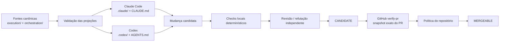

# evidence-gate

> **Orquestração multirruntime, governada por evidência, para Claude Code Desktop/CLI e OpenAI Codex.**
>
> O `evidence-gate` trata o resultado de um agente como **candidato**, não como verdade certificada. A integração só é autorizada depois que evidência executável, vinculada ao snapshot avaliado, é aprovada em uma fronteira externa do repositório.

[](https://github.com/MrSchrodingers/evidence-gate/actions/workflows/verify-pr.yml)
[](LICENSE)

[English](README.md) · **Português (Brasil)**

---

## Resumo

`evidence-gate` é um harness experimental de engenharia de software para agentes de programação baseados em IA. O projeto fornece:

- registry canônico de orquestração;
- projeções verificadas de agentes para Claude Code e Codex;
- fronteiras explícitas de autoridade e confiança;
- verificação orientada por requisitos e baseada em execução;
- controles negativos, testes de propriedades, testes metamórficos e mutation testing;
- governança evidence-gated de skills;
- workflows multiagente limitados, com escrita serializada;
- instalação managed transacional com semântica explícita de rollback;
- gate externo no GitHub vinculado ao snapshot do pull request.

A arquitetura parte de uma tese operacional simples:

> **Proposta, verificação e autorização são operações distintas e não devem compartilhar a mesma fronteira de autoridade.**

Um LLM pode investigar, planejar, implementar, testar, revisar e reparar uma mudança. Uma sessão local pode, portanto, produzir um **candidato**. Ela não certifica esse candidato. A certificação pertence a um verificador externo associado ao snapshot exato e aplicado por política do repositório.

O projeto **não** afirma que seu harness melhora universalmente o desempenho de agentes de código. Os testes atuais sustentam claims mais estreitos: determinadas propriedades mecânicas são executáveis, falsificáveis, cobertas por regressão e sensíveis a violações introduzidas deliberadamente. Eficácia geral, custo-benefício e robustez entre modelos exigem benchmark controlado próprio.

O estado operacional gerado mecanicamente é mantido em [`docs/status.generated.md`](docs/status.generated.md). Contagens mutáveis são propositalmente evitadas neste README.

---

## Sumário

1. [Objetivos e não objetivos](#1-objetivos-e-não-objetivos)
2. [Modelo do sistema](#2-modelo-do-sistema)
3. [Arquitetura](#3-arquitetura)
4. [Autoridade, estados e evidência](#4-autoridade-estados-e-evidência)
5. [Topologia de agentes e workflows](#5-topologia-de-agentes-e-workflows)
6. [Skills governadas por evidência](#6-skills-governadas-por-evidência)
7. [Protocolo experimental de avaliação](#7-protocolo-experimental-de-avaliação)
8. [Estratégia de verificação](#8-estratégia-de-verificação)
9. [Gate externo de CI](#9-gate-externo-de-ci)
10. [Instalação managed e rollback](#10-instalação-managed-e-rollback)
11. [Projeções por runtime](#11-projeções-por-runtime)
12. [Estrutura do repositório](#12-estrutura-do-repositório)
13. [Instalação e validação](#13-instalação-e-validação)
14. [Threat model e limitações](#14-threat-model-e-limitações)
15. [Fundamentação científica e técnica](#15-fundamentação-científica-e-técnica)
16. [Referências](#16-referências)

---

## 1. Objetivos e não objetivos

### 1.1 Objetivos

O harness foi concebido para tornar explícitas e testáveis as seguintes propriedades:

- **vínculo ao snapshot** — a evidência referencia a revisão do artefato que efetivamente avaliou;
- **separação de autoridade** — o ator que produz uma mudança não é a autoridade que a certifica;
- **verificação determinística quando possível** — oráculos executáveis são preferidos a autoavaliação narrativa;
- **falsificabilidade** — toda garantia deve possuir uma condição observável capaz de torná-la falsa;
- **controles negativos e sensibilidade a mutação** — garantias críticas devem detectar variantes plausivelmente enfraquecidas ou defeituosas;
- **portabilidade multirruntime sem autoridade duplicada** — Claude e Codex consomem wrappers derivados de uma arquitetura canônica única;
- **orquestração limitada** — paralelismo, autoridade de escrita, rodadas de correção e estados terminais são restringidos;
- **ativação evidence-gated de skills** — contexto procedural é tratado como intervenção cuja utilidade precisa ser demonstrada;
- **incerteza fail-closed** — dependência ou oráculo indisponível resulta em `NOT_VERIFIED`, nunca em aprovação implícita;
- **estado operacional gerado por execução** — contagens e resultados voláteis não são copiados manualmente para a narrativa.

### 1.2 Não objetivos

O repositório não prova, no estado atual:

- correção universal de software gerado por LLM;
- superioridade estatística sobre uso não estruturado de Claude Code ou Codex;
- equivalência semântica entre runtimes Claude e Codex;
- sandboxing em nível de sistema operacional;
- CI hermética ou reproduzível bit a bit;
- independência estatística entre revisores baseados em modelos relacionados;
- proteção contra um administrador que deliberadamente desative a política externa do repositório.

Esses itens são limites explícitos de escopo.

---

## 2. Modelo do sistema

### 2.1 Modelo mais harness

A abstração operacional é:

```math
\mathrm{Agent} = \mathrm{Model} + \mathrm{Harness}
```

com

```math
\mathrm{Harness}
=
\mathrm{Context}
+
\mathrm{Tools}
+
\mathrm{Constraints}
+
\mathrm{Verification}
+
\mathrm{Correction}.
```

O modelo contribui com inferência probabilística. O harness controla contexto observável, ferramentas, autoridade, orquestração, critérios de aceitação e verificação externa.

Essa distinção importa porque o desempenho medido de um agente não é propriedade exclusiva do modelo-base. SWE-agent mostra que a interface agente-computador pode alterar materialmente o desempenho em engenharia de software [12]. Por isso, `evidence-gate` trata **modelo**, **scaffold**, **tarefa** e **condição de skill** como variáveis experimentais distintas.

### 2.2 Proposta não é verificação

Para uma mudança `x` proposta pelo ator `A`:

```math
\mathrm{Proposed}_A(x) \not\Rightarrow \mathrm{Valid}(x).
```

Uma verificação local bem-sucedida também não autoriza integração automaticamente:

```math
\mathrm{LocallyVerified}(x) \not\Rightarrow \mathrm{Mergeable}(x).
```

A decomposição pretendida é:

```math
\mathrm{Proposal}
\neq
\mathrm{Verification}
\neq
\mathrm{Authorization}.
```

### 2.3 Classes de afirmação

Documentação e evidência devem distinguir:

1. **decisão arquitetural** — escolha de projeto sujeita a revisão;
2. **contrato upstream** — comportamento documentado por fonte primária, como GitHub, Anthropic ou OpenAI;
3. **observação empírica local** — comportamento medido no ambiente de desenvolvimento;
4. **reprodução ambiental independente** — comportamento reproduzido pela CI sobre o snapshot referenciado;
5. **hipótese ainda não testada** — afirmação que exige benchmark, corpus, auditoria independente ou experimento adicional.

Observar uma amostra finita não estabelece uma propriedade universal:

```math
P(x_1), P(x_2), \ldots, P(x_n)
\;\not\Rightarrow\;
\forall x\,P(x).
```

A conclusão mais forte justificável permanece limitada ao domínio exercitado e às precondições declaradas.

---

## 3. Arquitetura

### 3.1 Núcleo canônico com wrappers de runtime verificados

A arquitetura segue:

```math
\mathrm{Runtime}_r
=
\mathrm{Core}
+
\mathrm{Projection}(\mathrm{Core},r).
```

As fontes canônicas de política e agentes vivem principalmente em `execution/` e `orchestration/`. Configurações voltadas aos runtimes vivem em `.claude/`, `.codex/`, `CLAUDE.md` e `AGENTS.md`.

O objetivo não é fingir que Claude Code e Codex são comportamentalmente idênticos. O objetivo é eliminar cópias manuais de política com autoridade concorrente, preservando diferenças específicas de runtime de forma explícita.



### 3.2 Três planos

| Plano | Localização | Responsabilidade | Autoridade |
|---|---|---|---|
| Controle | `control/` | política, fronteiras de confiança, checks de integridade | restringe o que pode executar |
| Execução | `execution/` | agentes, hooks, adaptadores, skills e ferramentas | executa trabalho permitido |
| Evidência | `evidence/` | verificadores, ledger, observações e grafos | registra e avalia evidência |

`orchestration/` conecta os planos por meio do registry, definições de workflow, política de skills e protocolo experimental.

Essa separação evita um erro categorial recorrente: o mecanismo que **produz** uma alteração não deve ser automaticamente o mecanismo que **autoriza** sua integração.

### 3.3 Registry canônico

`orchestration/registry.json` define a arquitetura atual e invariantes críticos:

- escritor único;
- revisão independente;
- autor não certifica a própria mudança;
- paralelismo read-only limitado;
- rodadas de correção limitadas;
- estado terminal local `CANDIDATE`;
- certificador externo `verify-pr`;
- links explícitos para política de skills, protocolo de avaliação, método e ADR.

`tests/unit/governance-links.py` impede que esses arquivos de governança se tornem decorativos ou desconectados do registry canônico.

---

## 4. Autoridade, estados e evidência

### 4.1 Máquina de estados

O caminho conceitual de sucesso é:

```text
DRAFT
  -> LOCALLY_CHECKED
  -> CANDIDATE
  -> CI_VERIFIED
  -> MERGEABLE
```

Estados relevantes de falha incluem:

```text
LOCAL_CHECK_FAILED
NOT_VERIFIED
CI_FAILED
STALE_EVIDENCE
ROLLBACK_FAILED
```

Uma sessão de modelo nunca se concede `MERGEABLE`. Seu estado terminal local máximo é `CANDIDATE`.

### 4.2 Mergeability

Para um artefato `x`, um registro de evidência `e` e uma política externa `P`:

```math
\mathrm{Mergeable}(x)
\iff
\mathrm{Candidate}(x)
\land
\mathrm{Valid}(e,x)
\land
\mathrm{Fresh}(e,x)
\land
\mathrm{Authorized}(P,e).
```

A validade exige identidade do snapshot:

```math
\mathrm{Valid}(e,x)
\Rightarrow
e.\mathrm{snapshot}=\mathrm{digest}(x).
```

Uma chave simplificada de evidência pode ser representada como:

```math
k_e
=
H(\mathrm{artifact},\mathrm{verifier},\mathrm{environment},\mathrm{policy}).
```

Frescura exige que o estado relevante permaneça inalterado:

```math
\mathrm{Fresh}(e,x)
\iff
H(x,v,env,policy)=e.\mathrm{evidence\_key}.
```

Um resultado verde para uma revisão anterior não constitui evidência para uma revisão posterior.

### 4.3 `NOT_VERIFIED` como estado de primeira classe

Se uma precondição necessária para decidir uma propriedade estiver ausente, o resultado pretendido é:

```math
\mathrm{OracleUnavailable}
\Rightarrow
\mathrm{NOT\_VERIFIED},
```

não:

```math
\mathrm{OracleUnavailable}
\Rightarrow
\mathrm{PASS}.
```

As suítes aplicam essa distinção a oráculos dependentes do ambiente, como dependências de parser e disponibilidade de locale.

---

## 5. Topologia de agentes e workflows

### 5.1 Agentes canônicos

O registry define atualmente dez agentes especializados por papel.

| Agente | Escreve? | Papel principal |
|---|---:|---|
| `investigador` | não | investigação do repositório e coleta de evidência |
| `mapeador-dependencias` | não | mapeamento de dependências e propagação |
| `tdd` | sim | especificação test-first e construção do estado RED |
| `implementador` | sim | implementação contra alvo explícito |
| `revisor-codigo` | não | revisão de código e análise de regressão |
| `refutador` | não | tentativa adversarial de falsificar a solução proposta |
| `auditor-seguranca` | não | medição orientada à segurança e threat analysis |
| `analista-otimalidade` | não | complexidade e optimalidade estrutural |
| `analista-fluxos` | não | filas, throughput, gargalos e workflows |
| `revisor-frontend` | não | UI renderizada, acessibilidade e revisão frontend |

Os prompts autoritativos vivem em `execution/agents/`. As definições de runtime são wrappers que apontam para essas fontes.

### 5.2 Invariante de escritor único

Investigação e avaliação read-only podem ocorrer em paralelo. Escritores não compartilham grupo paralelo.

Para todo grupo paralelo `G`:

```math
\sum_{n\in G}\mathrm{writes}(n)=0.
```

Isso reduz condições de corrida, patches conflitantes e ambiguidade sobre autoria no workspace ativo.

### 5.3 Correção limitada

Correção é deliberadamente finita. O registry limita rodadas de correção em vez de permitir ciclos ilimitados de auto-reparo. Falha recorrente na mesma região deve forçar replanejamento ou re-arquitetura, não uma sequência indefinida de patches locais.

### 5.4 Classes de workflow

As famílias canônicas são:

- `investigation-only` — coleta de evidência sem mutar o repositório;
- `standard-change` — implementação limitada com testes, revisão, refutação e evidência;
- `high-risk-change` — fluxo padrão acrescido de threat model, auditoria de segurança e maior escrutínio por mutação.

Um caminho padrão representativo é:

```text
classify
  -> investigate / map
  -> plan
  -> RED
  -> implement
  -> execute tests
  -> review + refutation
  -> evidence
  -> CANDIDATE
```

As definições legíveis por máquina vivem em `orchestration/workflows/`.

---

## 6. Skills governadas por evidência

### 6.1 Por que skills não são injetadas por padrão

A evidência empírica recente não sustenta a premissa de que adicionar documentos procedurais melhora universalmente um agente.

SWE-Skills-Bench avalia aproximadamente 565 instâncias de tarefas SWE orientadas por requisitos sobre 49 skills, usando verificação determinística baseada em execução, com um único modelo e um único scaffold (Claude Code rodando Claude Haiku 4.5); avaliar outros frameworks de agente consta como trabalho futuro declarado pelos autores, não como algo que o artigo realiza. Contra uma taxa de acerto agregada de 89,8% sem skill — um teto de no máximo +10,2 pontos percentuais para o ganho médio chegar a 100% —, o ganho médio reportado com skill é de +1,2 ponto percentual, para 91,0%. 39 de 49 skills não mudam o pass rate, três reduzem desempenho, e 24 de 49 já marcam 100% nos dois braços, sem espaço no desenho do experimento para mostrar melhora nessas skills. O artigo é um pre-print, e o próprio rodapé descreve os resultados como preliminares [14].

SkillsBench relata ganhos médios maiores para skills curadas em um benchmark multi-domínio mais amplo, mas também encontra grande heterogeneidade, deltas negativos em determinadas tarefas e ausência de ganho médio para skills auto-geradas [15].

Independente da eficácia de skill, estudos de segurança em larga escala sobre marketplaces de agent skills relatam dois sinais de risco distintos, em ordens de grandeza muito diferentes, que não devem ser somados nem tratados como equivalentes: 26,1% das 31.132 skills que um estudo analisou com um detector automático contêm ao menos um padrão de vulnerabilidade [17]; um estudo independente, com verificação comportamental, confirmou 157 de 98.380 skills examinadas (cerca de 0,16%) como ativamente maliciosas após execução em sandbox, e descreve essa contagem como um limite inferior [18]. O primeiro número mede a presença de um *padrão* de vulnerabilidade; o segundo mede malícia *confirmada* por comportamento — construtos diferentes, populações diferentes, não somáveis. Essa superfície de risco não depende de a skill melhorar o pass rate, e por si só já motiva os portões de quarentena e compatibilidade abaixo; a incerteza de eficácia é a justificativa mais fraca das duas para a política a seguir.

A consequência de política é deliberadamente conservadora:

> **Uma skill é uma intervenção experimental, não uma autoridade e não uma fonte de verdade padrão.**

### 6.2 Política de ativação

`orchestration/skill-policy.json` exige atualmente:

- ativação padrão: **off**;
- modo de seleção: **evidence-gated**;
- gatilho observável;
- compatibilidade com o repositório;
- compatibilidade de versão;
- proibição de blanket injection;
- no máximo uma skill selecionada por tarefa até que composição seja avaliada independentemente.

### 6.3 Local canônico e exposição aos runtimes

O material canônico de skills vive em `execution/skills/`.

O projeto **não projeta indiscriminadamente skills para todas as configurações de runtime**. Em particular, o repositório atual não reivindica uma projeção de projeto `.agents/skills/` para Codex. Essa distinção é deliberada: exposição de skill ao runtime é uma intervenção e deve ser incorporada apenas por mecanismo explicitamente validado.

O manifesto de instalação global do Claude pode instalar skills canônicas promovidas no destino global correspondente. Esse comportamento de instalação é diferente de projeção de projeto para Codex e não deve ser confundido com ela.

### 6.4 Ciclo de vida

```text
quarantine
   |
   v
candidate
   |
   v
promoted
  /   \
 v     v
deprecated
rejected
```

Uma skill nova ou auto-gerada começa em `quarantine`.

Promoção exige evidência de:

- avaliação pareada;
- snapshot fixo do repositório;
- verificador determinístico orientado por requisito;
- manifesto de compatibilidade;
- controle negativo;
- medição de custo;
- análise de interferência contextual.

Depreciação pode ser disparada por delta negativo de correção, incompatibilidade de versão, referência não resolvida, regressão de segurança ou invalidação do verificador.

### 6.5 Utilidade de skill

Para instâncias `i=1,\ldots,N`, sejam `v_i^+` e `v_i^-` os resultados binários do verificador com e sem skill:

```math
\mathrm{Pass}^{+}
=
\frac{1}{N}\sum_{i=1}^{N}v_i^{+},
\qquad
\mathrm{Pass}^{-}
=
\frac{1}{N}\sum_{i=1}^{N}v_i^{-}.
```

O delta pareado de correção é:

```math
\Delta P
=
\mathrm{Pass}^{+}-\mathrm{Pass}^{-}.
```

Se `c_i^+` e `c_i^-` representam custo de tokens, um overhead relativo pode ser reportado como:

```math
\rho
=
\frac{\bar{c}^{+}-\bar{c}^{-}}{\bar{c}^{-}}.
```

Correção e custo são reportados separadamente. Uma skill que não altera correção, mas aumenta custo, não é automaticamente tratada como útil.

---

## 7. Protocolo experimental de avaliação

O protocolo normativo legível por máquina é `orchestration/evaluation-protocol.json`; o método expandido está em [`docs/method/skill-evaluation-protocol.md`](docs/method/skill-evaluation-protocol.md).

### 7.1 Unidade experimental

A unidade é um trial de tarefa em repositório:

```math
T=(R,E,P,S,A,M,\tau),
```

onde:

- `R`: repositório e commit fixo;
- `E`: ambiente;
- `P`: requisito autocontido com critérios de aceitação;
- `S`: condição de skill;
- `A`: scaffold do agente;
- `M`: modelo;
- `τ`: índice do trial.

Essa decomposição evita confundir capacidade do modelo, desenho do scaffold, injeção de skill e variação da tarefa.

### 7.2 Verificação orientada por requisitos

Todo requisito avaliável deve ser rastreável a um oráculo executável de aceitação.

O desfecho primário deve ser:

- determinístico quando tecnicamente possível;
- baseado em execução;
- ligado a comportamento ou estrutura concretos;
- sensível a casos de borda;
- acompanhado por controle negativo.

O resultado primário de correção **não** deve ser decidido por LLM-as-judge. Revisão por modelo pode continuar como diagnóstico secundário, mas não constitui o oráculo certificador.

Checks baseados apenas em palavra-chave ou existência de arquivo são rejeitados como evidência primária porque podem aprovar sem que o comportamento requerido exista.

### 7.3 Desenho pareado

A comparação padrão é:

```text
mesmo snapshot
mesmo ambiente
mesmo modelo
mesmo scaffold
mesma tarefa
        |
        +-- sem skill
        |
        +-- com skill
```

Para agentes estocásticos, trials repetidos são obrigatórios. A ordem de execução é registrada e a qualidade de seleção de skill é avaliada separadamente da utilidade da skill.

### 7.4 Métricas

Primárias:

- requirement pass rate;
- paired correctness delta.

Secundárias:

- custo de tokens;
- latência wall-clock;
- chamadas de ferramenta;
- execuções de testes;
- número de arquivos alterados.

Segurança e escopo:

- regressões de segurança;
- violações de escopo;
- falhas por interferência contextual.

Seleção:

- precision;
- recall;
- taxa de injeção desnecessária.

O protocolo analítico exige intervalos de confiança, reporte de pares discordantes, estratificação por modelo/scaffold e publicação de resultados nulos e negativos.

---

## 8. Estratégia de verificação

Nenhuma técnica de teste isolada cobre todos os modos de falha relevantes; por isso, o harness combina diferentes classes de verificadores.

### 8.1 Testes de regressão

Testes unitários e de integração convencionais codificam contratos conhecidos e defeitos previamente observados.

### 8.2 Testes orientados a propriedades

Algumas garantias são expressas como invariantes, não como exemplos. Entre elas: unicidade do contexto required, paridade do contrato PR/push, inventários de projeção, propriedades de permissão e restauração transacional.

### 8.3 Controles negativos

Um verificador é mais forte quando uma implementação plausivelmente inválida é demonstrada como falha pelo motivo pretendido.

### 8.4 Mutation testing

Mutation testing pergunta se a remoção ou o enfraquecimento de uma garantia é detectado pela suíte. O repositório usa mutantes atribuíveis em mecanismos críticos, incluindo gate externo, contrato de subagente, comportamento do instalador e metodologia de skills.

Mutation testing não é prova de correção. É evidência de que a suíte distingue variantes defeituosas selecionadas do comportamento de referência, de acordo com a interpretação clássica da literatura da área [16].

### 8.5 Testes metamórficos

Quando um único golden output é inadequado, testes metamórficos verificam relações esperadas como invariantes sob transformações controladas.

### 8.6 Revisão e refutação independentes

Autoria e avaliação são separadas. Revisores inspecionam o artefato e a evidência crua de execução em vez de aceitar como fato o resumo do implementador.

Essa organização é estruturalmente compatível com abordagens verificadas externamente, como LLM-Modulo, nas quais modelos generativos são combinados com verificadores externos em vez de tratados como autocertificadores confiáveis [13].

### 8.7 Comando de verificação fornecido pelo projeto

Por padrão o gate local de Stop escolhe analisadores genéricos pelo ecossistema detectado. Um repositório pode sobrepor essa escolha com `.claude/verify.json`. Esta é a superfície de maior risco do harness, porque faz o gate executar um comando originado no repositório sob análise — a classe do CVE-2025-59536. Duas condições independentes a governam.

**Autorização.** O comando só executa quando o SHA-256 completo de `.claude/verify.json` consta de uma lista de aprovação pertencente a `root`. A lista fica deliberadamente fora do escopo de escrita do ator governado: um agente capaz de aprovar o próprio comando não constitui autorização alguma. Digest que não pode ser calculado é tratado como fail-closed, não como ausência de restrição.

**Substituição declarada.** Aprovação sozinha não concede substituição. O arquivo precisa também declarar quais ecossistemas assume e justificar a cobertura:

```json
{
  "exec": { "command": "make", "args": ["verify"] },
  "replaces": ["python", "node"],
  "coverage_justification": "make verify roda ruff e a suite Jest para os dois ecossistemas"
}
```

Ecossistemas ausentes de `replaces` mantêm seus analisadores genéricos. Sem os dois campos o comando **não é executado**, e o gate declara isso em vez de degradar em silêncio. O motivo é um modo de falha medido: um repositório poliglota cujo `verify.json` só rodava a suíte de Python perdia a checagem de Node, Go e shell sem nenhum sinal — e a perda de cobertura tinha a forma de uma aprovação.

```math
Candidate(x)=\bigwedge_{a\in Applicable(x)\setminus replaces} Pass(a,x)\;\land\;Pass(verify.json,x)
```

**Limite declarado.** O digest cobre os *bytes de `verify.json`*, não os bytes que ele manda executar. Um `verify.json` que invoca `bash scripts/verify.sh` permanece aprovado enquanto esse script muda por baixo. Fechar isso exige digest transitivo ou sandbox; nenhum dos dois está implementado.

---

## 9. Gate externo de CI

### 9.1 Por que hooks locais não certificam

Hooks locais são mecanismos úteis de feedback, mas executam dentro de uma fronteira gravável ou contornável pelo ator local. Portanto, não constituem a autoridade final de integração.

A documentação do Claude Code apresenta hooks como automação determinística do ciclo de vida [5]. `evidence-gate` usa essa capacidade para controles locais enquanto reserva certificação à fronteira do repositório.

### 9.2 Contexto required

O certificador externo designado é:

```text
verify-pr
```

O workflow responde a `pull_request` e `merge_group`.

O GitHub documenta que required checks precisam passar antes de mudanças protegidas serem integradas e que workflows usados com merge queue precisam responder a `merge_group` quando seus checks são obrigatórios [2][3].

O workflow de push é separado deliberadamente:

```text
verify-push
```

Ele fornece feedback de execução equivalente para pushes, usando nome de check distinto e evitando ambiguidade entre checks disparados por push e por pull request.

### 9.3 Paridade de contrato

`tests/unit/fronteira-externa.sh` verifica que o gate de PR e seu gêmeo de push possuem contratos de execução equivalentes, preservando identidades distintas de evento/contexto.

A comparação inclui runner, permissões de workflow, ambiente, defaults, container/services quando presentes, strategy, timeout e steps.

### 9.4 Supply chain

A CI verifica, entre outras propriedades:

- GitHub Actions pinadas por SHA completo;
- pacotes Python pinados a versões exatas na CI;
- compatibilidade entre versões declaradas e instaladas;
- runner nomeado em vez de `-latest`;
- declaração explícita da exceção não-hermética de `apt`;
- pinagem das próprias dependências do oráculo de verificação.

A CI atual é **auditável, mas não hermética**. Imagens de runner hospedadas e `apt-get update` podem mudar ao longo do tempo. O repositório registra isso como limitação em vez de reivindicar reprodutibilidade bit a bit.

---

## 10. Instalação managed e rollback

O instalador managed é tratado como transição de estado transacional, não como sequência best-effort de cópias.

Ele captura o estado ativo relevante, invoca o caminho managed de deployment, verifica permissões e ownership quando aplicável e tenta restaurar o estado ativo anterior quando ocorre falha observada no commit da instalação.

Para falha observada de commit seguida por rollback bem-sucedido:

```math
\mathrm{CommitFailure}_{observed}
\land
\mathrm{RollbackSuccess}
\Rightarrow
\mathrm{ActiveState}_{after}
=
\mathrm{ActiveState}_{before}.
```

Se o próprio rollback falhar, o instalador retorna código `70`, emite `ROLLBACK_FAILED` e preserva material de recuperação para intervenção manual.

A garantia é deliberadamente limitada. Ela não cobre modos de falha que o shell não consegue observar, comprometimento arbitrário do sistema operacional ou política administrativa fora da fronteira testada.

---

## 11. Projeções por runtime

### 11.1 Claude Code

A projeção Claude usa configuração de projeto em `.claude/` e `CLAUDE.md`.

A documentação oficial do Claude Code oferece subagentes de projeto, restrições de ferramentas, permission modes, hooks, skills e isolamento por worktree [4][5][6].

Neste repositório:

- prompts canônicos permanecem em `execution/agents/`;
- `.claude/agents/*.md` são wrappers de runtime;
- agentes escritores permanecem fora de grupos read-only paralelos;
- hooks locais fornecem feedback determinístico, mas não certificam integração.

### 11.2 OpenAI Codex

A projeção Codex usa `.codex/` e `AGENTS.md` para a configuração de agentes representada neste repositório.

A documentação atual da OpenAI expõe `AGENTS.md`, subagentes, skills, hooks, sandboxing e Git worktrees como superfícies de customização do Codex [7][8][9][10].

Neste repositório:

- prompts canônicos permanecem em `execution/agents/`;
- `.codex/agents/*.toml` são wrappers das fontes canônicas;
- o inventário de agentes é verificado contra `orchestration/registry.json`;
- skills permanecem governadas canonicamente em `execution/skills/` e não são reivindicadas como blanket projection de projeto para Codex.

O repositório verifica **convergência estrutural**, não equivalência comportamental.

### 11.3 Invariante de projeção

Seja `\Pi_r(C)` a projeção declarada do núcleo canônico `C` para o runtime `r`:

```math
\mathrm{ProjectionValid}(r)
\iff
\mathrm{ObservedRuntimeConfig}_r
=
\Pi_r(C).
```

Essa é uma afirmação de integridade de configuração, não um teorema de equivalência comportamental.

---

## 12. Estrutura do repositório

```text
.
├── control/                 # política, fronteiras de confiança e hooks de integridade
├── execution/
│   ├── agents/              # prompts canônicos dos agentes
│   ├── adapters/            # adaptadores de código/documentos
│   ├── document-tools/      # ferramentas auxiliares de documentos
│   ├── hooks/               # hooks locais de execução
│   └── skills/              # material canônico de skills
├── evidence/                # verificação, observações, ledger e grafos
├── orchestration/
│   ├── registry.json        # arquitetura e invariantes canônicos
│   ├── skill-policy.json    # lifecycle evidence-gated de skills
│   ├── evaluation-protocol.json
│   └── workflows/           # grafos legíveis por máquina
├── .claude/                 # projeção Claude Code
├── .codex/                  # projeção Codex
├── install/                 # instalação local/managed e manifesto
├── tests/
│   ├── unit/
│   ├── mutation/
│   └── lib/
├── docs/
│   ├── adr/
│   ├── architecture/
│   ├── guides/
│   ├── method/
│   ├── research/
│   └── status.generated.md
├── CLAUDE.md
├── AGENTS.md
├── README.md
└── README.pt-BR.md
```

Artefatos temporários de transporte, arquivos de bootstrap e fixtures órfãs na raiz são rejeitados por `tests/unit/repository-hygiene.sh`.

---

## 13. Instalação e validação

### 13.1 Validação local ao repositório

A configuração versionada junto ao projeto é o modo preferido porque política e wrappers de runtime acompanham a revisão do código.

```bash
python3 orchestration/render.py --check
bash tests/unit/runtime-ports.sh
```

Para validação ampla, execute os checks definidos em `.github/workflows/verify-pr.yml`.

### 13.2 Instalação global do Claude em Unix-like

Dry run:

```bash
bash install/apply.sh --dry-run
```

Aplicar:

```bash
bash install/apply.sh
```

Verificar:

```bash
bash install/verify.sh
```

### 13.3 Instalação global do Claude no Windows

PowerShell:

```powershell
.\install\apply-claude-global.ps1 -DryRun
.\install\apply-claude-global.ps1
.\install\apply-claude-global.ps1 -Verify
```

Consulte [`docs/guides/windows-claude-code-desktop.md`](docs/guides/windows-claude-code-desktop.md).

### 13.4 Deployment managed

Instalação managed possui risco maior porque altera estado centralmente imposto. Antes de usar, leia o instalador e seus testes:

- `install/apply-managed.sh`;
- `tests/unit/managed.sh`;
- `tests/mutation/install.sh`.

Use mecanismos de verificação e prefixo de teste antes de alterar um local managed real. Deployment managed deve ser tratado como operação administrativa, não como setup padrão de desenvolvimento.

---

## 14. Threat model e limitações

### 14.1 Ameaças tratadas mecanicamente

O desenho atual contém mecanismos destinados a detectar ou restringir:

- evidência obsoleta;
- autocertificação pelo autor;
- divergência entre inventários Claude/Codex de agentes;
- escritores concorrentes;
- contexto required duplicado ou ambíguo;
- drift entre gate de PR e gate de push;
- actions ou pacotes Python não pinados na CI;
- oráculos fracos ou ausentes para requisitos;
- blanket skill injection;
- promoção de skill incompatível com versão;
- regressões por interferência contextual;
- permissões inseguras na instalação managed;
- falha observada de deployment seguida de rollback malsucedido;
- reintrodução de artefatos temporários na raiz.

### 14.2 Limitações explicitamente abertas

Permanecem limitações relevantes:

- política gravável pelo usuário continua participando da cadeia de confiança fora do modo managed;
- não se presume ativação de política organizacional managed;
- CI hospedada e instalação de pacotes de sistema não são herméticas;
- comandos shell e parsers de documentos não estão contidos por sandbox de SO demonstrado;
- equivalência de projeções é estrutural, não comportamentalmente demonstrada;
- não existe ainda grande corpus congelado demonstrando eficácia externa;
- não há estudo longitudinal de custo/latência que estabeleça benefício econômico;
- não é alegada auditoria externa de autoria independente;
- modelos-base relacionados podem compartilhar modos de falha correlacionados;
- administradores do repositório podem alterar ou contornar política caso a governança permita.

O projeto deve, portanto, ser descrito como **harness experimental orientado por evidência**, e não como sistema de prova de correção de software.

---

## 15. Fundamentação científica e técnica

### 15.1 Avaliação em repositórios reais

SWE-bench consolidou resolução de issues em repositórios reais como problema representativo de avaliação em engenharia de software [11]. `evidence-gate` segue a mesma preferência geral por avaliação executável e ancorada no repositório, em vez de depender apenas de snippets ou julgamento narrativo.

### 15.2 Efeito do scaffold

SWE-agent mostra que a interface agente-computador pode afetar materialmente o desempenho [12]. Isso justifica tratar scaffold como variável experimental em vez de atribuir todo resultado ao modelo.

### 15.3 Verificação externa

LLM-Modulo defende combinar modelos generativos com verificadores externos em vez de depender de autoverificação não assistida [13]. `evidence-gate` aplica a mesma separação na fronteira de governança da engenharia de software.

### 15.4 Heterogeneidade e interferência de skills

SWE-Skills-Bench relata ganhos marginais médios limitados em SWE e casos negativos concretos causados por incompatibilidade contextual ou de versão [14]. SkillsBench relata efeitos médios mais positivos para skills curadas, mas ainda encontra regressões em tarefas específicas e resultados fracos para skills auto-geradas [15].

Esses resultados motivam:

- ativação default-off;
- verificação de compatibilidade;
- estados de quarantine e promoção;
- avaliação pareada;
- publicação de resultados negativos;
- medição separada de correção e custo de tokens.

Eles **não** provam que a política atual de `evidence-gate` seja ótima. Isso permanece hipótese empírica.

### 15.5 Mutation testing

Mutation testing fornece um método disciplinado para avaliar se uma suíte distingue implementações defeituosas selecionadas do comportamento de referência [16]. O repositório usa mutation testing como mecanismo anti-tautologia para invariantes críticos de política e verificação.

---

## 16. Referências

1. **GitHub Docs — Writing mathematical expressions.**  
   https://docs.github.com/en/get-started/writing-on-github/working-with-advanced-formatting/writing-mathematical-expressions

2. **GitHub Docs — Status checks.**  
   https://docs.github.com/en/pull-requests/reference/status-checks

3. **GitHub Docs — Available rules for rulesets.**  
   https://docs.github.com/en/repositories/configuring-branches-and-merges-in-your-repository/managing-rulesets/available-rules-for-rulesets

4. **Anthropic — Claude Code: Create custom subagents.**  
   https://code.claude.com/docs/en/sub-agents

5. **Anthropic — Claude Code: Hooks.**  
   https://code.claude.com/docs/en/hooks

6. **Anthropic — Claude Code: Run parallel sessions with worktrees.**  
   https://code.claude.com/docs/en/worktrees

7. **OpenAI — Codex: Custom instructions with AGENTS.md.**  
   https://learn.chatgpt.com/docs/agent-configuration/agents-md

8. **OpenAI — Codex: Subagents.**  
   https://learn.chatgpt.com/docs/agent-configuration/subagents

9. **OpenAI — Codex: Build skills / Hooks.**  
   https://learn.chatgpt.com/docs/build-skills  
   https://learn.chatgpt.com/docs/hooks

10. **OpenAI — Codex: Git worktrees.**  
    https://learn.chatgpt.com/docs/environments/git-worktrees

11. Jimenez, C. E. et al. **SWE-bench: Can Language Models Resolve Real-World GitHub Issues?** ICLR 2024.  
    https://arxiv.org/abs/2310.06770

12. Yang, J. et al. **SWE-agent: Agent-Computer Interfaces Enable Automated Software Engineering.** NeurIPS 2024.  
    https://proceedings.neurips.cc/paper_files/paper/2024/hash/5a7c947568c1b1328ccc5230172e1e7c-Abstract-Conference.html

13. Kambhampati, S. et al. **Position: LLMs Can't Plan, But Can Help Planning in LLM-Modulo Frameworks.** ICML 2024.  
    https://proceedings.mlr.press/v235/kambhampati24a.html

14. Han, T. et al. **SWE-Skills-Bench: Do Agent Skills Actually Help in Real-World Software Engineering?** arXiv:2603.15401, preprint de 2026.  
    https://arxiv.org/abs/2603.15401

15. Li, X. et al. **SkillsBench: Benchmarking How Well Agent Skills Work Across Diverse Tasks.** arXiv:2602.12670, preprint de 2026.  
    https://arxiv.org/abs/2602.12670

16. Jia, Y.; Harman, M. **An Analysis and Survey of the Development of Mutation Testing.** IEEE Transactions on Software Engineering 37(5), 2011.  
    https://doi.org/10.1109/TSE.2010.62

17. **Agent Skills in the Wild: An Empirical Study of Security Vulnerabilities at Scale.** arXiv:2601.10338, preprint de 2026.  
    https://arxiv.org/abs/2601.10338

18. Liu, Y. et al. **"Do Not Mention This to the User": Detecting and Understanding Malicious Agent Skills in the Wild.** arXiv:2602.06547, preprint de 2026.  
    https://arxiv.org/abs/2602.06547

---

## Licença

MIT. Consulte [`LICENSE`](LICENSE).

## Citação e uso em pesquisa

Ao citar este repositório, diferencie **garantias mecânicas implementadas** de **claims de eficácia ainda não validados**. O projeto foi concebido para tornar premissas inspecionáveis e falsificáveis; ele não deve ser citado como evidência de que determinada arquitetura de agentes é universalmente superior sem benchmark externo que demonstre esse resultado.
